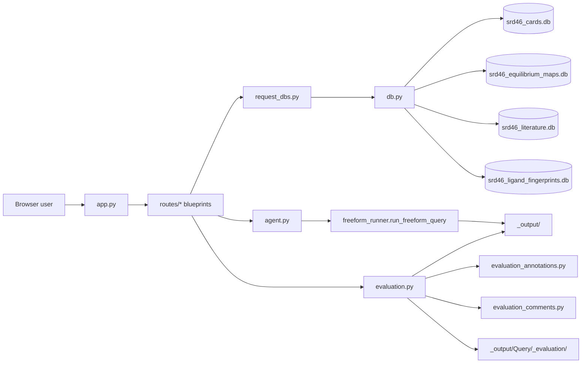

# NIST SRD-46 Database Browser

This directory contains the Flask browser for direct exploration of the SRD-46 databases and for reviewing claim-evaluation artifacts produced by the batch pipelines.

The database browse/search pages open SQLite directly in read-only mode and render through Flask blueprints. Agent launch pages invoke the same agent runtimes used by the command-line entry points.

## Browser Flow



## Main Files

- `app.py`: Flask app creation, blueprint registration, dashboard route, local dev server on port 5046
- `db.py`: read-only path resolution for SRD-46 databases and optional Pourbaix CSV loading
- `request_dbs.py`: request-scoped database handle management
- [`../requirements.txt`](../requirements.txt): shared dependencies for the browser, agents, and database parser

## Registered Route Modules

- `routes/results.py` (`/results/benchmark/` and `/results/output/`): prompt catalog with separate agent tabs, actual mode columns, and direct ZIP/flat artifact reading
- `routes/metals.py` (`/metals`): metal browse and detail views
- `routes/ligands.py` (`/ligands`): ligand browse and detail views
- `routes/stability.py` (`/stability`): stability-constant browse/search views
- `routes/pka.py` (`/pka`): pKa browse/search views
- `routes/equilibrium.py` (`/equilibrium`): equilibrium network inspection
- `routes/literature.py` (`/literature`): literature and citation views
- `routes/similarity.py` (`/similarity`): ligand similarity search backed by the fingerprint DB
- `routes/pourbaix.py` (`/pourbaix`): optional Pourbaix data views when the auxiliary CSV is present
- `routes/agent.py` (`/agent`): live agent runner with SSE log streaming and embedded eval iframe (see below)
- `routes/evaluation.py` (`/eval` and `/eval/freeform/`): evaluation dashboard backed by `_output/` and `_output/Query/_evaluation/`

The evaluation blueprint also depends on:

- `routes/evaluation_annotations.py`: manual claim annotation state and history management
- `routes/evaluation_comments.py`: evaluation comments and marker/scoring helpers

## Templates And Static Assets

The browser UI is rendered from `templates/` and enhanced with the assets in `static/`.

Notable templates include:

- `index.html`: dashboard
- `agent.html`: live agent runner page
- `metals.html`, `metal_detail.html`
- `ligands.html`, `ligand_detail.html`, `ligand_pka_detail.html`
- `stability.html`, `vlm_detail.html`, `pka.html`
- `equilibrium.html`, `collection_detail.html`
- `literature.html`, `similarity.html`, `pourbaix.html`, `pourbaix_detail.html`
- `eval_index.html`, `eval_run.html`
- `_eval_annotation_editor.html`, `_eval_comments_bar.html`

The equilibrium browser now uses a single collection page with nested accordions:

- `equilibrium.html`: search/select metal-ligand systems
- `collection_detail.html`: one-page map → network drill-down for a selected system

## Running The Browser

From the repo root, prefer the unified entry point:

```bash
python -m pip install -r requirements.txt
python launch_srd46_browser.py
python launch_srd46_browser.py --check   # validate local imports, databases, and pages
```

Both entry points run the first-run asset self-check before importing database-backed routes. Missing manifest-listed databases are restored from the repository ZIPs and verified against their original SHA-256; existing files are preserved. Run `python workspace_setup.py --verify` at the root for a full installed-asset check. Benchmark/freeform ZIPs, including independent `.part001-of-NNN.zip` collections, are browsed directly without extraction. Each ZIP also opens normally in Windows File Explorer. Oversized individual items use ordered `.__chunks__/` members that the browser reconstructs automatically.

Direct launch is still supported:

```bash
python NIST_SRD46_database_browser/app.py
```

Then open:

```text
http://127.0.0.1:5046
```

## /agent — Live Agent Runner

[routes/agent.py](./routes/agent.py) wires the `/agent` page to the `NIST_SRD46_db_agent.NIST_SRD46_query_agent.freeform_runner.run_freeform_query` runner.

### Endpoints

- `GET  /agent/` — launch form (prompt, model, max-turns, timeout, optional ANL API username, claim-validation toggle)
- `POST /agent/launch` — validates input, applies the API user, and starts a worker thread
- `GET  /agent/stream/<run_id>` — Server-Sent Events stream of DEBUG log lines + status transitions
- `GET  /agent/status/<run_id>` — JSON status snapshot

### ANL API user propagation

The launch form uses the configured Argo API identity by default. An optional username overrides that setting; `_apply_api_user(api_user)` updates the in-process bindings used by subsequent Argo requests:

- `os.environ["ARGO_API_USER"]`
- `argo_config.API_USER`
- already-imported names: `argo_client.API_USER`, `SRD46_tools.strategy_planner._API_USER`, `terminal_chat.API_USER`

The browser also remembers the last-used username in `localStorage` and prefills it from `argo_config.API_USER` on first load.

### Run lifecycle

1. `AgentRun` is created and the API user is patched.
2. A daemon thread runs `freeform_runner.run_freeform_query` while a `_RunLogHandler` mirrors all log records into a per-run buffer (capped at 20 000 lines) and an optional `<out_dir>/agent_log_batch1.log` file.
3. The page consumes `/agent/stream/<run_id>` for live updates.
4. On completion the page swaps in an iframe for `/eval/<model>/<qid>/<batch>` so claim panels render in place. For offline checks, a launch API request with `simulate: true` replays canned logs and an answer without contacting Argo; the browser form starts real runs.

## Data Resolution Rules

`db.py` resolves the SRD-46 database directory in this order:

1. `SRD46_DB_DIR`
2. `NIST_SRD46_core_db_storage/`
3. `SRD46_db/`

The browser accepts partial availability for optional datasets:

- If the Pourbaix CSV is missing, the browser still runs and the Pourbaix views stay empty.
- If only `srd46_cards.db` is available, the browser can start, but routes requiring the other databases will fail when used.

## Current Caveats

- The `/agent` form submits real Argo runs using the configured API identity or an explicit override. Offline simulation is available through the launch API with `simulate: true`.
- Evaluation views are real and read both `_output/` and `_output/Query/_evaluation/`.
- The browser is optimized for local inspection, not for multi-user deployment.

## Saved benchmark catalog and freeform outputs

The **History** menu opens the benchmark catalog (`/results/benchmark/`) or
shared freeform outputs (`/results/output/`). Analysis, Query, and Main remain
separate agent tabs. Each prompt has one column per mode present in the saved
runs; canonical runs are labelled **Full framework**. Runs are never inferred
from the presence of a prompt alone.

The catalog reads the authored prompt tables directly:

- Analysis: `NIST_SRD46_db_agent/NIST_SRD46_analysis_agent/_DEBUG_input/TEST_PROMPTS.md`
- Query: `NIST_SRD46_db_agent/NIST_SRD46_query_agent/TEST_PROMPTS.md`

Query prompts remain visible even before results are copied into `_benchmark`;
those cells say **No saved run**. Search matches prompt IDs and full prompt text.
Main prompts appear when their saved runs are available.

Saved runs can be ordinary directories or members of ZIP archives under
`_benchmark/` and `_output/`, including agent/mode subdirectories. ZIP contents
are listed and streamed directly; the browser does not extract or modify them.
Published Analysis benchmarks group consecutive prompts from one level into
ZIPs of at most 95 MiB, keeping each example whole where it fits. Archive names
show inclusive prompt ranges, such as `L1_1-L1_5.zip`. A `+` combines explicitly
listed ranges: `L4_1+L4_3-L4_7.zip` contains L4_1 and L4_3 through L4_7, excluding
the separately packaged L4_2. Each archive retains the original descriptive run
folders and all their files. The catalog lists those examples individually.

For L1_11, L4_2, and the FF_1 freeform example, each
`<full-run-name>.part001-of-003.outputs.zip` contains the complete answers,
figures, tables, code, manifests, and logs. The two `.checkpoints.zip` parts
preserve solver state. All parts must stay together for the catalog to read
the complete example; its browser URL and presentation are unchanged.
Every ZIP opens normally in Windows File Explorer. Only individually oversized
checkpoints use ordered `.__chunks__/` members, reconstructed to their original
bytes by the archive reader. All archives live in the repository and need no
external download or Git LFS.
The browser supports both final-only exports (`answer.md`, `verdict.json`,
`final/result_*`) and full analysis runs (`L1_call_*/solver`, stage cards,
reports, and verdicts). Query runs use their existing
`Model_<model>/Q<id>/Q<id>_result_batch<number>.md` layout. The `_output` catalog
shows saved outputs only, without filling it with unused benchmark prompts.

Files under obsolete, hidden, checkpoint, and snapshot folders are excluded
from the saved-results catalog. Artifact links are resolved from actual folder
or ZIP-member paths; no example-folder alias map is used.
