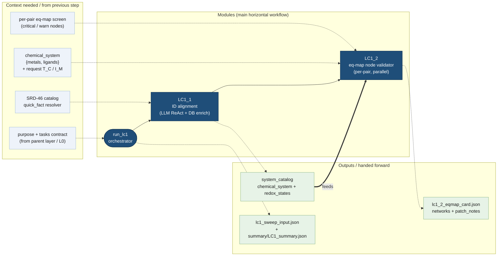

# LC1 — Eq-Card Alignment

The **LC1** stage of the calc-input-building pipeline turns a free-text
`purpose` + `tasks` contract into a **validated eq-map card** whose every
`(metal, ligand)` equilibrium network carries parseable `patch_notes` the
downstream solver can hardcode. The SRD-46 SQL database is only ever **read**;
all curation edits are persisted as JSON instructions, never written back.

```text
purpose + tasks  ─►  LC1_1 (resolve chemistry)  ─►  LC1_2 (validate eq-maps)  ─►  lc1_2_eqmap_card.json
```

---

## Workflow diagram

The **center horizontal lane** is the module chain. The **top lane** shows what
each module needs as context (inputs / artefacts from previous steps); the
**bottom lane** shows what each module produces and hands forward.



---

## Default-off query-estimation lane

Estimated equilibrium support is implemented behind
`LC1_3_ESTIMATE_EQ_STABILITY_ENABLED = False`. All of its source modules and
gated workflows live in `LC1_3_estimate_eq_stability_dispatch/`. On enabled
runs the LC1 orchestrator interposes that sibling stage after LC1_2 fetches the
authoritative eq-map but before LC1_2 performs its system review:

```text
LC1_2.fetch -> LC1_3_estimate_eq_stability_dispatch -> LC1_2.review/write
```

Each canonical non-water metal-ligand pair receives one fresh QueryAgent
conversation. The first user message is an ordinary chemistry question;
LC1.3 supplies no determination agent, analogue router, custom planner,
pair-specific tool allowlist, response schema, or answer-reorganization turn.
The QueryAgent chooses how to use the standard SRD-46 tools and may combine
retrieved examples with chemistry knowledge to state a clearly labelled
estimate. A separate revisioned parser uses tools to build partial drafts and
passes them through deterministic entry and network gates. If an estimate is
present but essential chemistry is missing, the host may send a bounded,
targeted follow-up in the same QueryAgent conversation without changing its
initial prompt or asking for schema-shaped output.

Successful tool results are converted into post-hoc evidence receipts. These
receipts prove which canonical IDs were observed but do not rank analogue
quality or restrict the agent to a hardcoded transfer route. Deterministic
code validates the parsed identities, numeric source bindings, receipt
lineage, and native support map before publication.

All generated contexts and eq-map-like support data remain session artifacts.
They do not modify `lc1_2_eqmap_card.json`. Accepted support is handed to LC2_1
through a separate conditional path with the current system catalog, exact
LC1_3 session ID, and exact support-file SHA-256. LC2 revalidates those
bindings and the v3 evidence-receipt lineage, then joins accepted nodes to the
materialized reaction network before stability constants are converted to
free energies. Candidate, selected, and actually materialized estimated-entry
counts are reported separately.

With `LC1_3_ESTIMATE_EQ_STABILITY_ENABLED = False` (the default), or an
explicit false per-run override, the path is strict legacy identity: LC1 does
not import LC1_3, load estimation prompts/hints, create LC1_3 artifacts, add
enabled-only result keys, or widen the LC2 call.

See the
[current LC1.3 estimation module](LC1_3_estimate_eq_stability_dispatch/README.md)
for current runtime flow, evidence handling, and validation behavior.

---

## Modules

### `LC1_eq_card_alignment_orchestrator.py` — stage entry point
Single top-level entry for the whole LC1 stage.

- **`configure_lc1_session(...)`** — binds the per-session side-channel
  (`session_dir`, `history`, `stats`, `working_memory`, `debug`) once, and
  mirrors it into both child stages.
- **`run_lc1(purpose, tasks=None, *, output_dir=None, request_T_C=25.0,
  request_I_M=0.1, max_validator_retries=2, max_parallel=4, debug=False,
  estimate_missing_equilibria=None, chemical_context_plan=None)`** —
  runs the full chain:
  1. Normalises `tasks`, builds a per-call artefact tree, re-wires the LC1_1 /
     LC1_2 session side-channels under it (`call_dir/LC1_1`, `call_dir/LC1_2`).
  2. Calls **LC1_1** to resolve the chemical system. If no metals/ligands
     resolve, returns `status="failed"` early.
  3. On the enabled branch only, fetches the LC1_2 base card, runs LC1_3, and
     retains the published support path/session/file digest; then calls
     **LC1_2** to validate every `(metal, ligand)` reference eq-map.
  4. On the disabled branch, calls the literal legacy LC1_2 wrapper directly.
  5. Writes the stage artefacts and returns a summary dict.
- **Returns** `{status, output_dir, purpose, tasks, chemical_system,
  system_catalog, eq_map_card_path, manifest_path, lc1_1, lc1_2, elapsed_s}`.
  `status` is `failed` when LC1_1 finds nothing, otherwise it mirrors LC1_2's
  dispatch status (`ok` / `partial` / `failed` / `skipped`). Enabled results
  additionally carry `lc1_3`, `support_eq_map_path`, `support_session_id`, and
  `support_eq_map_sha256`; disabled results retain the legacy shape.
- **Artefacts** (`_write_summary`): copies the final card to
  `lc1_2_eqmap_card.json`, writes the solver skeleton `lc1_sweep_input.json`
  (only the `system_catalog` block), and a compact `summary/LC1_summary.json`.

### `LC1_1_SRD46_eq_map_ID_alignment/` — chemical-system ID alignment
Resolves the named chemistry into canonical SRD-46 catalog IDs.

- **`LC1_1_ID_alignment_subagent.py`** — the LLM ReAct loop. It exposes two
  tools to the agent:
  - `quick_fact(name, smiles, prefix_id, exclude_ids)` — an LC1 adapter over
    the SRD-46 shared `NIST_SRD46_core_db_search_tools`; returns unified metal/ligand rows with
    canonical `prefix_id`s.
  - `commit_chemical_system(json_payload)` — terminal tool that locks in
    `{metals, ligands}` and ends the turn.
- **`id_enrichment_helpers.py`** — deterministic, pure-Python DB enrichment.
  `build_system_catalog(committed)` attaches `element` + `redox_states`
  (every accessible charge state, deduped by element) and `smiles`,
  re-usable by any layer that already holds canonical IDs.
- **`LC1_1_ID_alignment_workflow.md`** — the agent system prompt (role, the two
  tools, and the disambiguation / commit rules).
- **Output:** `{"system_catalog": {"chemical_system": {"metals":[...],
  "ligands":[...]}}}`.

### `LC1_2_SRD46_eq_map_node_validator/` — eq-map node validator
For one chemical system, fetches and validates the eq-map of every pair.

- **`LC1_2_eq_map_validator_orchestrator.py`** — `run_lc1_2(...)`:
  1. `fetch_eqmap_card(chemical_system)` builds the per-pair card (one
     `eq_network` row per `(metal, ligand)` pair) — pure DB lookup.
  2. For each pair, in parallel (`ThreadPoolExecutor`, `max_parallel`):
     synthesises an ephemeral `maps_v0.json`, runs the deterministic
     `screen_eq_map` to flag `critical` / `warn` nodes, then (if
     `cfg.LC1_2_ENABLED`) dispatches the per-pair LLM curator with
     validator-feedback retries (`max_validator_retries`).
  3. Merges each pair's validated `patch_notes` back into the card and
     persists `lc1_2_eqmap_card.json` + a per-pair manifest.
- **`eqmap_fetch_helpers.py`** — `fetch_eqmap_card` / `fetch_networks_for_pair`
  build the seed card straight from the SRD-46 equilibrium DB.
- **`eqmap_validation_helpers/`** — deterministic node screening + patch
  validation (`screen_eq_map`, `EqMapScreen`, `PatchValidationResult`,
  `render_screen_md`, `format_errors_for_agent`, neighbour query / node screen /
  patch validator / report rendering).
- **`LC1_2_eq_map_validator_subagent.py`** — the per-pair curator agent. Tools:
  `inspect_node`, `get_node_neighbors`, and the terminal `finalize_patches`
  (emits `{"patches": [...]}` with closed-enum `set_value` / `drop_node`
  operations).
- **`LC1_2_eq_map_validator_workflow.md`** — the curator system prompt (flag
  vocabulary, patch schema, hard rules, worked examples).
- **Output:** `{status, output_dir, eq_map_card_path, manifest_path,
  pair_results, elapsed_s}`; the augmented card carries a parseable
  `patch_notes` slot inside every `eq_network`.

### `LC1_3_estimate_eq_stability_dispatch/` — estimate-support dispatch

This source directory owns the implemented, default-off estimation branch.

- Owns deterministic canonical pair scoping, the direct SRD-46 QueryAgent
  adapter, post-hoc evidence receipts, the revisioned parser workspace and
  gates, targeted same-conversation clarification, support schema/validator,
  and artifact writing.
- The active stages are `dispatch_srd46_query/` (including deterministic pair
  scoping), `parse_speciation_answer/`, `runtime_support/`, and
  `validate_support_eq_map/`. The obsolete
  `determine_estimation_needed/` and hardcoded retrieval-policy modules have
  been removed.
- Does not own stability-constant-to-free-energy conversion; accepted entries
  are handed to LC2_1 as reaction-network support and converted only after the
  authoritative and estimated entries pass one combined validation/dedup gate.
- Groups same-pair/same-condition claims into separate `eq_network` rows when
  their canonical beta topologies are disconnected.
- Must be imported and configured only when
  `LC1_3_ESTIMATE_EQ_STABILITY_ENABLED` resolves true.
- See its [module contract](LC1_3_estimate_eq_stability_dispatch/README.md) and the
  [current LC1.3 estimation module](LC1_3_estimate_eq_stability_dispatch/README.md).

---

## Artefact tree

```text
<output_dir>/
  lc1_2_eqmap_card.json        # final eq-map card (networks + patch_notes)
  lc1_sweep_input.json         # solver skeleton (system_catalog only)
  summary/
    LC1_summary.json           # compact stage summary (child payloads elided)
  LC1_1/                       # LC1_1 per-call logs (quick_fact, commit)
  LC1_2/
    c01/p00_m<m>_l<l>/         # per-pair: maps_v0.json, screen.md/.json,
                               #   attemptNN/, patch_notes.json
  LC1_3_estimate_eq_stability_dispatch/  # enabled runs only; never created when false
    00_parent_request_context.json
    query_agents/q001/          # scope, immutable first answer, optional
                                #   targeted follow-ups, v3 evidence receipts
    parser_agents/q001/         # revisioned drafts, gate reports, parser cycles,
                                #   atomic commit receipt
    support_eq_map/             # complete session-only 11-table sidecar
    *_manifest.json             # four stages + main LC1_3 transaction
```

## Key contracts

| Contract | Shape |
| --- | --- |
| Stage input | `purpose: str`, `tasks: list[str] \| str` |
| `chemical_system` | `{"metals": [{db_id, name}], "ligands": [{db_id, name}]}` |
| eq-map card row | `{eq_network, metal_id, ligand_id, ..., patch_notes}` |
| patch | `{node_key, beta_definition_id, examined_vlm_id, examined_value, operation, chosen_value?, rationale}` |

---

## Pipeline context

LC1 is the first of three layers. Its `lc1_sweep_input.json` (system_catalog)
and `lc1_2_eqmap_card.json` feed **LC2** (free-energy card building) and
**LC3** (solver-para card building). The modelling regime (activity model,
solids, redox / ionic-strength mode) is **not** decided here — it is authored
later by the **LC3_2** initial-condition designer and inherited by LC3_3. See
the [pipeline README](../README.md) for the end-to-end `purpose + tasks →
calc_input_card.json` API.
