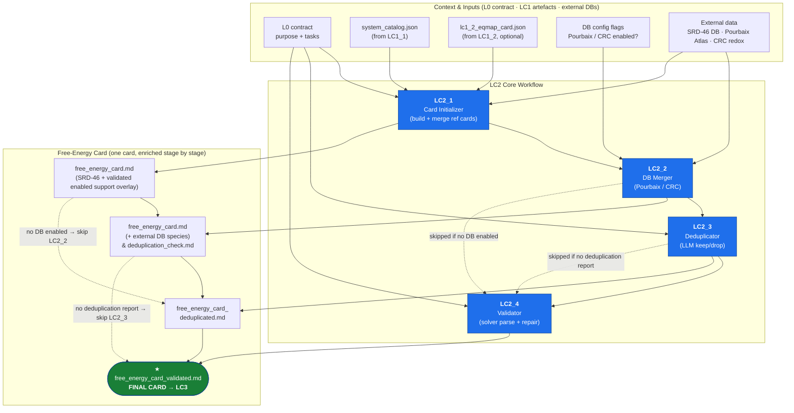

# LC2 — Free-Energy Card Building

LC2 is the second stage of the calculation-input building pipeline. It turns the abstract
system definition produced by LC1 (metals, ligands, validated equilibrium networks) into a
single, **solver-parseable free-energy card** that downstream LC3 / numerical solvers can read.

The stage is split into four sub-stages that run in sequence. Each sub-stage takes the card
produced by the previous one, enriches or validates it, and hands it forward. Two of the
middle stages (LC2_2, LC2_3) are **conditional** and are skipped when no external database
participates or LC2_2 emits no deduplication report.

---

## Workflow Diagram

The **center horizontal lane** is the module pipeline. The **top lane** shows the context /
inputs each module consumes (from the L0 contract, from LC1, or from external databases). The
**bottom lane** shows the artefact each module produces and hands to the next step.



> **Conditional flow:** If no external DB is enabled, **LC2_2** is skipped and **LC2_3** is
> also skipped (no merge ⇒ no cross-source comparison). If LC2_2 runs but emits no
> `deduplication_check.md`, **LC2_3** is skipped. In every case the most recent
> card flows directly into **LC2_4** for solver validation.

## Query-estimated-equilibrium branch

Analogue-derived or otherwise estimated equilibria are implemented as a
default-off, session-only support overlay. Evidence acquisition belongs to the sibling
`LC1_3_estimate_eq_stability_dispatch` package, interposed after the
authoritative LC1_2 fetch and before its system review. Accepted supporting
entries join the materialized equilibrium network inside LC2_1,
before log K is converted to cumulative log beta and free energy—not in LC3 and
not in a post-LC2_1 merge. The branch is default-off and keeps measured versus
estimated provenance distinct.

An enabled support handoff requires both the reviewed LC1_2 card and the active
LC1_1 system catalog. LC2 expands every catalog metal ID, including IDs nested
under `redox_states`, across every catalog ligand ID. Every pair in the support
sidecar must belong to that set. A support-only pair is therefore allowed when
it is part of the current chemical system but absent from the reviewed reference
map; a structurally valid sidecar containing any pair from another system is
rejected before a working map or free-energy card is created. The enabled
compile manifest and pair audits retain the LC1_3 session ID, sidecar hash,
catalog-file hash, and deterministic catalog-pair-set hash.

The LC1 handoff also carries the expected LC1_3 `session_id` and the SHA-256
of the exact published sidecar bytes. LC2 requires both whenever a support
path is present and compares them with the file metadata and actual file
digest before schema/chemistry compilation. This prevents a valid but stale
sidecar from another run of the same chemical system from being substituted.
The loader also recomputes every query evidence-authorization snapshot digest,
scope, and VLM/network/literature relation and binds each estimated node to its
snapshot context/digest. Within each pair/condition map, separate species-graph
connected components must be separate native networks; disconnected networks
are rejected on reload.

The full authorization snapshot remains in native `eq_export_metadata`.
Materialized node provenance and the free-energy-card Markdown note retain its
query context/digest link plus source/evidence/method/uncertainty fields, so a
downstream estimate can be traced back to the validated snapshot without
copying the entire query context into each row.

The enabled-only compile/LC2_1 manifests report both candidate flow and actual
use separately: compile-level `candidate_count` and LC2_1-level
`support_candidate_count` count validated sidecar nodes,
`selected_support_node_count` counts attached support nodes, while
`materialized_estimated_entry_count` counts estimated entries that survived
collision policy and entered free-energy cards. Only the materialized count
means estimates affected generated calculation input.

When estimation is false (the default), the LC2 caller uses the literal legacy
argument set: no support loader package is imported, no support validation or
working overlay is created, and the existing reference-card/cache behavior is
unchanged.

See the
[current LC1.3 estimation module](../LC1_SRD46_eq_card_alignment/LC1_3_estimate_eq_stability_dispatch/README.md)
for current agent boundaries, artifacts, evidence handling, and validation.

---

## Top-Level Orchestrator

**`LC2_free_energy_card_orchestrator.py`** — single entry point for the whole stage.

- `configure_lc2_session(...)` — binds per-session state (history, stats, working memory, debug).
- `run_lc2(purpose, tasks, *, system_catalog_path, lc1_2_eqmap_card_path,
  output_dir, support_eq_map_path=None, expected_support_session_id=None,
  expected_support_eq_map_sha256=None, ...)` —
  runs LC2_1 → LC2_2 → LC2_3 → LC2_4 and emits the final validated card.

| Input | Source | Purpose |
|-------|--------|---------|
| `purpose`, `tasks` | L0 contract | Drives calc-aware decisions in LC2_3 / LC2_4 |
| `system_catalog_path` | LC1_1 | Metals + ligands + SRD-46 IDs |
| `lc1_2_eqmap_card_path` | LC1_2 (optional) | Validated / patched equilibrium networks |
| `support_eq_map_path` | LC1_3 (optional, default off) | Session-only native estimated-equilibrium support; requires both inputs above and is catalog-pair bound |
| `expected_support_session_id` | LC1_3 (required with support) | Exact publishing-session identity; must match native metadata |
| `expected_support_eq_map_sha256` | LC1_3 (required with support) | Exact published sidecar-byte digest; must match the file LC2 reads |
| `output_dir` | caller | Destination for all artefacts |

**Final output:** `free_energy_card_validated.md` plus a `lc2_N_manifest.json` per sub-stage.

---

## LC2_1 — Card Initializer

Builds a reference-equilibrium card **per metal–ligand pair** from SRD-46, then merges all
pairs into one system-wide card.

**Orchestrator:** `LC2_1_card_initializer/LC2_1_ref_eq_card_orchestrator.py`
→ `run_lc2_1(...)`. Loads the system catalog, builds per-pair cards, and merges them. When no
LC1_2 eqmap card is supplied it synthesizes a minimal eqmap from the catalog.

### `native_support_eq_map/` *(enabled support only)*

- **`support_loader.py`** — binds the exact system/session/file, revalidates
  all 11 native tables, connected graphs, canonical beta topology, and
  query-authorization lineage, then adapts support nodes to the established
  equation-builder grammar.
- **`working_map.py`** — creates session working selections, applies
  measured-wins and reaction/beta collision rules, and supports current-system
  pairs with no reference map without fabricating a reference-network ID.
- **`provenance.py`** — carries estimate source/evidence/method/uncertainty and
  query/authorization digests across common log-K/free-energy conversion into
  report/Markdown notes.

### `ref_eq_SRD46_json_cards_builder/`
Builds each pair's speciation card as JSON.

- **`ref_eq_SRD46_json_cards_builder.py`** — thin orchestrator: resolves IDs, auto-fetches
  auxiliary networks, persists eq-map JSONs, renders the card.
- **`json_cards_builder_helpers/auto_fetch.py`** — discovers auxiliary SRD-46 networks:
  hydroxide M(OH)ₙ, ligand protonation (HL, H₂L…), the primary ML complex, and oxidation-state
  siblings.
- **`component_builder.py`** — builds the `components` section (H⁺, OH⁻, metals, ligands with
  formulas, charges, total concentrations).
- **`equation_builder.py`** — builds the `equations` section by querying the SRD-46
  equilibrium-map DB; applies VLM overrides from LC1_2 patches.
- **`lc1_2_patch_adapter.py`** — translates LC1_2 patch annotations into legacy `vlm_overrides`.
- **`ref_card_cache.py`** — deterministic filenames (IDs + T/I ranges + patch hash) and cache
  lookup so patched/unpatched variants never collide.
- **`single_pair_pipeline.py`** — full one-pair pipeline: IDs → components → equations → card JSON.
- **`speciation_json_input_parser.py`** — parse/validate the speciation JSON input format.

### `ref_eq_SRD46_md_cards_builder/`
- **`ref_eq_free_energy_md_card_generation.py`** — renders a `FreeEnergyReport` JSON into a
  machine-parsable Markdown card (Notation, Components, Valence Alignment, Reactions, Free-Energy
  metadata, and per-phase Species tables).

### `ref_eq_SRD46_md_cards_merger/`
Merges per-pair cards into one system card (no dedup — only byte-identical species drop).

- **`ref_eq_SRD46_cards_merger.py`** — `merge_ref_cards(...)`: parse all cards → unify
  components → concatenate species → regenerate a single unified card.
- **`component_unifier.py`** — unifies metals/ligands/solvents into one global list and builds
  per-card index remaps.
- **`species_concatenator.py`** — concatenates species using the remaps so stoichiometry points
  at the global component list; also merges equilibrium metadata.

**Output:** `free_energy_card.md` (SRD-46 plus any validated, enabled LC1_3 support entries) and
`lc2_1_manifest.json`. LC2_1 is deterministic and its manifest explicitly records zero LC2 agent
calls; the upstream query/estimation-agent context remains an LC1 artifact.

---

## LC2_2 — External DB Merger *(conditional)*

Merges entries from external databases into the SRD-46 card. **Parse-and-merge only — no
deduplication happens here** (both SRD-46 and external entries are kept).

**Orchestrator:** `LC2_2_card_db_merger/lc2_2_orchestrator.py` → `run_lc2_2(...)`. Branches on
config flags (`enable_pourbaix`, `enable_crc`). If neither is enabled, LC2_2 (and LC2_3) are skipped.

### `db_pourbaix_atlas/`
- **`pourbaix_merge.py`** — `merge_card_hardcoded(...)`: parse card metals/valences/species, load
  the Pourbaix atlas per element, align reference states (compute μ° offsets), and rewrite the
  card with merged atlas species + Pourbaix IDs.
- **`atlas_loader.py` / `atlas_data.py`** — load and expose `AtlasSpecies` (name, charge, phase,
  log β, E°).

### `db_crc_redox/`
- **`crc_redox_merge.py`** — `embed_redox_in_card(...)`: compute valence offsets (kJ/mol) for
  non-reference oxidation states from CRC E° data and shift μ° values in Sections 3.1 and 5.

### `_md_card_merge_core/`
Shared merge machinery:

- **`merge_helpers.py`** — card parsers (metals, valence tables, 2.303RT), species-ID generation,
  stoich formatting.
- **`species_unifier.py`** — groups species by GCD-normalized core stoichiometry into `CoreGroup`s
  and detects cross-source duplicates (`UnifiedSpecies` is the common representation).
- **`reference_alignment.py`** — selects element reference species and aligns μ° scales between
  SRD-46 and the atlas.
- **`reference_state_converter.py`** — energy-offset math (kJ/mol) for non-reference oxidation
  states; cal↔kJ conversion.
- **`species_dedup_report_writer.py`** — writes `deduplication_check.md` (species grouped by core
  identity).
- **`enriched_card_writer.py`** — rewrites the card markdown with merged species and include/exclude flags.

**Output:** merged `free_energy_card.md` and `lc2_2_manifest.json`; when the Pourbaix merge creates
deduplication candidates, it also writes `deduplication_check.md`, immutable
`element_inventory.json`, and its Markdown rendering. LC2_2 is deterministic, and its manifest
explicitly records zero agent calls.

---

## LC2_3 — Deduplicator *(conditional)*

LLM-assisted, element-supervised deduplication of the external/source candidates enumerated by
LC2_2. It runs whenever LC2_2 emits `deduplication_check.md`; singleton candidates are reviewed
as well as multi-member groups.

**Orchestrator:** `LC2_3_card_deduplicator/lc2_3_dedup_agent.py` → `run_lc2_3(...)`:

1. Parse the immutable LC2_2 report and element inventory.
2. Start one element-level orchestration agent. Its instruction phase sees the calculation
   purpose/tasks and every inventory row grouped by element, and must commit — in one gated
   call — the case-specific recommendations (the worker system-prompt block) plus one or two
   sentences of guidance per element.
3. The commit drives a deterministic first batch: the supervisor pauses while the controller
   mechanically dispatches **parallel** workers—one per multi-member stoichiometric group—plus
   one batched singleton worker, from the static plan and exactly the committed guidance. Every
   worker carries the supervisor's recommendations in its system prompt and the applicable
   element instruction in its plan; targeted guidance also reaches singleton redispatches.
4. Apply returned decisions deterministically. Missing worker decisions are explicitly marked
   `not examined`, never silently treated as kept.
5. Refresh the same orchestration session with the current table, latest diff, commit flags, and
   incomplete-result errors. In this ReAct phase it may edit one row, redispatch selected complete
   groups, restart all workers from immutable LC2_2 inputs with revised instructions, or commit.
   Chemistry flags challenge only `commit_final`: the agent may fix them or explicitly confirm
   them with a rationale. A `not examined` group is an unconfirmable completeness error.

- **`_dedup_decision/dedup_general_plan.md`** — static worker defaults; the element supervisor's
  committed case-specific recommendations (appended to every worker system prompt) are the sole
  calculation-aware refinement. The former purpose-only addendum agent
  (`dedup_decision_agent.py`) is retired from the flow: it saw neither the inventory nor the
  design questions.
- **`_dedup_engine/group_dispatch.py`** — parallel dispatch of per-group agents.
- **`_dedup_engine/decision_apply.py`** — `apply_decisions_to_card(...)`: sets `include = false`
  on dropped species rows in Section 5.
- **`_pair_dedup_subagent/`** — per-group agents return
  `{phase, core_label, keep_species: [{name, source}], rationale}`; the singleton worker returns a
  complete list of equivalent per-group decisions.
- **`_element_dedup_orchestrator/`** — the same-session instruction and review phases, including
  direct row correction, targeted worker redispatch, bounded full restart, and final commit.

### LC2_3 agent context contract

| Agent phase | Receives | Does not receive | State-changing tools | Context directory |
|-------------|----------|------------------|----------------------|-------------------|
| Element instruction | session ID, purpose/tasks, and an element-grouped projection of every row: entry key, phase, family, core, label, source, and aligned μ | worker verdicts (not run yet), charge, multiplier, original include flag, and fields not present in that projection | `commit_element_instructions` | `element_instruction_supervisor/` |
| Multi-group worker | one complete group, general/targeted plan, applicable element instructions, supervisor case recommendations (system prompt) | unrelated groups and raw purpose/tasks | `finalize_group_decision` | `generation_NN/subagents/group_.../` or `targeted_review_NN/...` |
| Singleton worker | all selected singleton groups, general/targeted plan, all element instructions, supervisor case recommendations (system prompt) | multi-member group tables and raw purpose/tasks | `finalize_singleton_decisions` | `generation_NN/subagents/singletons/` or `targeted_review_NN/...` |
| Element review | same session ID with fresh memory; purpose/tasks, current instructions, flags/errors, latest diff, full current table and report | earlier conversation history (the persisted session identity and committed instructions are supplied explicitly) | `set_entry_include`, `dispatch_target_dedup`, `redo_all_dedup`, `commit_final` | `review_pass_NN/supervisor/` |

Each context bundle represents one `agent_turn` invocation, not one inner ReAct iteration.
`system_prompt.md`, `user_message.md`, and `memory.json` record the initial inputs passed to the
engine (`memory.json` is empty for current LC2 agents); `final_context.md` records the flattened
context and response of the final model call after deterministic memory shaping/compaction; and
`tool_calls.json` records every audit-visible tool call with full arguments and returned results.
This is not a chain-of-thought log: private/internal reasoning and reasoning discarded by the
engine are not persisted. `agent_answer.md` contains the cleaned final prose, while iteration,
elapsed-time, timeout, role, phase, model/runtime settings, tool count, and hashes for every bundle
file are recorded in `agent_context_manifest.json`. Its `completed` result status means that
`agent_turn` returned; timeout and chemistry/stage commit status are separate fields. The context
index lists agent invocations, verifies every referenced file and digest, and the stage fails
closed if either the invocation count or bundle integrity is incomplete.
The LC2_3 agent helper entry points reject calls without a context directory, so direct use cannot
silently bypass this contract.

If the shared engine raises instead of returning an `AgentTurnResult`, the error bundle still
records the exact initial system prompt, user message, memory, tool surface, runtime settings, and
controller-visible exception. Its manifest marks the narrower
`initial_context_and_controller_exception_only` audit scope because partial in-engine exchanges
are not returned to LC2; such a call cannot satisfy a successful stage hand-off.

**Output:** `free_energy_card_deduplicated.md`, post-dedup report, element table, latest diff,
complete mark history (including `not examined`), versioned element instructions, per-generation
and targeted-dispatch manifests, review-action records, agent-context index, `report.md`, and the
authoritative `lc2_3_manifest.json` with hashes and context-completeness counts.

---

## LC2_4 — Validator

Validates the current card against the **solver's own parser** and repairs it with an LLM agent
if parsing fails.

**Orchestrator:** `LC2_4_card_validator/lc2_4_validator_agent.py` → `run_lc2_4(...)`:

1. `validate_card_with_solver(card_path)` → `SolverParseResult`.
2. If `ok` → emit `free_energy_card_validated.md`.
3. If not → invoke the repair agent, re-validate, loop until valid or max iterations.
4. Hard final validation; raise `CardValidationError` if still failing.

- **`_card_validation/solver_parse_check.py`** — dynamically imports the solver's
  `numcalc_input_cards_reader.resolve_card_source()` (the exact call the solver makes at runtime)
  and returns `SolverParseResult` (`ok`, `report`, `error`, `traceback`, `short_error()`).
- **`_repair_subagent/lc2_4_repair_agent.py`** — `run_repair_agent(...)`: initially shows the LLM
  the parse error, at most the final 4,000 traceback characters, and at most the first 24,000 card
  characters. The full mutable card remains on disk/in controller state; the agent can inspect up
  to 12,000 characters from a named section per tool call, edit the markdown, and revalidate it.
- **`_repair_subagent/LC2_4_repair_workflow.md`** — task / tool documentation for the repair agent.

When repair is invoked, its exact visible input context and complete audit-visible tool history use
the same context-bundle contract as LC2_3. The context manifest records those prompt bounds and
runtime limits, and a missing or digest-invalid repair-context artifact fails the stage closed.

**Output:** `free_energy_card_validated.md` (solver-confirmed), `report.md`,
`agent_context_index.{json,md}`, and `lc2_4_manifest.json`.

---

## Directory Layout

```
LC2_free_energy_card_building/
├── LC2_free_energy_card_orchestrator.py        # top-level entry point
├── LC2_1_card_initializer/
│   ├── LC2_1_ref_eq_card_orchestrator.py
│   ├── native_support_eq_map/
│   │   ├── support_loader.py
│   │   ├── working_map.py
│   │   └── provenance.py
│   ├── ref_eq_SRD46_json_cards_builder/
│   │   ├── ref_eq_SRD46_json_cards_builder.py
│   │   └── json_cards_builder_helpers/
│   │       ├── auto_fetch.py
│   │       ├── component_builder.py
│   │       ├── equation_builder.py
│   │       ├── lc1_2_patch_adapter.py
│   │       ├── ref_card_cache.py
│   │       ├── single_pair_pipeline.py
│   │       └── speciation_json_input_parser.py
│   ├── ref_eq_SRD46_md_cards_builder/
│   │   └── ref_eq_free_energy_md_card_generation.py
│   └── ref_eq_SRD46_md_cards_merger/
│       ├── ref_eq_SRD46_cards_merger.py
│       ├── component_unifier.py
│       └── species_concatenator.py
├── LC2_2_card_db_merger/
│   ├── lc2_2_orchestrator.py
│   ├── _md_card_merge_core/
│   │   ├── enriched_card_writer.py
│   │   ├── merge_helpers.py
│   │   ├── reference_alignment.py
│   │   ├── reference_state_converter.py
│   │   ├── species_dedup_report_writer.py
│   │   └── species_unifier.py
│   ├── db_pourbaix_atlas/  (pourbaix_merge.py · atlas_loader.py · atlas_data.py)
│   └── db_crc_redox/       (crc_redox_merge.py)
├── LC2_3_card_deduplicator/
│   ├── lc2_3_dedup_agent.py
│   ├── _dedup_decision/    (dedup_decision_agent.py · dedup_general_plan.md)
│   ├── _dedup_engine/      (decision_apply.py · group_dispatch.py)
│   ├── _element_dedup_orchestrator/
│   └── _pair_dedup_subagent/
├── agent_context_artifacts.py                    # exact context bundles + indexes
└── LC2_4_card_validator/
    ├── lc2_4_validator_agent.py
    ├── _card_validation/   (solver_parse_check.py)
    └── _repair_subagent/   (lc2_4_repair_agent.py · LC2_4_repair_workflow.md)
```

---

## Artefact Chain

| Stage | Consumes | Produces |
|-------|----------|----------|
| LC2_1 | catalog, [eqmap], SRD-46 DB, [bound LC1_3 support sidecar] | `free_energy_card.md` (SRD-46 measured plus any materialized query estimates) |
| LC2_2 | LC2_1 card, DB flags, Pourbaix/CRC | merged card, optional `deduplication_check.md` and element inventory, manifest |
| LC2_3 | LC2_2 card + dedup report + element inventory, `purpose`/`tasks` | deduplicated card, reports/history/diffs, versioned instructions, all agent contexts, manifest |
| LC2_4 | most recent card, `purpose`/`tasks` | validated card, optional repair context, manifest |

### Audit artifact catalog

- LC2_1 persists the merged card, per-pair reference cards, `lc2_1_manifest.json`, and, when the
  validated support overlay is enabled, its working-map and support-compilation provenance.
- LC2_2 persists the merged card and `lc2_2_manifest.json`; Pourbaix merging additionally persists
  `deduplication_check.md`, `element_inventory.{json,md}`, and source/alignment statistics.
- LC2_3 snapshots the incoming report as `input_deduplication_check.md`, then records
  `dedup_plan.md` when the plan agent runs, versioned `element_instructions_generation_NN.md`, and
  for every full or targeted generation, `plan_supplied_to_workers.md`,
  `element_instructions.json`, `generation_manifest.json`, and each worker context. Every review
  turn stores the current table, post-report, diff (Markdown and JSON), current card,
  `review_action.json`, and the supervisor context. The final output directory contains the
  deduplicated card, post-report, element table, latest diff, and complete mark history, including
  explicit `not examined` marks.
- LC2_4 persists its initial/final parser outcomes, validated card, report, and manifest. If repair
  runs, the repair directory also contains the exact agent bundle and temporary parser-check card
  snapshots created by its inspection/edit/revalidation tools.

At the LC2 root, `summary/LC2_summary.json` gives headline stage results and
`summary/LC2_artifact_manifest.{json,md}` indexes stage manifests and every agent-context
manifest. Each context manifest, in turn, identifies and hashes every prompt, memory, tool,
answer, and final-context file in its bundle. The root artifact manifest aggregates expected,
documented, indexed, and digest-verified context counts across all executed stages; artifact-index
failure or an incomplete aggregate context audit blocks the hand-off. Numerical card content
remains in the referenced cards rather than being duplicated into the index.

The final `free_energy_card_validated.md` is the hand-off artefact consumed by **LC3**
(solver-parameter card building). It is passed as `fixed_card_path` into `run_lc3`, alongside
the LC1 `system_catalog_path`; LC3 then decides the sweep method, authors the initial
conditions and the modelling regime (the **LC3_2** stage owns those settings, inherited by
LC3_3), designs the sweep axes (**LC3_4**), and emits the solver-ready `calc_input_card.json`.
See the [pipeline README](../README.md) for the end-to-end API.
