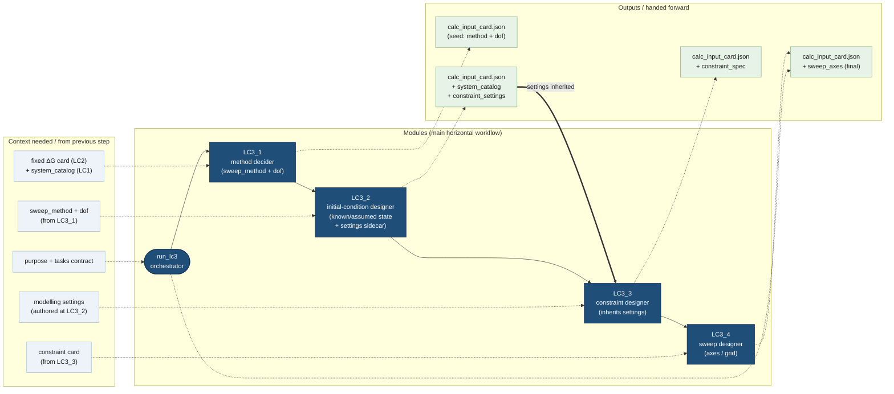

# LC3 — Solver-Para Card Building

The **LC3** stage of the calc-input-building pipeline turns the validated
LC2 free-energy markdown card (plus the LC1 system catalog) into a
**solver-ready `calc_input_card.json`**: the sweep method, the degrees of
freedom, the modelling regime, the starting state and the full constraint
algebra the numeric solver consumes verbatim.

## Individual-species support boundary

LC3's variable catalog lists `s.species`, `s.conc`, and `s.lnconc` handles, but
that visibility is not end-to-end solver support. LC3_2 `known`/`assumed`
species values are audit text stored under `_initial_conditions`; they are not
warm starts or soft priors. Re-authoring one in LC3_3 makes it an exact pin,
which is currently disabled, and manual opt-in reaches an unfinished API
mapping path.

```text
fixed ΔG card + system_catalog
        ─►  LC3_1 (method + dof)
        ─►  LC3_2 (fixed/deferred inputs + modelling settings)
        ─►  LC3_3 (constraint algebra, inherits settings)
        ─►  LC3_4 (sweep axes)
        ─►  calc_input_card.json
```

---

## Workflow diagram

The **center horizontal lane** is the module chain. The **top lane** shows the
context each module needs; the **bottom lane** shows what each module emits and
hands forward.



---

## Modules

### `LC3_solver_para_card_orchestrator.py` — stage entry point
Single top-level entry for the whole LC3 stage.

- **`configure_lc3_session(*, session_dir, history=None, stats=None,
  working_memory=None, debug=False)`** — binds the per-session side-channel
  once; each child stage is re-wired under a dedicated sub-directory
  (`call_dir/LC3_1` … `call_dir/LC3_4`).
- **`run_lc3(purpose, tasks=None, *, fixed_card_path, system_catalog_path,
  output_dir=None, debug=False, max_restarts=None)`** — runs the full chain:
  1. **LC3_1** — decide the `sweep_method` and `dof`; seed the single
     evolving `calc_input_card.json`.
  2. **LC3_2** — author fixed initial conditions, explicit L3_3 deferrals,
     **and** the modelling settings,
     folding `system_catalog` + `constraint_settings` into the same card.
  3. **LC3_3** — author the constraint algebra, **inheriting** the LC3_2
     settings (it does not re-choose them); append `constraint_spec` to the
     same card.
  4. **LC3_4** — design the sweep axes, grid, and explicit refinement
     decision; append them to the same card and validate it with the solver
     loader.
  5. Copy the final card to `calc_input_card.json` and write the summary.
- A deterministic tool error is normally repaired inside the current stage's
  ReAct loop. A stage may request a fresh LC3_1→LC3_4 pass when an earlier
  design premise must change; LC3_4 `FATAL_UPSTREAM` does this automatically.
  The default cap is two full restarts (three attempts total). Failed attempts
  remain under `restarts/`, and only a validated terminal card is promoted.
- **Returns** `{status, output_dir, purpose, tasks, sweep_method, dof,
  calc_input_card_path, initial_condition_card_path, initial_conditions,
  constraint_settings, sweep_constraints, final_card_path,
  lc3_1, lc3_2, lc3_3, lc3_4, stages_run, stages_skipped, attempts,
  restart_count, restart_limit, restart_exhausted, elapsed_s}`.

### `LC3_1_method_decider/` — sweep method + degrees of freedom
Inspects `purpose` / `tasks` against the fixed card and decides the
`sweep_method` (`pH_sweep`, `pourbaix_sweep`, `titration_sweep`,
`freeform_sweep`) and the problem `dof`. Seeds the single evolving
`calc_input_card.json` the downstream stages grow in place.

### `LC3_2_initial_condition_designer/` — initial conditions **and** settings
Runs **before** the constraint designer. An LLM lists everything already
**known** or reasonably **assumed** about the starting state (temperature,
ionic strength, fixed pH / redox, component totals) as an
**initial-condition card** — a constant-only subset of the LC3_3 constraint
syntax that the constraint designer can lift verbatim. A value intended as an
axis or derived relation is not pinned: it is explicitly recorded in
`deferred_json` as `swept` or `derived`, then L3_3 must close that exact handle.

This stage also **owns the modelling regime**: it authors the
`constraint_settings` block (folded into the evolving `calc_input_card.json`)
that LC3_3 inherits.

| setting | supported values | declaration rule | notes |
| --- | --- | --- | --- |
| `activity_model` | `ideal`, `davies` | required | Debye-Hückel is not implemented. |
| `solids` | `include`, `exclude` | required | no implicit inclusion choice |
| `redox_mode` | `axis`, `fixed`, `freeform`, `solve`, `excluded` | required | `solve` releases E_V against one global state-subtotal target |
| `ionic_strength_mode` | `fixed`, `auto`, `none` | required | `fixed` additionally requires an explicit numeric value |

### `LC3_3_constraint_designer/` — constraint algebra (inherits settings)
Authors the constraint card: the lambda-surface binds and the
`sweep_constraints` the solver enforces. It **inherits** the LC3_2 settings
through `run_l3_3(..., constraint_settings=...)` and must honour them — it
does **not** choose the modelling regime. The consistency contract:

- `ionic_strength_mode = fixed` → pin `s.ionic_strength`; `auto` or `none` →
  do **not** bind it.
- `redox_mode = axis` → add a redox axis; `solve` → leave E_V free and add
  exactly one global state-subtotal target; `excluded` → no redox coupling.

### `LC3_4_sweep_designer/` — sweep axes / grid (optional)
Designs the sweep axes and grid refinement for the chosen method. Loaded
optionally by the orchestrator; if the module is absent it is skipped and
the card carried out of LC3_3 becomes the final card.

### Agent-local standard templates — progressively disclosed route guidance

After LC3_1 selects a method, LC3_2--LC3_4 automatically load the template
owned by the current agent for its standard family. The files are colocated in
`_standard_initcond_templates`, `_standard_constr_templates`, and
`_standard_sweep_templates`, respectively:

- `pH_sweep` and `titration_sweep` → `speciation-path-design`;
- `pourbaix_sweep` → `predominance-map-design`;
- `freeform_sweep` → the standalone `freeform-sweep-design` skill.

Every post-method agent sees all three skill headers and receives read-only
`list_sweep_design_skills` / `read_sweep_design_skill` tools. It can inspect
the alternative family without preloading all templates. Each agent-local
`SKILL.md` contains only that stage's direct submission contract.
`sweep_template_router.py` performs discovery and progressive loading but
contains no scientific templates.

Each stage-local `freeform/` folder also owns a `gallery/` of less-standard
examples. In a freeform run, the agent may list the gallery, open useful
examples, and optionally recommend one inspected example as its best
structural analogue. Neither action gates the stage, and `best_example` may be
null. The evolving card stores `_meta.freeform_gallery_notes` in stage order;
each note preserves every example that stage inspected and, when present,
places the recommendation and rationale first. L3_3 and L3_4 receive the
accumulated upstream notes, while gallery readers remain bound to the current
stage.

If a deterministic stage error triggers a whole-LC3 restart, the failed
submission artifact captures that stage's latest gallery trace, including
examples inspected after the failed submission but before the restart request.
The restart context lists all failed-pass traces in a separate
`advisory_failed_pass` block. They are evidence for reconsidering the design,
not validated solver input: the fresh pass starts with an empty current-stage
trace and does not copy the failed recommendations into its evolving card.

`freeform_gallery_registry.json` is keyed by the canonical gallery ID, which
must also be the Markdown filename stem and frontmatter `example_id` in all
three stages. `freeform_gallery_registry.py` checks the stage, title, revision,
exact three-slice content hash, and registered solve status as one cross-stage
unit. A misaligned, unregistered, modified-after-validation, or non-passing
entry is quarantined from every agent-facing list/read/select tool without
hiding valid neighbors. Debug runs additionally execute the tiny no-network
cases in `freeform_gallery_validation.py` through the real numerical API and
log a structured quarantine report.

An agent read is deliberately layered. It begins with only that agent's L3_2,
L3_3, or L3_4 slice, then adds a supporting section containing the complete
minimal calc-input card generated from the same local solve-check definition.
The support card shows how the slices join, but is explicitly not a substitute
for the current stage's direct tool submission.

### normalizer helpers — authoritative variable catalog *(shared, hosted one level up)*
`build_variable_catalog(...)` produces the exact handles / id pools both
LC3_2 and LC3_3 reference, so the LLM never invents variable names. Cards are
parsed with `ast` and **never executed**. These modules now live in the
shared [`NIST_SRD46_normalizer_helpers/`](../../NIST_SRD46_normalizer_helpers/README.md)
package, under `constr_card_normalizer/` (`constr_variable_catalog.py`,
`constr_normalizer.py`).

---

## Artefact tree

```text
<output_dir>/
  LC3_1/                       — method + dof; seeds calc_input_card.json
  LC3_2/
    calc_input_card.json       — + system_catalog + constraint_settings
    …initial-condition debug files…
  LC3_3/
    calc_input_card.json       — + constraint_spec (inherits the settings)
    sweep_card.lc3_2.json      — residual spec snapshot (debug)
  LC3_4/
    calc_input_card.json       — + sweep_axes (when implemented)
  calc_input_card.json         — final solver-ready card
  summary/
    LC3_summary.json           — compact stage summary
```

---

## The inherited-settings contract

The modelling regime is **decided once, at LC3_2**, and **inherited
unchanged by LC3_3**. This keeps the starting state and the constraint
algebra mutually consistent: whatever LC3_2 records under
`constraint_settings` in the evolving card is exactly what LC3_3 honours.
No modelling mode is selected by default. LC3_2 must explicitly choose
`fixed`, `auto`, or `none`; fixed mode additionally requires the numeric ionic
strength. A missing declaration remains `Not defined` and blocks the card.
