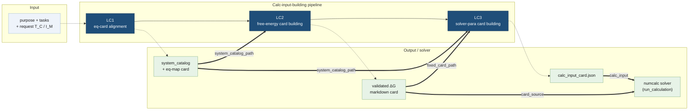

# SRD-46 Calc-Input-Building Agentic Pipeline

Turn a free-text **`purpose` + `tasks`** brief into a **solver-ready
`calc_input_card.json`** — then, optionally, run the numeric solver. This
pipeline is the *card-building* half of the SRD-46 analysis stack; the
numeric solver it feeds lives in `NIST_SRD46_core_numcalc_pipeline`.

```text
purpose + tasks
      │
      ▼
   LC1  ── eq-card alignment ........ system_catalog + eq-map card
      │
      ▼
   LC2  ── free-energy card building . validated ΔG markdown card
      │
      ▼
   LC3  ── solver-para card building . calc_input_card.json
      │
      ▼
 (optional) numcalc solver ........... sweep results
```

---

## Public API — `SRD46_calc_input_building_api.py`

A single front door exposes both halves of the workflow.

### Building half

```python
from NIST_SRD46_db_agent.NIST_SRD46_analysis_agent \
        .NIST_SRD46_calc_input_building_agentic_pipeline \
        .SRD46_calc_input_building_api import build_calc_input_card

result = build_calc_input_card(
    purpose="Map Cu speciation vs pH at fixed ionic strength",
    tasks="pH 2–12 sweep; include hydroxide and glycine complexes",
    output_dir=r"…/_outputs_user/<bucket>/<DB>/<Agent>/Diagnostics/cu_glycine_run",
)
# result["calc_input_card_path"]  → solver-ready calc_input_card.json
```

`build_calc_input_card(purpose, tasks="", *, output_dir, request_T_C=25.0,
request_I_M=0.1, water_system=True, debug=False)` drives **LC1 → LC2 → LC3**
and returns:

```python
{
  "status": "ok",                       # "failed" if any layer failed
  "output_dir": "…",
  "purpose": "…",                       # echoed contract
  "tasks": "…",                         # single prose string (never a list)
  "calc_input_card_path": "…/LC3/calc_input_card.json",
  "system_catalog_path":  "…/LC1/lc1_sweep_input.json",
  "eq_map_card_path":     "…/LC1/lc1_2_eqmap_card.json",
  "free_energy_card_path":"…/LC2/…/free_energy_card_validated.md",
  "lc1": {...}, "lc2": {...}, "lc3": {...},
  "elapsed_s": 0.0,
}
```

Each layer writes under its own sub-tree: `<output_dir>/LC1`, `.../LC2`,
`.../LC3`. The modelling regime (activity model, solids, redox /
ionic-strength mode) is decided by the **LC3_2 initial-condition designer**
and inherited by LC3_3 — it is **not** set through the API; only the default
`request_T_C` / `request_I_M` environment values are passed to LC1.

### Full pipeline (build → calculate)

```python
from …SRD46_calc_input_building_api import run_pipeline

result = run_pipeline(purpose, tasks, output_dir=out, run_solver=True)
# result["solver"]  → run_calculation(...) result dict
```

`run_pipeline(..., run_solver=False)` is exactly `build_calc_input_card`.
With `run_solver=True` the final card (and the LC2 markdown card it points
at) is handed to `run_calculation`, and the solver result is attached under
`result["solver"]`.

### Calculation half (re-exported)

For callers that already hold cards, the numeric entry points are
re-exported verbatim from `NIST_SRD46_core_numcalc_pipeline` so everything
is importable from one module:

```python
from …SRD46_calc_input_building_api import (
    load_calc_input, dump_calc_input, resolve_card_source,
    run_calculation, SUPPORTED_SWEEP_METHODS, CalcInput,
)
```

`SUPPORTED_SWEEP_METHODS` → `('pH_sweep', 'pourbaix_sweep',
'titration_sweep', 'freeform_sweep')`.

---

## Workflow diagram



---

## Layer responsibilities

| Layer | Orchestrator | Input | Output |
| --- | --- | --- | --- |
| **LC1** | `run_lc1` | `purpose`, `tasks` | `lc1_sweep_input.json` (system_catalog) + `lc1_2_eqmap_card.json` |
| **LC2** | `run_lc2` | `system_catalog_path`, `lc1_2_eqmap_card_path` | validated free-energy markdown card |
| **LC3** | `run_lc3` | `fixed_card_path` (LC2 card), `system_catalog_path` | `calc_input_card.json` |

See each layer's own `README.md` for the internal module chain:

- [LC1 — Eq-Card Alignment](LC1_SRD46_eq_card_alignment/README.md)
- [LC2 — Free-Energy Card Building](LC2_free_energy_card_building/README.md)
- [LC3 — Solver-Para Card Building](LC3_solver_para_card_building/README.md)

Architecture and support-boundary documents:

- [LC1_3 estimation module](LC1_SRD46_eq_card_alignment/LC1_3_estimate_eq_stability_dispatch/README.md)

---

## Directory layout

```text
NIST_SRD46_calc_input_building_agentic_pipeline/
  SRD46_calc_input_building_api.py      — public end-to-end API (this doc)
  SRD46_calc_input_building_config.py   — shared LLM config re-export
  LC1_SRD46_eq_card_alignment/          — layer 1 (+ README)
  LC2_free_energy_card_building/        — layer 2 (+ README)
  LC3_solver_para_card_building/        — layer 3 (+ README)
  card_management_helpers/              — shared card I/O helpers
  _DEBUG_input/ _outputs_user/<bucket>/<DB>/<Agent>/Diagnostics/ _DEBUG_script/   — fixtures + smoke tests
  _ref_eq_cards_storage/                — reference eq-card corpus
```

---

## Notes

- **Namespace packages.** Several sub-packages have no `__init__.py`; the API
  bootstraps `sys.path` (using `Path(__file__).absolute()`, never
  `.resolve()`, to keep mapped-drive roots intact) for the numcalc pipeline
  and the `SRD46_research_agent` root. Benign Pylance "import could not be
  resolved" warnings for `numcalc_input_cards_reader` and
  `SRD46_numcalculator_api` are expected — they resolve at runtime.
- **Independent of the analysis-orchestration half.** This pipeline does not
  depend on `analysis_agent_orchestration` (the S1–S8 analysis pipeline); the
  parent package import is lazy so a mid-refactor module there cannot block
  the calc-input-building API.
```
