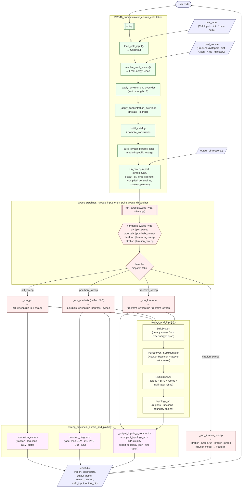

# NIST SRD-46 Core Numerical-Calculation Pipeline — Architecture

## 1. Overview

`NIST_SRD46_core_numcalc_pipeline` is the unified calculation engine
for aqueous speciation and electrochemical equilibrium analysis built
on NIST SRD-46. It exposes a **single public entry point**:

```python
from SRD46_numcalculator_api import run_calculation, load_calc_input
```

Internally, every sweep (1-D pH, N-D Pourbaix, freeform, titration)
is executed through the **unified sweep dispatcher**
(`sweep_pipelines._sweep_input_entry_point.sweep_dispatcher.run_sweep`).
The top-level API is a thin adapter that resolves a card source + a
calc-modes JSON and forwards a single `run_sweep` call.

> The architecture below describes the supported Tier-1 path. Partial
> individual-species pin compiler/numerical code exists, but report mapping,
> dispatch, and result plumbing are incomplete; there is no species warm-start
> feature.

---

## 2. Directory tree

```
NIST_SRD46_core_numcalc_pipeline/
│
├── SRD46_numcalculator_api.py            ← public API (run_calculation)
├── README.md                              high-level overview + quick start
├── ARCHITECTURE.md                        ← this file
├── API_AND_SETTINGS.md                    full API + settings reference
│
├── numcalc_input_cards_reader/            § Inputs (cards + calc-modes)
│   ├── card_md_input_reader.py            resolve card source → FreeEnergyReport
│   ├── calc_json_input_reader.py          CalcInput dataclass + JSON schema
│   └── README.md
│
├── thermodynamics_helpers/                § FreeEnergyReport + canonical μ° + activity
│   ├── thermodynamic_constants.py         R, F, NERNST_FACTOR, Kw, ...
│   ├── electrolyte_activity_models/
│   │   ├── activity_model.py              compute_ionic_strength, recompute_activity_at_I
│   │   ├── solution_models_activity_coeff.py   Davies / Debye–Hückel / ideal
│   │   └── ARCHITECTURE.md
│   ├── gibbs_value_calc_from_logK_eq_map_helpers/
│   │   ├── free_energy_network_calc_helper.py  ★ FreeEnergyReport
│   │   ├── canonical_standard_state_rulebook.py
│   │   ├── micro_valence_calculator.py    optional RDKit valence
│   │   └── ARCHITECTURE.md
│   └── README.md
│
├── solvers_and_topology/                  § Numerical solvers + topology
│   ├── solver_core_api.py                 shared dataclasses
│   ├── solver_settings.py                 tolerances / clamps
│   ├── support_TD_helpers/                THE bridge to thermodynamics_helpers
│   │   ├── activity_model_entry_point.py
│   │   └── TD_constants_entry_point.py
│   ├── numerical_solvers/                 PointSolver + SolidManager
│   ├── _input_solver_helper/
│   │   └── built_system_from_dGreport.py  FreeEnergyReport → BuiltSystem
│   ├── nd_grid/                           NDGridSolver + retry phases + refiner
│   │   ├── grid_solver.py                 ★ NDGridSolver (the ONE public class)
│   │   ├── data_types.py                  GridAxis · NDGrid · PointResult · …
│   │   ├── grid_solver_sweep_retry_patching/
│   │   └── grid_dynamic_refiner/
│   └── _output_topology_mapper/
│       ├── topology_dispatcher.py
│       └── topology_nd/                   regions · junctions · boundary builder (2-D fix)
│
├── sweep_pipelines/                       § Per-method handlers + dispatcher + output
│   ├── sweep_method_registry_api.py       sweep_id → metadata + tools
│   ├── _path_utils.py                     long_path() / safe_mkdir() (Windows)
│   ├── _sweep_input_entry_point/
│   │   ├── sweep_dispatcher.py            ★ run_sweep() — single dispatch
│   │   ├── constraint_compiler.py         catalog + sweep_constraints compile
│   │   ├── sweep_constraints_expander.py
│   │   └── initial_condition_normalizer.py
│   ├── pH_sweep/                          1-D pH speciation
│   ├── pourbaix_sweep/                    unified N-D Pourbaix sweep (1, 2, 3 wired)
│   ├── freeform_sweep/                    N-D catch-all sweep
│   ├── titration_sweep/                   added-volume + dilution (via freeform)
│   └── _output_and_plotting/
│       ├── _sweep_output_and_plotting_registry.py
│       ├── _output_topology_compactor/    dense fine raster + topology JSON
│       ├── pourbaix_diagrams/             label-map CSV + 2-D PNG + 3-D PNG
│       ├── speciation_curves/             fraction / log-c plots & CSV
│       └── freeform_output/               (reserved)
│
├── _DEBUG_input/                          § fixtures
├── _outputs_user/<bucket>/<DB>/<Agent>/Diagnostics/                         § fixture outputs
└── _DEBUG_script/                         § smoke tests & probes
    └── _run_pourbaix.py                   numbered scenarios (01 … 09)
```

---

## 3. Single-entry-point architecture



The top-level API performs **only** input adaptation; all per-method
logic lives in the dispatcher and its handlers. All real sweep
handlers (`pH_sweep`, `pourbaix_sweep`, `freeform_sweep`) traverse
the same solver chain
`BuiltSystem` → `PointSolver` → `NDGridSolver` → `topology_nd`.

---

## 4. Two input families

### 4.1 Card source

A *card source* is anything `card_md_input_reader.resolve_card_source`
accepts:

| Source                                  | Resolution                                |
|-----------------------------------------|-------------------------------------------|
| `FreeEnergyReport`                      | used as-is                                |
| `dict` / `*.json` path                  | `compute_free_energy_network(...)`        |
| `*.md` path                             | parsed via MD card reader                 |
| directory                               | first match of card-file priority list, then any `*.md` |

Card-file priority inside a directory:

```
free_energy_card_numcalc.md
free_energy_card_enriched.md
free_energy_card.md
free_energy_card_with_include.md
```

### 4.2 Calc-modes input (`CalcInput`)

Defined in
[numcalc_input_cards_reader/calc_json_input_reader.py](numcalc_input_cards_reader/calc_json_input_reader.py):

```python
@dataclass
class CalcInput:
    sweep_method:       str
    sweep_axes:         List[SweepAxis]
    ionic_strength:     IonicStrengthSpec     # fixed | auto | none
    temperature_C:      Optional[float]
    total_metals:       Dict[str, float]
    total_ligands:      Dict[str, float]
    grid_refine:        GridRefineSpec
    use_activity:       bool = True
    include_solids:     bool = True
    output_dir:         Optional[str]
    system_catalog:     Dict[str, Any]        # v3 schema
    sweep_constraints:  Dict[str, Any]        # v3 dict-shape
    extras:             Dict[str, Any]
```

`CalcInput.axis_or_default(name)` falls back to
`DEFAULT_AXES_BY_METHOD[method]` when a method's expected axis is
absent in the JSON.

---

## 5. CalcInput → run_sweep translation

`SRD46_numcalculator_api._build_sweep_params` is the *only* place that
maps `CalcInput` fields onto dispatcher kwargs:

| Method            | Kwargs forwarded to `run_sweep`                                                                                                |
|-------------------|--------------------------------------------------------------------------------------------------------------------------------|
| `pH_sweep`        | `pH_range`, `n_points`                                                                                                         |
| `pourbaix_sweep`  | Unified N-D handler: subsets of `pH_range`+`n_pH`, `E_range`+`n_E`, `aw_range`+`n_aw` (declare `a_w` axis → 3-D); plus explicit `refine_factor` + `n_layers` |
| `freeform_sweep`  | `axes` list + explicit `refine_factor` + `n_layers`; no separate `coarse_only` switch                                              |
| `titration_sweep` | `axes` (single `V_added_mL` axis) + `volume_initial_mL`, `titrant_conc`, `fixed_pH`                                          |

Common to all: `use_activity`, `include_solids`, and the compiled
`compiled_constraints` object.  Refinement values are forwarded only to
Pourbaix and freeform routes; card mode `none` maps to `n_layers=0` and
`refine_factor=None`.
Ionic-strength `mode == "none"` short-circuits to `use_activity=False`
and `ionic_strength=None`.

---

## 6. Sweep pipelines

### 6.1 Dispatcher

`sweep_pipelines/_sweep_input_entry_point/sweep_dispatcher.py` exposes:

- `run_sweep(source, sweep_type, *, output_dir, temperature_K,
  ionic_strength, debug, compiled_constraints, **sweep_params)`
- `parse_source(source, temperature_K)` — accepts `FreeEnergyReport`,
  paths, dicts.
- `build_solver_chain(...)` — common solver-chain construction.

Aliases recognised in `sweep_type`:
`pH | ph | pH_sweep`, `pourbaix | pourbaix_sweep`,
`freeform | freeform_sweep`, `titration | titration_sweep`.

### 6.2 Per-method handlers

| Package                              | Sweep IDs                | Notes                                                       |
|--------------------------------------|--------------------------|-------------------------------------------------------------|
| [sweep_pipelines/pH_sweep/](sweep_pipelines/pH_sweep/)               | `pH_sweep`         | NDGridSolver(ndim=1) on shared solver chain                  |
| [sweep_pipelines/pourbaix_sweep/](sweep_pipelines/pourbaix_sweep/)   | `pourbaix_sweep`   | Unified N-D; per-layer snapshot callback; adaptive refine    |
| [sweep_pipelines/freeform_sweep/](sweep_pipelines/freeform_sweep/)   | `freeform_sweep`   | Arbitrary axes; wide CSV + topology JSON                     |
| [sweep_pipelines/titration_sweep/](sweep_pipelines/titration_sweep/) | `titration_sweep`  | Added-volume axis + dilution bindings → freeform pipeline    |

### 6.3 Output & plotting

[sweep_pipelines/_output_and_plotting/](sweep_pipelines/_output_and_plotting/)
centralises:

- `pourbaix_diagrams/` — label-map CSV, 2-D PNG, 3-D PNG.
- `speciation_curves/` — fraction / log-conc CSV + plots.
- `_output_topology_compactor/` — bottom-up topology graph
  construction (regions → junctions → boundary chains), RDP
  simplification, dense fine label raster assembly.

---

## 7. Solvers & topology

`solvers_and_topology/` houses everything that consumes a
`FreeEnergyReport` and produces solved point/grid results:

- `_input_solver_helper/built_system_from_dGreport.py` — projects a
  `FreeEnergyReport` into the solver-ready `BuiltSystem`
  (numpy arrays for stoichiometry, mass balance, dissolution, redox).
- `numerical_solvers/` — Newton-Raphson `PointSolver`, `SolidManager`
  active-set precipitation loop, auto-I outer iteration.
- `nd_grid/` — N-dimensional grid container + 5-phase coarse solve +
  multi-layer cascaded refinement.
- `_output_topology_mapper/topology_nd/` — N-D boundary chain
  construction, junction extraction, vertex-based facet ordering.

The **2-D Pourbaix diagonal-artifact fix** lives in
`topology_nd/boundary_builder.py` (`_fit_line_2d` returns a
collinearity residual; `_refine_interior_junctions_2d` gates SVD-based
junction relocation by `residual ≤ 0.25` and `max_span ≤ min(spacing)`).

---

## 8. Key dataclasses

### `FreeEnergyReport`
**Module:** `thermodynamics_helpers/.../free_energy_network_calc_helper.py`

Central thermodynamic container — species (μ°, logβ, stoichiometry,
phase), reactions (ΔG°), components (metals/ligands), valence groups,
redox couples, total concentrations, ionic strength, temperature.

### `BuiltSystem`
**Module:** `solvers_and_topology/_input_solver_helper/built_system_from_dGreport.py`

Solver-ready numpy arrays — `log_beta_eff`, `stoich_pq/r/s`,
`nu_matrix`, `C_total`, dissolution arrays, derived redox tokens,
water-stability lines. Same layout serves pH-only and full Pourbaix
sweeps. A redox-enabled pH-only sweep uses an explicitly fixed `E_V`;
a redox-excluded sweep instead keeps each declared oxidation state as an
independent zero-reference component, sets electron stoichiometries to zero,
and has no potential coordinate. Redox exclusion is not `E_V = 0`.

### `CalcInput`
**Module:** `numcalc_input_cards_reader/calc_json_input_reader.py`

Calc-modes spec (sweep method + axes + environment + concentrations +
constraints + options), serialisable via `to_dict` /
`load_calc_input` / `dump_calc_input`. Legacy v1/v2 JSONs are
auto-translated by an internal shim.

### `NDGrid` / `SolveResult` / `ElementResult` / `TopologyND`
**Module:** `solvers_and_topology/nd_grid/data_types.py` +
`grid_solver.py`

The grid container, the bundle returned by `NDGridSolver.solve()`, the
per-element entry containing coarse scheduler facets, refined points, the
final effective label map, final topology, and explicitly named coarse
diagnostic topology, and the dim-agnostic topology container. Refined
junctions, boundaries, and regions are reconstructed only from the final
effective label field.

---

## 9. I/O contract (top-level)

### Input

| What                | Form                                                          |
|---------------------|---------------------------------------------------------------|
| Card source         | `FreeEnergyReport` · dict · `.json` · `.md` · directory       |
| Calc-modes          | `CalcInput` · dict · JSON file path                           |
| Output dir          | `str` / `Path` (created if missing)                           |

### Output (`run_calculation` result dict)

| Key                | Type                                | Notes                                   |
|--------------------|-------------------------------------|-----------------------------------------|
| `report`           | `FreeEnergyReport`                  | After environment/concentration overrides. |
| `grid`             | `NDGrid` (Pourbaix/freeform/pH)     | Coarse + refined sub-points.            |
| `built`            | `BuiltSystem`                       | Solver-ready arrays.                    |
| `per_element`      | `Dict[str, ElementResult]`          | Pourbaix / freeform only.               |
| `speciation_curve` | `SpeciationCurve`                   | pH sweep only.                          |
| `topology`         | `TopologyND`                        | When extracted.                         |
| `output_paths`     | `Dict[str, str]`                    | CSV / PNG / JSON files written.         |
| `sweep_method`     | `str`                               | Canonical sweep id.                     |
| `calc_input`       | `CalcInput`                         | The resolved input (post-shim).         |
| `output_dir`       | `str`                               | Where artefacts landed.                 |

### On-disk output files (Pourbaix 2-D, illustrative)

```
<output_dir>/
├── pourbaix_map_<system>_<E>.csv        16×16 coarse + 64×64 fine label map
├── pourbaix_<system>_<E>.png            2-D Pourbaix diagram
├── topology_<system>_<E>.json           features_0d / features_1d / regions
├── topo_csv_<system>_<E>/
│   ├── metadata.json
│   └── features_*.csv                   per-feature breakdown
├── speciation_full_<system>.csv         every evaluated grid point
├── _snapshots/snap_NN_*.png             per-layer refinement snapshots
└── sweep_log.txt                        timestamped pipeline log
```

---

## 10. Windows long-path discipline

The pipeline runs against UNC shares and produces output paths that
routinely exceed 260 characters. All file writes inside
`sweep_pipelines/` go through
[`sweep_pipelines/_path_utils.py`](sweep_pipelines/_path_utils.py):

| Helper            | Replaces                                                              |
|-------------------|-----------------------------------------------------------------------|
| `long_path(p)`    | the bare `path` passed to `open()`, `savefig()`, `shutil.copy2`       |
| `safe_mkdir(p)`   | `Path.mkdir(parents=True, exist_ok=True)` (pathlib ignores `\\?\` on Windows) |

Both are no-ops on non-Windows hosts.

---

## 11. Smoke tests

```powershell
cd NIST_SRD46_core_numcalc_pipeline
python _DEBUG_script\_run_pourbaix.py 04   # 2-D Pourbaix Fe+Cu+glycine+citrate
python _DEBUG_script\_run_pourbaix.py 03   # 3-D Pourbaix (pH × E_V × a_w)
```

Outputs land under `_outputs_user/<bucket>/<DB>/<Agent>/Diagnostics/OUT_test_<NN>_*/`.

---

## 12. External dependencies

| Dependency                                            | Usage                                         |
|-------------------------------------------------------|-----------------------------------------------|
| `numpy`                                               | All solver arrays, grid operations.           |
| `matplotlib`                                          | Plotting (Agg backend in headless runs).      |
| `RDKit`                                               | Optional — `micro_valence_calculator.py`.     |
| `NIST_SRD46_core_db_search_tools`                     | Card builder DB queries.                      |
| SQLite DBs in `NIST_SRD46_core_db_storage/`           | `srd46_cards.db`, `srd46_equilibrium_maps.db`.|
