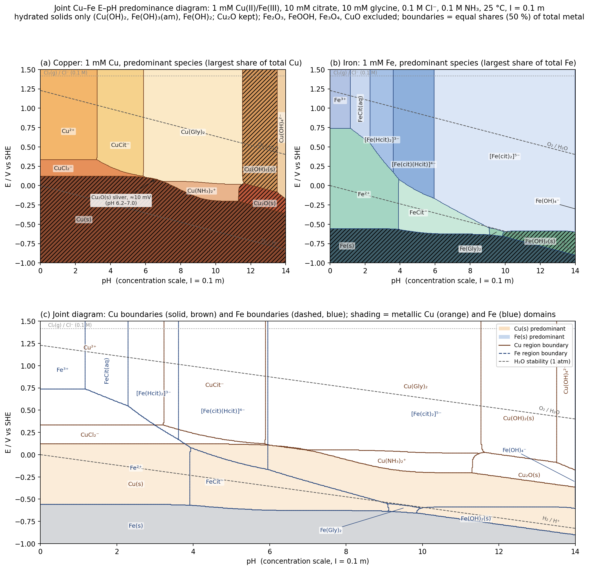

[Joint Cu–Fe Pourbaix diagram — citrate/glycine/Cl/NH3 electrolyte](pourbaix_CuFe_report.html)

*Presented file: `pourbaix_constants_used.csv`*

*Presented file: `pourbaix_boundaries_junctions.csv`*

The published page holds the diagram plus every table (constants, regions, all 36 boundaries with closed-form equations, junctions, sub-speciation vs pH); the PNG and two CSVs are attached for reuse.

**Method.** Full mass-balance speciation (Cu, Fe, citrate, glycine, Cl⁻, NH₃ at every point of a 701 × 626 grid), concentration constants at I = 0.1 m (NIST/Martell–Smith where available; I = 0 data and E° values Davies-corrected). Cells are coloured by the species holding the largest share of the metal, so solid/solution boundaries are 50 %-precipitated lines and aqueous ones are equal-concentration lines. pH is p[H]; add ≈0.11 for the activity scale.

**Partitioning**

- Cu(II): Cu²⁺ (pH < 3.2, ~20 % CuCl⁺) → CuCit⁻ (3.2–5.9) → Cu(Gly)₂ (5.9–11.5; Cu(NH₃)₄²⁺ never reaches 1 %) → Cu(OH)₂(s) (11.5–13.5) → Cu(OH)₄²⁻.
- Cu(I): two disjoint windows — CuCl₂⁻/CuCl₃²⁻ (79/20 %) at +0.12…+0.33 V for pH 0–6.0, and Cu(NH₃)₂⁺ at ≈0…−0.20 V for pH 7.0–11.3; between them Cu(I) disproportionates apart from a ~10 mV Cu₂O sliver (pH 6.2–7.0). Cu₂O is the Cu(I) phase above pH 11.3.
- Fe(III): Fe³⁺ (pH < 1.2) → FeCit → [Fe(Hcit)₂]³⁻ (2.3–3.6) → [Fe(cit)(Hcit)]⁴⁻ (3.6–5.95) → [Fe(cit)₂]⁵⁻ (5.95–14). With fresh Fe(OH)₃(am) (log *Ks0 = 4.89) **no ferric-hydroxide region appears**; Fe(OH)₄⁻ reaches 50 % only at pH 14.0. Sensitivity: an aged hydroxide (log *Ks0 = 3.2) brings Fe(OH)₃(s) in above pH 13.1.
- Fe(II): Fe²⁺ (pH < 3.9) → FeCit⁻ (3.9–9.1) → Fe(Gly)₂ (9.1–9.9) → Fe(OH)₂(s).

**Principal lines (solver constants, V vs SHE; log[L] = free ligand)**
- Cu²⁺/CuCl₂⁻: E = 0.4527 + 0.1183·log[Cl] = +0.334; CuCl₂⁻/Cu: +0.122; Cu²⁺/CuCit⁻ at pH 3.23 (log[Cit] = −5.90); CuCit⁻/Cu(Gly)₂ at pH 5.89.
- Cu(Gly)₂/Cu(NH₃)₂⁺: E = −0.1061 − 0.1183·log[Gly] + 0.1183·log[NH₃] (+0.054 → +0.018 V); Cu(NH₃)₂⁺/Cu: E = −0.3231 − 0.1183·log[NH₃] (+0.046 at pH 7 → −0.202 at pH ≥ 10.4).
- Cu₂O/Cu: E = 0.4647 − 0.0592·pH; Cu(OH)₂/Cu₂O: E = 0.7138 − 0.0592·pH; Cu(Gly)₂/Cu(OH)₂ at pH = 13.588 + log[Gly] = 11.53.
- Fe³⁺/Fe²⁺: +0.739 (pH < 1.2); the Fe(III)/Fe(II) line then falls to +0.174 (pH 3.6), −0.162 (pH 5.95), −0.546 (pH 9.1) and sits at E = −0.826 − 0.1183·log[Cit] ≈ −0.59 V for pH 10–14 ([Fe(cit)₂]⁵⁻/Fe(OH)₂).
- Fe²⁺/Fe: −0.557; FeCit⁻/Fe: E = −0.6875 − 0.0296·log[Cit] (−0.57 → −0.63); Fe(OH)₂/Fe: E = −0.0718 − 0.0592·pH.

**Junctions:** Cu — (3.21, +0.334) Cu²⁺/CuCit⁻/CuCl₂⁻; (5.87, +0.122) CuCit⁻/CuCl₂⁻/Cu(Gly)₂; (5.98, +0.108) Cu(s)/CuCl₂⁻/Cu(Gly)₂; (6.20, +0.099) Cu(s)/Cu₂O/Cu(Gly)₂; (6.96, +0.055) near-degenerate Cu(Gly)₂/Cu(NH₃)₂⁺/Cu₂O/Cu(s); (11.29, −0.202); (11.47, +0.014); (11.61, +0.026); (13.51, −0.086). Fe — (1.17, +0.738); (2.29, +0.550); (3.61, +0.174); (3.91, −0.566); (3.93, +0.078); (5.95, −0.162); (9.07, −0.546); (9.09, −0.634); (9.83, −0.654); (9.95, −0.598).

**Design implication:** the Cu/Fe deposition gap is 0.68 V in acid and narrowest (≈0.48 V) at pH 9–10, and Fe deposition lies 0.07–0.56 V below the H₂ line everywhere. The one result to treat with care is the no-Fe(OH)₃ finding, which hinges on the alkoxide-deprotonated [Fe(cit)₂]⁵⁻ constant (Vukosav et al., converted with the citrate alcohol pKa = 14.4) — the page's caveat section quantifies this and the other flagged constants (Cu(I)–ammine, ternary Cu(Gly)(NH₃)ₙ omitted).
