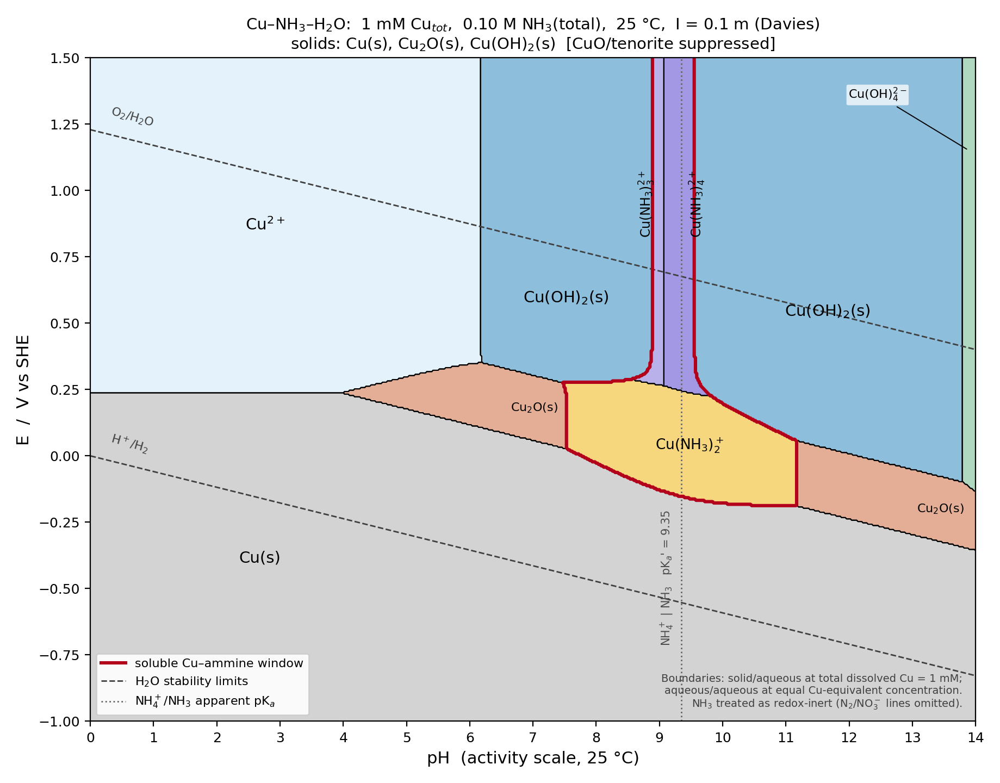

**Where soluble Cu–ammine complexes predominate** (red outline in the figure), 1 mM Cu, 0.1 M NH₃(total), 25 °C, I = 0.1 m:

**1. Cu(I) — Cu(NH₃)₂⁺, the main window.** pH ≈ 7.5–11.2, between the Cu(s) line (≈ −0.19 V at pH ≥ 10) and the Cu(II) boundary (≈ +0.29 V at its highest):

| pH | E lower (vs Cu(s)) | E upper | what lies above |
|---|---|---|---|
| 8.0 | −0.03 V | +0.28 V | Cu(OH)₂(s) |
| 9.0 | −0.13 V | +0.27 V | Cu(NH₃)₃²⁺ |
| 9.5 | −0.16 V | +0.24 V | Cu(NH₃)₄²⁺ |
| 10.0 | −0.18 V | +0.20 V | Cu(OH)₂(s) |
| 11.0 | −0.19 V | +0.08 V | Cu(OH)₂(s) |

Outside pH 7.5–11.2, Cu₂O(s) takes over from the diammine. The lower line sits ~0.4 V above the H₂ line, so metallic Cu is unstable toward Cu(NH₃)₂⁺ in this pH range even in the absence of O₂.

**2. Cu(II) — Cu(NH₃)₃²⁺ / Cu(NH₃)₄²⁺, a narrow notch only.** pH ≈ 8.6–9.8 (triammine 8.6–9.05, tetraammine 9.05–9.8), for E above ≈ +0.24 to +0.29 V (in practice capped by the O₂/H₂O line, ≈ +0.70 V at pH 9). Everywhere else in the Cu(II) field, 1 mM Cu precipitates as Cu(OH)₂(s).

**Caveat — the Cu(II) notch is marginal.** Dissolved Cu(II) in equilibrium with Cu(OH)₂(s) peaks at only ~2 mM near pH 9.2, so the notch width hinges on log β₄ − log *Ks0, uncertain by ~±0.3 across the literature:

| variant | Cu(II)-ammine window |
|---|---|
| base set (below) | pH 8.6–9.8 |
| no activity corrections (I = 0) | 8.9–9.4 |
| Bjerrum ammine constants (log β₄ = 12.67) | 8.2–10.4 |
| log *Ks0(Cu(OH)₂) = 8.34 (CRC Ksp 2.2×10⁻²⁰) | none |
| log *Ks0 = 8.94 (fresh precipitate) | 6.4–10.1 |
| 0.5 M total NH₃ instead of 0.1 M | 5.7–11.5 (Cu(I) window: 5.7–12.6) |

The Cu(I) window is robust to all of these; log β₂ = 10.86 makes Cu(NH₃)₂⁺ beat Cu₂O comfortably.

**Model and data.** Davies activity coefficients (A = 0.509); NH₄⁺ pKₐ 9.244 (apparent 9.35 on the a(H⁺) scale); ammonia mass balance includes Cu-bound NH₃; solid/aqueous boundaries at total dissolved Cu = 1 mM. Constants at I = 0: E°(Cu²⁺/Cu) 0.339 V, E°(Cu⁺/Cu) 0.518 V (NBS ΔfG°); Cu₂O + 2H⁺ log K = −1.55; Cu(OH)₂(s) log *Ks0 = 8.64; Cu(II) hydrolysis log *β₁₋₄ = −7.95, −16.2, −26.6, −39.7 (IUPAC 2007) plus Cu₂(OH)₂²⁺/Cu₃(OH)₄²⁺; Cu(II)–NH₃ log β₁₋₄ = 4.04, 7.47, 10.27, 11.75 (NIST 46 I = 0 set, β₅ = 11.2); Cu(I)–NH₃ log β₁,₂ = 5.93, 10.86. CuO suppressed as requested; Cu(I) hydroxo complexes omitted (they matter only above pH ≈ 13.8 at this concentration); NH₃ treated as redox-inert.

*Presented file: `pourbaix_cu_nh3.py`*

The script keeps every constant in one dictionary at the top, so you can swap in your preferred stability constants or change the ammonia concentration and re-run.
