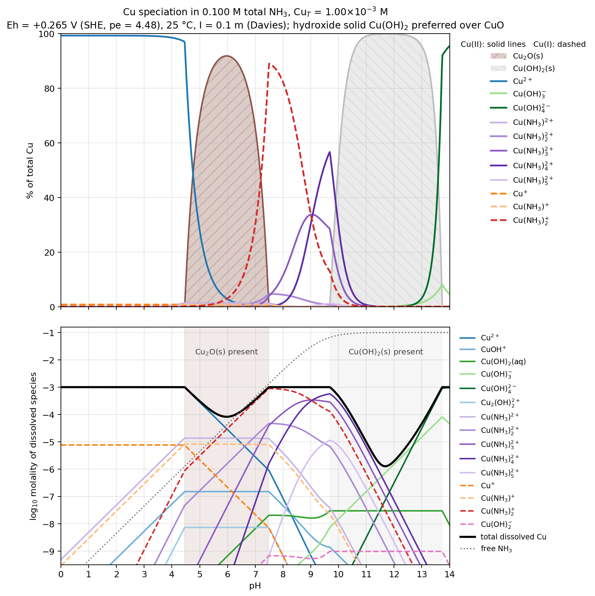

*Presented file: `cu_nh3_speciation.csv`*

*Presented file: `cu_nh3_speciation.py`*

The diagram (top: % of total Cu; bottom: log molality of dissolved species) plus the full data grid (0.02 pH steps) and the solver script are attached. Mass balances close to 1e-12; Cu metal never becomes stable (SI ≤ −0.9 everywhere).

**What the sweep shows at Eh = +0.265 V (pe = 4.48)**

| pH range | Dominant form | Notes |
|---|---|---|
| 0 – 4.4 | Cu²⁺ (~99%) | ~0.8% Cu⁺; NH₃ is all NH₄⁺, so no complexation |
| 4.5 – 7.5 | **Cu₂O(s)** | Peaks at 92% near pH 6.0; dissolved Cu minimum 8.2×10⁻⁵ M; the dissolved fraction is Cu²⁺ at low pH, then Cu(NH₃)₂⁺ |
| 7.5 – 9.7 | All dissolved | Cu(NH₃)₂⁺ (Cu(I)) peaks at 89% at pH 7.5; Cu(I)/Cu(II) crossover at pH 8.7; then Cu(NH₃)₃²⁺ (34% at 9.0) → Cu(NH₃)₄²⁺ (57% at 9.7) |
| 9.7 – 13.7 | **Cu(OH)₂(s)** | >99% at pH 11–12.5; dissolved Cu minimum 1.3×10⁻⁶ M at pH 11.7 |
| 13.7 – 14 | Cu(OH)₄²⁻ | 95% at pH 14, with ~5% Cu(OH)₃⁻ |

Two features are non-obvious and worth calling out. First, Cu(I) is the dominant *dissolved* form between pH ~6 and 8.7 even though the free-ion ratio is Cu²⁺:Cu⁺ ≈ 60:1, because Cu(NH₃)₂⁺ (log β₂ = 10.86) outcompetes the Cu(II) ammines at the low free-NH₃ levels available below the NH₄⁺ pKₐ. Second, 0.1 M ammonia keeps Cu fully dissolved only in a narrow window (7.5–9.7); above that, Cu(OH)₂ wins over Cu(NH₃)₄²⁺ at 10⁻³ M Cu, and Cu(OH)₂ redissolves only near pH 13.7 as the hydroxo anions take over.

**Constants used** (25 °C, I = 0, activity scale; Davies with A = 0.509 gives γ₁ = 0.78, γ₂ = 0.37 at I = 0.1 m): E°(Cu²⁺/Cu⁺) = 0.159 V, E°(Cu⁺/Cu) = 0.520 V; Cu(II) log β(NH₃)₁₋₅ = 4.04, 7.47, 10.27, 11.75, 11.23; Cu(I) log β₁,₂ = 5.93, 10.86; Cu(II) hydrolysis log *β = −7.95, −16.2, −26.6, −39.6 (mono), −10.6 (Cu₂(OH)₂²⁺), −21.1 (Cu₃(OH)₄²⁺); Cu(I) Cu(OH)₂⁻ log *β₂ ≈ −16.0; pKₐ(NH₄⁺) = 9.245; Cu(OH)₂(s) log *Kₛ₀ = 8.67 (tenorite would be ~7.6, i.e. ~1 log unit less soluble); Cu₂O(s) + 2H⁺ = 2Cu⁺ + H₂O log K = −1.55.

Caveats: "hydroxide preferred" was applied to Cu(II) only — there is no well-characterized Cu(I) hydroxide phase, so cuprite is the Cu(I) solid. The Cu(I)–hydroxo constant is the least certain value in the set, but it never exceeds 10⁻⁹ M here. Mixed ammine–hydroxo Cu(II) complexes are not in standard compilations and were omitted. Ionic strength is held at 0.1 m throughout (physically inconsistent below pH ~1, where the acid alone exceeds that). The solid onsets (pH 4.5, 9.7) are sensitive to the ±0.1–0.2 log-unit uncertainties in the solubility products; all constants sit in one table at the top of the script if you want to substitute your own database.
