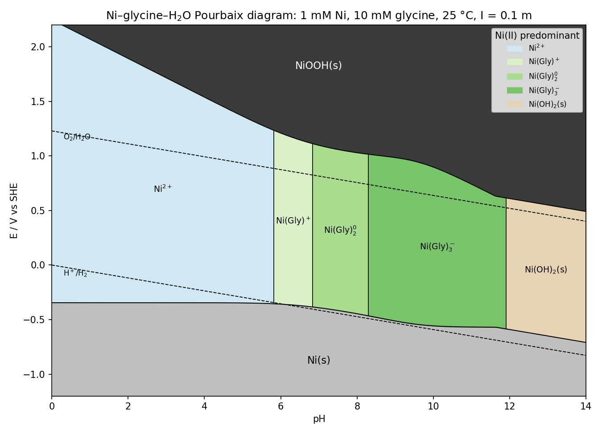

*Presented file: `Ni_glycine_pourbaix_boundaries.csv`*

**Stability window of the soluble Ni-glycinate complexes**

At 1 mM Ni / 10 mM glycine, the glycinates are the predominant Ni(II) form from **pH 5.8 to 11.9**, bounded below by Ni(s) and above by NiOOH(s):

| Complex | pH range (predominant) | E window (V vs SHE) |
|---|---|---|
| Ni(Gly)⁺ | 5.8 – 6.8 | −0.36 → +1.25 (pH 5.8) to −0.37 → +1.13 (pH 6.8) |
| Ni(Gly)₂⁰ | 6.8 – 8.3 | −0.37 → +1.13 to −0.46 → +1.02 |
| Ni(Gly)₃⁻ | 8.3 – 11.9 | −0.46 → +1.02 (pH 8.3) to −0.58 → +0.62 (pH 11.9) |

Key features:

- **Ni(OH)₂ precipitation is pushed from pH ≈ 7.8 (glycine-free, 1 mM) up to pH 11.9.** Above that, the solid holds >50 % of the nickel; Ni(Gly)₃⁻ still carries ~35 % at pH 12 and a few percent at pH 13.
- **Complexation depresses the Ni(s)/Ni(II) line** by up to ~0.24 V (free Ni²⁺ falls from 10⁻³ M at pH 4 to 3×10⁻¹¹ M at pH 11), so Ni electrodeposition from glycinate baths at pH 8–11 sits at ≈ −0.45 to −0.57 V, below the H⁺/H₂ line — hydrogen co-evolution is unavoidable thermodynamically, though kinetically it's the reason glycine baths work.
- **The Ni(II)/NiOOH line drops sharply** across the glycinate region (−0.18 V/pH instead of −0.06 V/pH) because oxidation to the solid releases three protons and the glycinate ligands; above pH ~9 the complexes are oxidised inside the water stability window.
- Ni(OH)₃⁻ only reaches parity with Ni(OH)₂(s) at pH ≈ 14.0, so it doesn't appear as a field in the 0–14 range.

Inputs (25 °C, I = 0.1 m; NIST 46 / Baes & Mesmer): glycine pKₐ 2.35, 9.57; log β₁₋₃ for Ni-Gly 5.78, 10.58, 14.0; log *K_s0 Ni(OH)₂ (fresh) 12.7; log *β(NiOH⁺) −9.86; log *β₃ −30.0; E°(Ni²⁺/Ni) −0.257 V; E°(NiOOH/Ni(OH)₂) 1.319 V at pH 0 (0.49 V vs SHE in 1 M OH⁻). Caveats: NiO₂ and Ni₃O₄ are omitted (NiOOH taken as the sole Ni(III/IV) phase); an aged/NiO solid (log *K_s0 ≈ 10.8–12.4) would shift precipitation ~0.2–1 pH lower; the redox lines use concentrations with standard E° values, so activity coefficients at I = 0.1 introduce ~10–20 mV uncertainty; glycine's own redox reactions are ignored.

The CSV gives the two boundary potentials plus free Ni²⁺ and Gly⁻ at 0.01-pH resolution if you want to replot or overlay experimental data.
