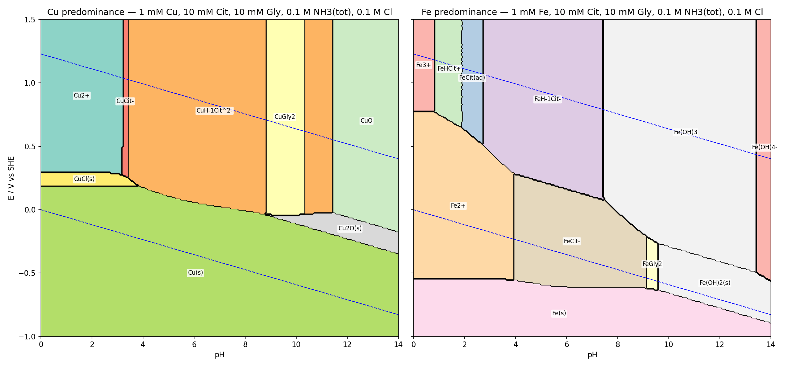
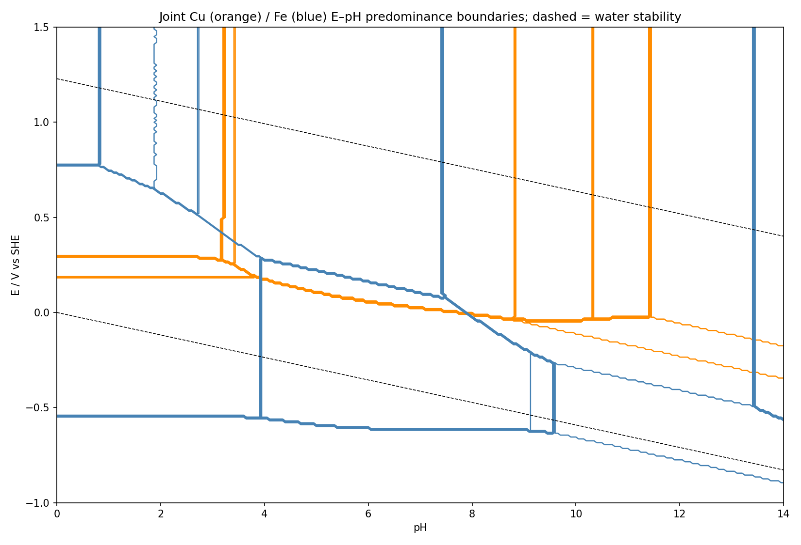

*Presented file: `boundaries.txt`*

*Presented file: `model.py`*

*Presented file: `run.py`*

## What was solved

Not a "1 mM activity" textbook overlay: at each of 281 × 251 (pH, E) grid points I solved the full mass-action/mass-balance problem with H⁺ and e⁻ as fixed components (unknowns: free Cu²⁺, Fe³⁺, Cit³⁻, Gly⁻, NH₃; Cl⁻ fixed at 0.1 M), 53 aqueous species + 7 solids, with solids added/removed by saturation index. Predominance = species (or solid) carrying the largest fraction of the 1 mM total. The two metals share the ligand pool, so Fe–Cu competition for citrate is included. Fe₃O₄ was deliberately excluded (with ferrihydrite as the Fe(III) solid it would take an artificial field up to E ≈ 1.28 − 0.059 pH; paired with hematite the Fe₃O₄/Fe₂O₃ line would be ≈ 0.17 − 0.059 pH). CuFeO₂/CuFe₂O₄ are also excluded, so this is a "fresh-precipitate, kinetically accessible" diagram.

## Constants used by the solver (25 °C, I = 0.1 m, log₁₀)

Redox: Cu²⁺/Cu⁺ 0.153 V, Cu⁺/Cu 0.521, Cu²⁺/Cu 0.340, Fe³⁺/Fe²⁺ 0.771, Fe²⁺/Fe −0.447. Protonation: citrate 5.69/4.35/2.87; glycine 9.57/2.35; NH₄⁺ 9.25.

| Metal | Species (log β from free ion + ligands, hydrolysis as log *β) |
|---|---|
| Cu(II) | CuOH⁺ −7.97, Cu(OH)₂ −16.2, Cu(OH)₃⁻ −26.9, Cu(OH)₄²⁻ −39.6; CuCl⁺ 0.30; Cu(NH₃)₁₋₄ 4.13/7.61/10.48/12.03; CuGly⁺ 8.13, CuGly₂ 15.03; CuCit⁻ 5.90, CuHCit 8.90, CuH₋₁Cit²⁻ 2.50 |
| Cu(I) | CuCl 2.70, CuCl₂⁻ 5.50, CuCl₃²⁻ 5.70; Cu(NH₃)⁺ 5.93, Cu(NH₃)₂⁺ 10.86 |
| Fe(III) | FeOH²⁺ −2.19, Fe(OH)₂⁺ −5.67, Fe(OH)₃ −13.0, Fe(OH)₄⁻ −21.6, Fe₂(OH)₂⁴⁺ −2.95; FeCl²⁺ 0.80; FeCit 11.40, FeHCit⁺ 13.30, FeH₋₁Cit⁻ 8.70, Fe(Cit)₂³⁻ 15.80 |
| Fe(II) | FeOH⁺ −9.50, Fe(OH)₂ −20.6, Fe(OH)₃⁻ −31.0; FeCl⁺ 0.14; Fe(NH₃)₁₋₂ 1.40/2.20; FeGly⁺ 4.10, FeGly₂ 7.60; FeCit⁻ 4.40, FeHCit 8.30 |
| Solids | CuO(tenorite) + 2H⁺ = Cu²⁺: 7.64; Cu₂O + 2H⁺ = 2Cu⁺: −1.60; CuCl(s) Ksp −6.73; Fe(OH)₃(ferrihydrite) + 3H⁺: 4.89; Fe(OH)₂ + 2H⁺: 12.85; Cu, Fe metal from E° |

These are my best recollection of NIST/Martell–Smith, Baes–Mesmer and IUPAC-recommended values; the Fe(III)–citrate set (especially FeH₋₁Cit⁻ and Fe(Cit)₂³⁻) and CuH₋₁Cit²⁻ are the least certain, and they set the vertical Fe(III)-citrate/ferrihydrite and Cu-citrate/glycine lines. Everything is in `model.py` if you want to swap values.

## Partitioning

**Copper.** Cu(II) is never "free" above pH 3.2. Citrate wins first (CuCit⁻ in a sliver pH 3.2–3.4, then the hydroxyl-deprotonated CuH₋₁Cit²⁻ from pH 3.4 to 11.4), glycine displaces it only in a window pH 8.8–10.3 (CuGly₂, with Cu(NH₃)₄²⁺ never exceeding ~10 % because 15.03 + 2 log[Gly⁻] beats 12.03 + 4 log[NH₃] everywhere), and tenorite precipitates above pH 11.4. Cu(I) survives as a predominant *dissolved* phase nowhere: chloride gives CuCl(s) (pH < 3.8, E 0.185–0.295) and at high pH the Cu(I) ammine is out-competed by Cu₂O in a thin band. Cu metal covers 40 % of the window.

**Iron.** Fe(III) is citrate-bound (FeHCit⁺ → FeCit → FeH₋₁Cit⁻) from pH 0.8 to 7.4, then ferrihydrite from pH 7.4 to 13.4, Fe(OH)₄⁻ beyond. Fe(II) is free Fe²⁺ below pH 3.9, FeCit⁻ pH 3.9–9.1, FeGly₂ pH 9.1–9.6, Fe(OH)₂(s) above 9.6. Ammonia does nothing to iron.

**Joint consequences.** Because Fe(III) grabs citrate 10⁵–10⁶ times harder than Cu(II), Cu speciation is essentially indifferent to iron, but ~1 of the 10 mM citrate is sequestered by iron below pH 7.4 (CuCit region shrinks slightly). The Cu(s)/Cu(II) line lies 0.55–0.75 V above the Fe(s)/Fe(II) line everywhere, so between them (e.g. pH 6: −0.60 < E < +0.05) the system is Cu(s) + FeCit⁻; iron plating is thermodynamically impossible anywhere above the H₂ line except pH > 9.5, so co-deposition is thermodynamically excluded and any Cu–Fe alloy region is kinetic.

## Principal boundaries (fits to the solver's grid boundaries; V vs SHE)

Copper:
- Cu²⁺ | CuCl(s): E = 0.293 (pH 0–3.15); CuCl(s) | Cu(s): E = 0.185 (pH 0–3.8)
- Cu²⁺ | CuCit⁻: pH 3.22; CuCit⁻ | CuH₋₁Cit²⁻: pH 3.43
- Cu(s) | CuH₋₁Cit²⁻: curved, E ≈ 0.324 − 0.0425 pH overall; analytically E = 0.177 − 0.0296(pH + log[Cit³⁻]) → 0.237 − 0.0296 pH once citrate is fully deprotonated (pH > 6)
- CuH₋₁Cit²⁻ | CuGly₂: pH 8.8 and 10.3 (nearly vertical, slope +0.004 V/pH)
- Cu(s) | Cu₂O: E = 0.479 − 0.0591 pH (pH 8.8–14); Cu₂O | Cu(II) aq: E ≈ −0.03 to −0.04 (flat, pH 8.8–11.4); Cu₂O | CuO: E = 0.656 − 0.0595 pH
- CuH₋₁Cit²⁻ | CuO: pH 11.43

Iron:
- Fe(s) | Fe²⁺: E = −0.546 (pH 0–3.9); Fe(s) | FeCit⁻: E ≈ −0.539 − 0.0099 pH (pH 4–9.1); Fe(s) | Fe(OH)₂: E = −0.066 − 0.0592 pH
- Fe²⁺ | Fe³⁺: E = 0.775 (pH < 0.8); Fe²⁺ | FeHCit⁺: E = 0.865 − 0.116 pH; Fe²⁺ | FeCit: E = 0.952 − 0.162 pH; Fe²⁺ | FeH₋₁Cit⁻: E = 1.016 − 0.187 pH
- Fe³⁺ | FeHCit⁺: pH 0.83; FeHCit⁺ | FeCit: pH 1.90; FeCit | FeH₋₁Cit⁻: pH 2.73; Fe²⁺ | FeCit⁻: pH 3.93
- FeCit⁻ | FeH₋₁Cit⁻: E = 0.516 − 0.0591 pH (pH 3.9–7.4)
- FeH₋₁Cit⁻ | Fe(OH)₃: pH 7.43; FeCit⁻ | Fe(OH)₃: E = 1.382 − 0.175 pH (pH 7.5–9.1)
- FeCit⁻ | FeGly₂: pH 9.13; FeGly₂ | Fe(OH)₂: pH 9.58
- Fe(OH)₂ | Fe(OH)₃: E = 0.301 − 0.0592 pH; Fe(OH)₃ | Fe(OH)₄⁻: pH 13.43

## Triple junctions (pH, E)

Cu: (3.18, +0.275) Cu²⁺/CuCit⁻/CuCl(s); (3.42, +0.255) CuCit⁻/CuCl(s)/CuH₋₁Cit²⁻; (3.82, +0.185) Cu(s)/CuCl(s)/CuH₋₁Cit²⁻; (8.78, −0.035) Cu(s)/Cu₂O/CuGly₂/CuH₋₁Cit²⁻ (a near-quadruple point); (10.32, −0.035) Cu₂O/CuGly₂/CuH₋₁Cit²⁻; (11.42, −0.025) Cu₂O/CuH₋₁Cit²⁻/CuO.

Fe: (0.82, +0.775) Fe²⁺/Fe³⁺/FeHCit⁺; (1.88, +0.655) Fe²⁺/FeHCit⁺/FeCit; (2.72, +0.515) Fe²⁺/FeCit/FeH₋₁Cit⁻; (3.92, +0.285) Fe²⁺/FeCit⁻/FeH₋₁Cit⁻; (3.92, −0.555) Fe(s)/Fe²⁺/FeCit⁻; (7.48, +0.075) FeCit⁻/FeH₋₁Cit⁻/Fe(OH)₃; (9.12, −0.215) FeCit⁻/FeGly₂/Fe(OH)₃; (9.12, −0.625) Fe(s)/FeCit⁻/FeGly₂; (9.58, −0.265) FeGly₂/Fe(OH)₂/Fe(OH)₃; (9.58, −0.635) Fe(s)/FeGly₂/Fe(OH)₂; (13.42, −0.495) Fe(OH)₂/Fe(OH)₃/Fe(OH)₄⁻.

Caveats worth keeping in mind: activity corrections are folded into the I = 0.1 constants rather than computed; Fe(III)–citrate dimers/trimers and Cu₂(Cit)₂H₋₂⁴⁻ are omitted (they would push the ferrihydrite and tenorite onsets ~0.5–1 pH higher); and "predominant" here means largest fraction, so in mixed regions (e.g. the CuGly₂ window, where CuH₋₁Cit²⁻ still holds ~30 %) the runner-up is not negligible. The full fraction arrays are saved by `run.py` if you need the secondary species.
