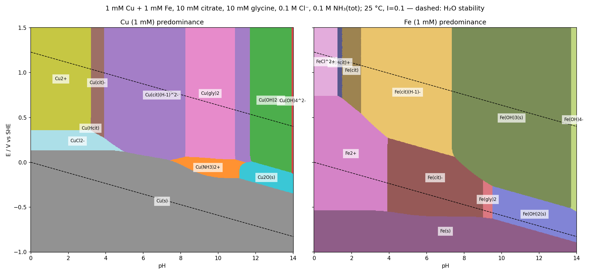
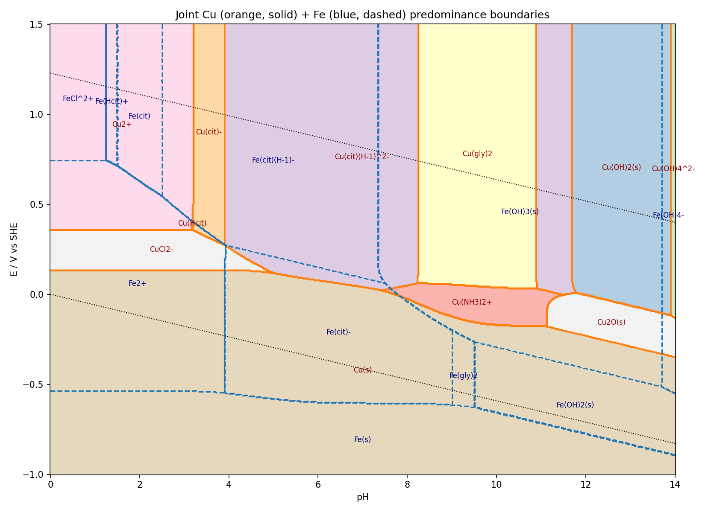

*Presented file: `boundaries_junctions.txt`*

*Presented file: `pourbaix_solver.py`*

## How the diagram was built

The solver is a full mass-balance speciation model, not a per-couple "line drawing": at each of 701 × 501 (pH, E) grid points it solves the free concentrations of cit³⁻, gly⁻, Cl⁻, NH₃, Cu²⁺ and Fe³⁺ simultaneously (ligand protonation + all metal complexes), links Cu(I)/Cu(II) and Fe(II)/Fe(III) by Nernst, and caps the free ion at the lowest solid-saturation value (Cu, Cu₂O, Cu(OH)₂, CuCl, Fe, Fe(OH)₂, Fe(OH)₃(am) — CuO, Fe₂O₃, FeOOH, Fe₃O₄ deliberately excluded). A region is labeled by the solid if dissolved metal < total (1 mM), otherwise by the most abundant aqueous species. Ligand mass-balance residuals converge to ~10⁻¹⁶.

**Constants used** (log₁₀, 25 °C, I≈0.1 concentration scale; activity coefficients for metal ions neglected; E° are standard values used as formal potentials):

- E°: Cu²⁺/Cu⁺ 0.153, Cu⁺/Cu 0.521, Fe³⁺/Fe²⁺ 0.771, Fe²⁺/Fe −0.447 V
- pKa: citrate 2.87/4.35/5.69; glycine 2.35/9.57; NH₄⁺ 9.29
- Solids (*Ksp, solid + nH⁺ → ion): Cu(OH)₂ 8.64; Cu₂O −1.42; CuCl −6.73 (Ksp); Fe(OH)₃(am) 4.89; Fe(OH)₂ 12.9
- Cu(II): hydrolysis −8.0/−16.2/−26.6/−39.5; CuCl⁺ 0.2, CuCl₂ −0.3; Cu(NH₃)₁₋₄ 4.04/7.47/10.27/11.75; Cu(gly)⁺ 8.15, Cu(gly)₂ 15.0; Cu(Hcit) 9.1, Cu(cit)⁻ 5.9, Cu(cit)(H₋₁)²⁻ 2.0
- Cu(I): CuCl 2.7, CuCl₂⁻ 5.5, CuCl₃²⁻ 5.7; Cu(NH₃)⁺ 5.93, Cu(NH₃)₂⁺ 10.86
- Fe(III): hydrolysis −2.19/−5.67/−12.56/−21.6; FeCl²⁺ 1.48, FeCl₂⁺ 2.13; Fe(Hcit)⁺ 12.9, Fe(cit) 11.4, Fe(cit)(H₋₁)⁻ 8.9, Fe(cit)₂³⁻ 15.6
- Fe(II): hydrolysis −9.5/−20.6/−31.0; FeCl⁺ 0.14; Fe(NH₃)₁,₂,₄ 1.4/2.2/3.7; Fe(gly)⁺ 4.3, Fe(gly)₂ 7.8; Fe(Hcit) 8.2, Fe(cit)⁻ 4.4

## Partitioning of Cu and Fe

**Copper.** Ammonia never wins the Cu(II) competition — at the pH where NH₃ is free (>9.3), glycinate (β₂ = 10¹⁵) beats tetraammine by ~10³, so the sequence along the oxidizing side is Cu²⁺ (pH < 3.2) → Cu(cit)⁻ (3.2–3.9) → Cu(cit)(H₋₁)²⁻ (3.9–8.2) → Cu(gly)₂ (8.2–10.9) → Cu(cit)(H₋₁)²⁻ again (10.9–11.7, glycinate is exhausted by the citrate-chelate's proton release advantage) → Cu(OH)₂(s) (11.7–13.9) → Cu(OH)₄²⁻. Cu(I) is stabilized in solution by chloride at low pH (CuCl₂⁻ window, 0.13–0.36 V, pH < 5) and by ammonia at mid pH (Cu(NH₃)₂⁺ band only ~40–200 mV wide, pH 7.4–11.5). Cu₂O(s) exists only above pH 11.1, where NH₃ can no longer hold Cu(I). Cu metal is stable everywhere below ~+0.13 V at low pH, sloping to −0.35 V at pH 14.

**Iron.** Fe(III) is bound by citrate immediately (Fe(Hcit)⁺ from pH 1.25, Fe(cit) 1.5–2.5, Fe(cit)(H₋₁)⁻ 2.5–7.4), but even 10 mM citrate cannot hold 1 mM Fe(III) against amorphous Fe(OH)₃ above pH 7.4; Fe(OH)₃(s) then spans pH 7.4–13.7 before Fe(OH)₄⁻ takes over. Fe(II) is Fe²⁺ to pH 3.9, then Fe(cit)⁻ (3.9–9.0), a narrow Fe(gly)₂ strip (9.0–9.5), then Fe(OH)₂(s). Fe(s) requires E < −0.54 V (pH < 4) falling to −0.89 V at pH 14, i.e. always below the hydrogen line — Fe co-deposition is only possible with hydrogen evolution, whereas Cu deposits ~0.6–0.7 V more positive across the whole range.

## Principal boundaries (fitted from the solver grid)

Cu:
- Cu²⁺ | CuCl₂⁻: E = +0.358 V (flat, pH 0–3.2)
- CuCl₂⁻ | Cu(s): E ≈ +0.134 − 0.001·pH (pH 0–5)
- Cu(cit)(H₋₁)²⁻ | Cu(s): E ≈ +0.306 − 0.038·pH (pH 5–7.4)
- Cu(NH₃)₂⁺ | Cu(s): E ≈ +0.430 − 0.059·pH (pH 7.4–11.1)
- Cu₂O | Cu: E ≈ +0.478 − 0.059·pH; Cu(OH)₂ | Cu₂O: E ≈ +0.706 − 0.059·pH
- Vertical: Cu²⁺|Cu(cit)⁻ pH 3.21; Cu(cit)⁻|Cu(cit)(H₋₁)²⁻ 3.91; Cu(cit)(H₋₁)²⁻|Cu(gly)₂ 8.23 and 10.91; Cu(cit)(H₋₁)²⁻|Cu(OH)₂ 11.7; Cu(OH)₂|Cu(OH)₄²⁻ 13.91

Fe:
- Fe²⁺ | FeCl²⁺: E = +0.743 V (pH < 1.25); Fe(cit) | Fe²⁺: E ≈ +0.967 − 0.169·pH; Fe(cit)(H₋₁)⁻ | Fe²⁺: E ≈ +1.018 − 0.191·pH (pH 2.5–3.9); Fe(cit)(H₋₁)⁻ | Fe(cit)⁻: E ≈ +0.505 − 0.059·pH (pH 3.9–7.5)
- Fe(OH)₃ | Fe(cit)⁻: E ≈ +1.339 − 0.172·pH (pH 7.5–9.0); Fe(OH)₃ | Fe(OH)₂: E ≈ +0.297 − 0.059·pH
- Fe(s) | Fe²⁺: E ≈ −0.54 V; Fe(cit)⁻ | Fe(s): E ≈ −0.526 − 0.011·pH; Fe(OH)₂ | Fe(s): E ≈ −0.065 − 0.059·pH
- Vertical: Fe(Hcit)⁺|Fe(cit) 1.50; Fe(cit)|Fe(cit)(H₋₁)⁻ 2.51; Fe²⁺|Fe(cit)⁻ 3.91; Fe(cit)(H₋₁)⁻|Fe(OH)₃ 7.35; Fe(cit)⁻|Fe(gly)₂ 9.01; Fe(gly)₂|Fe(OH)₂ 9.51; Fe(OH)₃|Fe(OH)₄⁻ 13.71

## Triple junctions

Cu: (3.17, +0.358) Cu²⁺/Cu(Hcit)/CuCl₂⁻ · (3.91, +0.273) Cu(cit)⁻/Cu(cit)(H₋₁)²⁻/CuCl₂⁻ · (4.99, +0.118) Cu(cit)(H₋₁)²⁻/CuCl₂⁻/Cu · (7.43, +0.023) Cu(cit)(H₋₁)²⁻/Cu(NH₃)₂⁺/Cu · (8.23, +0.063) and (10.91, +0.033) Cu(cit)(H₋₁)²⁻/Cu(gly)₂/Cu(NH₃)₂⁺ · (11.13, −0.177) Cu(NH₃)₂⁺/Cu/Cu₂O · (11.47, −0.002) Cu(NH₃)₂⁺/Cu(cit)(H₋₁)²⁻/Cu₂O · (11.79, +0.008) Cu(cit)(H₋₁)²⁻/Cu(OH)₂/Cu₂O · (13.91, −0.117) Cu(OH)₂/Cu(OH)₄²⁻/Cu₂O

Fe: (1.25, +0.743) FeCl²⁺/Fe(Hcit)⁺/Fe²⁺ · (1.49, +0.718) Fe(Hcit)⁺/Fe(cit)/Fe²⁺ · (2.51, +0.548) Fe(cit)/Fe(cit)(H₋₁)⁻/Fe²⁺ · (3.93, +0.273) Fe(cit)(H₋₁)⁻/Fe(cit)⁻/Fe²⁺ · (3.91, −0.547) Fe²⁺/Fe(cit)⁻/Fe · (7.49, +0.063) Fe(cit)(H₋₁)⁻/Fe(OH)₃/Fe(cit)⁻ · (9.01, −0.202) Fe(OH)₃/Fe(cit)⁻/Fe(gly)₂ · (9.01, −0.617) Fe(cit)⁻/Fe(gly)₂/Fe · (9.51, −0.267) Fe(OH)₃/Fe(OH)₂/Fe(gly)₂ · (9.51, −0.627) Fe(OH)₂/Fe(gly)₂/Fe · (13.69, −0.512) Fe(OH)₃/Fe(OH)₂/Fe(OH)₄⁻

**Design implications.** For a homogeneous Cu–Fe bath, the window is pH ≈ 4–7.3 (both metals fully dissolved as citrate chelates: Cu(cit)(H₋₁)²⁻ and Fe(cit)(H₋₁)⁻/Fe(cit)⁻); above pH 7.4 Fe(OH)₃ precipitates unless the bath is kept reducing (E < ~0 V, Fe(cit)⁻ region, up to pH 9). The Cu/Fe deposition-potential gap is ~0.65–0.7 V everywhere, so codeposition is diffusion-controlled for Cu and anomalous-type for Fe.

Caveats: the Fe(III)–citrate polynuclear species (Fe₂/Fe₃ citrate dimers/trimers) and Cu₂(cit)₂(H₋₁)₂⁴⁻ were not included, and the placement of the Fe(cit)(H₋₁)⁻|Fe(OH)₃ boundary is sensitive (±0.5 pH) to the amorphous Fe(OH)₃ *Ksp (4.89 fresh vs ~3.0 aged) and to Fe(cit)₂³⁻. The grid, solver, and full boundary listing are in the files below so you can swap constants and rerun.
