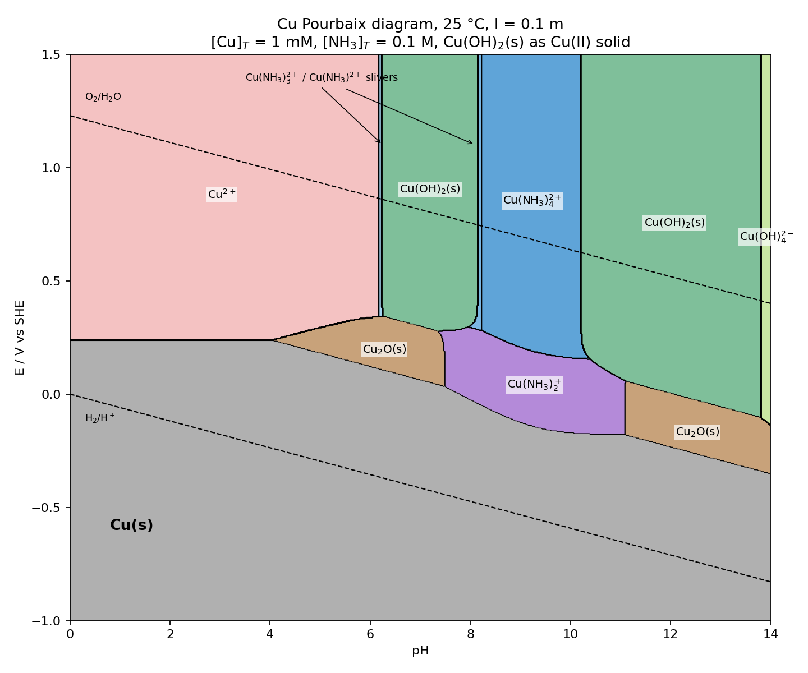

*Presented file: `Cu_NH3_pourbaix.py`*

**Ammine window (soluble Cu–NH₃ complexes predominate, no Cu(s) or Cu(OH)₂(s)):**

- **pH ≈ 8.2 – 10.2 (Cu(II)):** Cu(NH₃)₄²⁺ is the predominant species from E ≈ +0.19 V (SHE) up through the O₂ line. Above pH ~10.2, Cu(OH)₂(s) wins because free NH₃ stops increasing (NH₄⁺/NH₃ pKa ≈ 9.3) while [OH⁻] keeps climbing; below ~8.2, free NH₃ is too low to hold 1 mM Cu in solution against Cu(OH)₂ precipitation.
- **pH ≈ 7.5 – 11.1 (Cu(I)):** a Cu(NH₃)₂⁺ band sits between the Cu(s) floor and the Cu(II) region. At pH 9.3 it spans about −0.14 V to +0.18 V; at pH 10 about −0.17 V to +0.20 V.
- **Widest all-soluble window:** at pH ~10, E from ≈ −0.17 V (Cu(s) deposition) to ≈ +1.5 V, with the Cu(I)/Cu(II) ammine handoff at ≈ +0.20 V. Outside 8.2–10.2, only the low-E Cu(I) ammine band survives, capped by Cu(OH)₂(s) or Cu₂O(s).

Practical reading: to keep copper dissolved as ammine, hold pH ≈ 9–10 and E > −0.15 V; anything more reducing plates Cu(s).

**Model notes:** grid calculation, 1 mM Cu_T and 0.1 M NH₃_T mass balances solved at every (E, pH); solid drawn where the solution is saturated. Constants: Cu(NH₃)ₙ²⁺ log β = 4.13/7.61/10.48/12.59 and pKa(NH₄⁺) = 9.29 (0.1 M, Smith–Martell); Cu(NH₃)ₙ⁺ log β = 5.93/10.86 (literature values at higher ionic strength, the main uncertainty in the Cu(I) band); hydroxo complexes from IUPAC (Powell 2007) with Davies correction to I = 0.1; Cu(OH)₂(s) log *Ks0 = 8.64 (fresh precipitate, per your hydroxide preference, rather than tenorite, which would shrink the ammine windows by roughly a pH unit each side). No well-defined CuOH(s) exists, so Cu₂O is the Cu(I) solid. Cu₂(OH)₂²⁺ was omitted (negligible at 1 mM). Thin Cu(NH₃)²⁺ and Cu(NH₃)₃²⁺ slivers appear at the Cu(OH)₂ edges (arrowed). The script is attached if you want to swap in aged Cu(OH)₂, tenorite, or different ammine constants.
