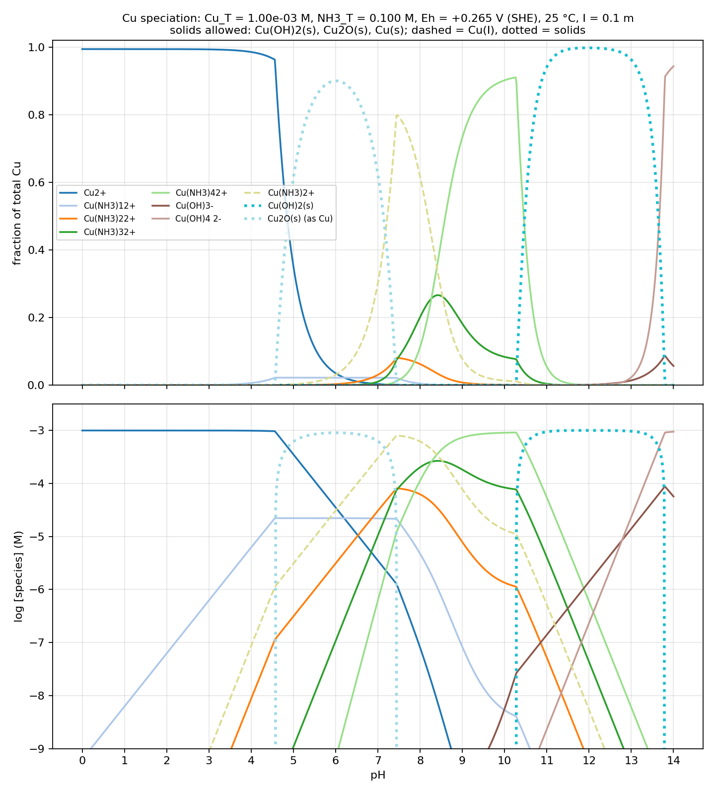

*Presented file: `cu_nh3_speciation.csv`*

**What the diagram shows (pH 0 → 14 at Eh = +0.265 V):**

| pH range | Dominant Cu form | Notes |
|---|---|---|
| 0 – 4.6 | Cu²⁺(aq) | Cu⁺ ≈ 0.6% (fixed by Eh); ammines negligible, NH₃ is all NH₄⁺ |
| 4.6 – 7.4 | **Cu₂O(s)** | At this Eh the Cu²⁺/Cu₂O boundary is crossed first (~pH 4.6); up to 90% of Cu is solid at pH 6 |
| 7.2 – 8.4 | **Cu(NH₃)₂⁺ (Cu(I))** | Cu₂O dissolves as the diammine (peak 80% at pH 7.5). Cu(I) wins here because Cu(NH₃)₂⁺ (log β₂ 10.9) is much stronger than the Cu(II) ammines at low free NH₃ |
| 8.4 – 10.3 | Cu(NH₃)₄²⁺ (+ Cu(NH₃)₃²⁺) | Rising free NH₃ flips the couple back to Cu(II); tetraammine reaches 91% at pH 10.3 |
| 10.3 – 13.8 | **Cu(OH)₂(s)** | 0.1 M NH₃ is not enough to hold 1 mM Cu in solution against Ksp; ≥94% precipitated |
| 13.8 – 14 | Cu(OH)₄²⁻ (+ Cu(OH)₃⁻) | Amphoteric redissolution |

Cu metal is never stable (a_Cu⁺ stays ≤10% of the value needed at this Eh). The Cu(OH)₂/Cu₂O equilibrium at this potential sits at pH 7.5, so Cu(OH)₂ is the "preferred" solid only where a solid exists above that pH; below it Cu₂O is thermodynamically required (there is no well-defined CuOH(s)).

**Model:** full mass balance on Cu and N, Nernst constraint a(Cu⁺)/a(Cu²⁺) from E°(Cu²⁺/Cu⁺) = 0.153 V, Davies activity coefficients at I = 0.1 (γ₁ = 0.78, γ₂ = 0.37). Constants: Cu(II) hydrolysis log*β₁…₄ = −7.95, −16.2, −26.6, −39.7, log*β₂₂ = −10.43 (IUPAC 2007); Cu(II)–NH₃ stepwise log K = 4.15, 3.50, 2.89, 2.13 (I = 0.1); Cu(I)–NH₃ log β = 5.93, 10.86; pKa(NH₄⁺) = 9.244; Cu(OH)₂ + 2H⁺ log K = 8.64; Cu₂O + 2H⁺ log K = −1.55. Mixed hydroxo‑ammine complexes and Cu(NH₃)₅²⁺ were omitted.

**Sensitivities worth knowing:** the Cu(OH)₂ window (10.3–13.8) and the tetraammine/hydroxide boundary move by several tenths of a pH unit depending on which Cu(OH)₂ Ksp you take (fresh precipitate log K ≈ 9.5 would shrink the solid window) and on β₄ (values up to 13.0 are reported). The CSV has all species concentrations and free NH₃ activity at 0.02 pH steps if you want to re-plot or change constants.
