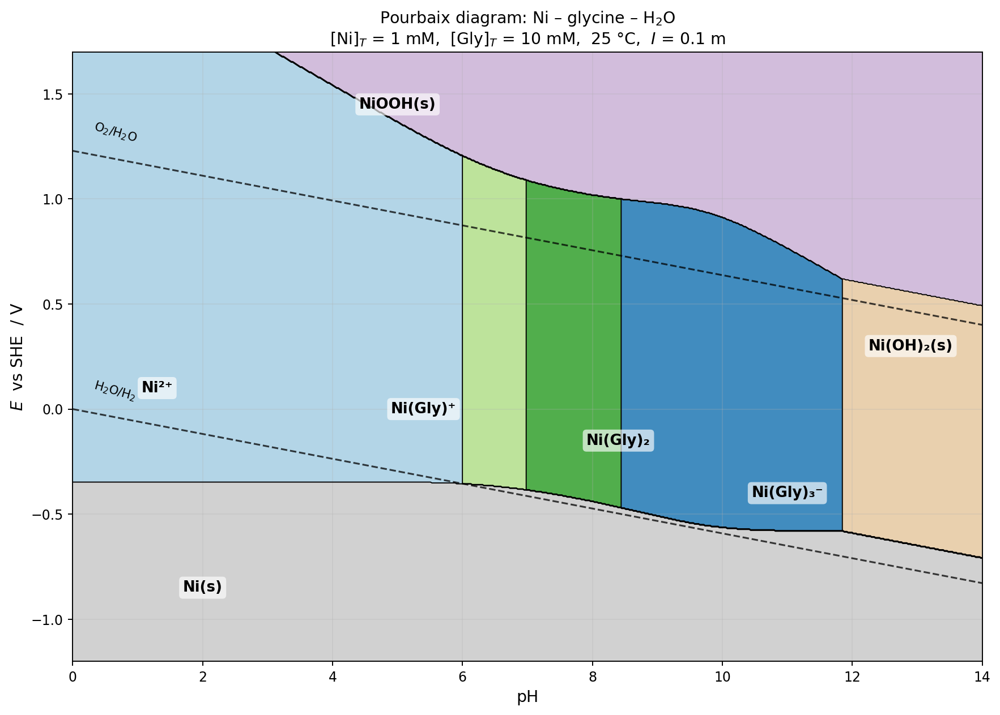

## Thermodynamic basis

Constants used (25 °C, I = 0.1 m):

| Equilibrium | log K / E° |
|---|---|
| H₂Gly⁺ ⇌ HGly + H⁺ | pKa₁ = 2.35 |
| HGly ⇌ Gly⁻ + H⁺ | pKa₂ = 9.78 |
| Ni²⁺ + Gly⁻ ⇌ NiGly⁺ | log K₁ = 5.78 |
| Ni²⁺ + 2 Gly⁻ ⇌ Ni(Gly)₂ | log β₂ = 10.58 |
| Ni²⁺ + 3 Gly⁻ ⇌ Ni(Gly)₃⁻ | log β₃ = 13.94 |
| Ni(OH)₂ ⇌ Ni²⁺ + 2 OH⁻ | log Ksp = −15.26 |
| Ni²⁺ + 2 e⁻ → Ni(s) | E° = −0.257 V |
| NiOOH + H⁺ + e⁻ → Ni(OH)₂ | E° = +1.32 V |

At each pH the free [Gly⁻] is set by the two pKa's, and the free [Ni²⁺] by α_Ni = 1 + K₁[L] + β₂[L]² + β₃[L]³. Ni(OH)₂ is imposed whenever [Ni²⁺]·[OH⁻]² > Ksp. Redox lines use the *free* Ni²⁺ activity (which is reduced by both complexation and precipitation), so the Ni(s)/Ni(II) line drops and the Ni(II)/NiOOH line rises inside the complex region — that is the "chelate stabilization" of dissolved Ni(II).

## Speciation walk-through (at E = 0 V)

| pH | [Gly⁻] | α_Ni | Solid? | Dominant Ni species |
|---:|---:|---:|:---:|:---|
| 2 | 5 × 10⁻¹¹ | 1.00 | no | Ni²⁺ |
| 5 | 1.7 × 10⁻⁷ | 1.10 | no | Ni²⁺ |
| 6 | 1.7 × 10⁻⁶ | 2.1 | no | Ni²⁺ (complexes just crossing over) |
| 7 | 1.7 × 10⁻⁵ | 22 | no | **Ni(Gly)₂** |
| 8 | 1.6 × 10⁻⁴ | 1.5 × 10³ | no | **Ni(Gly)₂** |
| 9 | 1.4 × 10⁻³ | 3.3 × 10⁵ | no | **Ni(Gly)₃⁻** |
| 11 | 9.4 × 10⁻³ | 7.6 × 10⁷ | no | **Ni(Gly)₃⁻** |
| 12 | 9.9 × 10⁻³ | 8.9 × 10⁷ | **yes** | Ni(OH)₂(s) |

Without glycine, Ni(OH)₂ would precipitate at pH ≈ 7.9 for 1 mM Ni. The 10 mM glycine buffer pushes that boundary up by ~4 pH units.

## Stability window of soluble Ni-glycinate complexes

**pH range** (horizontal window): 5.96 ≲ pH ≲ 11.84
- **Low-pH edge (~6):** below this, glycine is essentially all HGly zwitterion / H₂Gly⁺; [Gly⁻] is too small to compete with the free Ni²⁺ aqua ion.
- **High-pH edge (~11.8):** even with essentially all the ligand deprotonated, Ni(OH)₂ becomes thermodynamically saturated and starts stripping Ni out of the complex.

**Sub-regions within that window**
- **pH ~6 – 7:** NiGly⁺ (mono-glycinato) — a narrow strip; monodentate/single-chelate binding.
- **pH ~7 – 8.5:** Ni(Gly)₂ (bis-glycinato, neutral) — the classic pink/violet species relevant to plating baths and biology.
- **pH ~8.5 – 11.8:** Ni(Gly)₃⁻ (tris-glycinato) — becomes dominant only once α(Gly⁻) is high enough that a third ligand can outbid H⁺ for the last coordination site.

**Vertical (potential) window inside the complex region**

| pH | E lower (Ni/Ni(II)) | E upper (Ni(II)/Ni(III)) | Width |
|---:|---:|---:|---:|
| 7 | −0.39 V | +1.09 V | 1.47 V |
| 8 | −0.44 V | +1.02 V | 1.46 V |
| 9 | −0.51 V | +0.98 V | 1.49 V |
| 10 | −0.56 V | +0.91 V | 1.48 V |
| 11 | −0.58 V | +0.77 V | 1.34 V |

Chelation depresses the Ni(II)→Ni(s) reduction line by ~150–250 mV compared with the uncomplexed Ni²⁺/Ni couple at the same total concentration, so metallic nickel is harder to plate out of a glycinate bath than out of a simple Ni²⁺ solution — a well-known feature exploited in alkaline electroless-nickel and Ni-electrowinning chemistries. The upper (NiOOH) boundary is pushed above the O₂/H₂O line over most of the complex window, so oxidation to Ni(III) requires driving the electrode outside water stability except near very high pH.

**Caveats worth flagging**
- I used the β-Ni(OH)₂ Ksp; the freshly precipitated α-form is ~1–2 log units more soluble, which would shift the right-hand boundary further right by ~0.5 pH.
- Ternary hydroxo-glycinato species (e.g., Ni(Gly)₂(OH)⁻) are known but weak; ignoring them displaces the pH ≈ 11.8 boundary by no more than a few tenths.
- I did not include Ni₃O₄ or Ni₂O₃·H₂O polymorphs distinct from NiOOH; at [Ni]_T = 1 mM they do not open new fields inside the water-stability window.
- Constants and Nernst slope are for 25 °C only; no temperature correction is applied.
