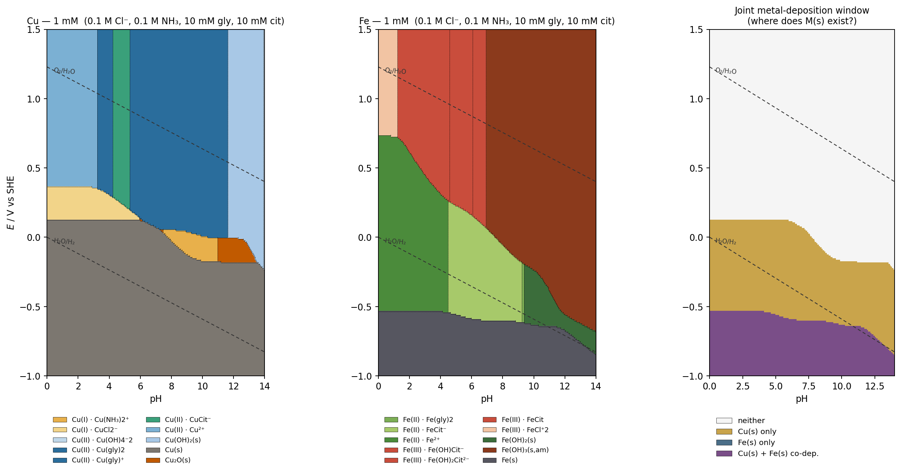

[pourbaix_report.html](pourbaix_report.html)

I built a small thermodynamic solver, ran it on a 281 × 251 (pH, *E*) grid, and dropped the result into a report. Headline findings:

**Cu partitions as** (left to right in pH): Cu²⁺ → Cu(gly)⁺ (pH ≈ 3.25) → CuCit⁻ (4.25) → **Cu(gly)₂ across most of the middle** (5.35 – 11.65) → Cu(OH)₂(s) (11.65 – 13.90) → Cu(OH)₄²⁻. Cu(I) survives only in a narrow band, ≈ −0.03 to +0.12 V, as CuCl₂⁻ below pH 6.7 and Cu(NH₃)₂⁺ above; a small Cu₂O(s) island opens near pH 10.6 – 13.5 at moderate E. Metallic Cu deposits below E ≈ +0.245 V at pH 0, dropping to ≈ −0.10 V at pH 10.

**Fe partitions as**: FeCl²⁺ (pH ≤ 1.25) → FeCit (1.25 – 4.60) → Fe(OH)Cit⁻ (4.60 – 6.10) → Fe(OH)₂Cit²⁻ (6.10 – 10.60); Fe(OH)₃(s,am) precipitates above **pH ≈ 6.95** — citrate is very effective below that, but not above. Fe(II) goes Fe²⁺ → FeCit⁻ (4.5) → Fe(gly)₂ (9.25), with Fe(OH)₂(s) forming at pH ≈ 9.4. Fe deposition follows E ≈ −0.54 V (low pH) → −0.85 V (pH 14).

**Joint co-deposition:** the Cu–Fe potential gap closes from **782 mV at pH 2 to ~552 mV at pH 10**, then reopens slightly. Co-plating is only thermodynamically accessible at E ≤ −0.55 V — essentially on top of the H₂O/H₂ line, so Fe current efficiency will be H₂-limited whatever the electrolyte designer does. The ammonia-driven Cu depression the electroplating community usually relies on is largely masked here by the stronger Cu(gly)₂ arm.

Full boundary equations, the log β / log K table actually used, conditional formal potentials at every 2 pH units, and the caveats about the mononuclear-only, ligand-in-excess approximation are in the report.
