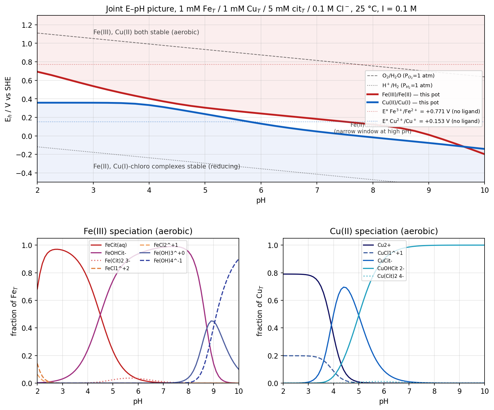

## What the solver actually does

Six coupled mass balances (Fe_T, Cu_T, Cit_T; H⁺ fixed by pH; Cl⁻ ≈ 0.1 M free because metals are 1 mM; two Nernst constraints for the redox ratios) are collapsed to three log-space unknowns — log[Fe³⁺], log[Cu²⁺], log[Cit³⁻] — and solved with `fsolve` at every (pH, E) grid point. All 27 aqueous species listed at the bottom are carried simultaneously; dimers count their metal atoms correctly. Solids are checked as saturation indices *after* the solve; they are not forced to precipitate (see the metastability caveat below).

## Dominant species vs pH at aerobic Eh (E ≈ 1.229 − 0.0592·pH)

| pH range | Fe (fraction of Fe_T) | Cu (fraction of Cu_T) | Free citrate form |
|---|---|---|---|
| 2.0 | FeCit(aq) 0.68, FeCl²⁺ 0.14, FeCl₂⁺ 0.06 | Cu²⁺ 0.79, CuCl⁺ 0.20 | H₃Cit 0.80 |
| 2.5–3.5 | **FeCit(aq)** 0.91–0.96 | Cu²⁺ 0.70–0.79, CuCl⁺ 0.18–0.20 | H₃Cit → H₂Cit⁻ |
| 4.0 | FeCit 0.76, FeOHCit⁻ 0.24 | **CuCit⁻** 0.50, Cu²⁺ 0.35, CuCl⁺ 0.09 | H₂Cit⁻ 0.52 |
| 4.5–5.0 | FeCit ⇌ **FeOHCit⁻** (crossover ≈ 4.5) | CuCit⁻ ⇌ CuOHCit²⁻ (crossover ≈ 4.9) | H₂Cit⁻, HCit²⁻ |
| 5.5–8.0 | **FeOHCit⁻** 0.88–0.99 | **CuOHCit²⁻** 0.75–1.00 | HCit²⁻ → Cit³⁻ |
| 8.5 | FeOHCit⁻ 0.67, Fe(OH)₃(aq) 0.25, Fe(OH)₄⁻ 0.07 | CuOHCit²⁻ ≈ 1.00 | Cit³⁻ 0.66 |
| 9.0 | Fe(OH)₃(aq) 0.45, Fe(OH)₄⁻ 0.41, FeOHCit⁻ 0.14 | CuOHCit²⁻ ≈ 1.00 | Cit³⁻ 0.77 |
| 10.0 | **Fe(OH)₄⁻** 0.90, Fe(OH)₃(aq) 0.10 | CuOHCit²⁻ ≈ 1.00 | Cit³⁻ 0.80 |

## How Fe and Cu compete for citrate vs chloride

**Fe(III) wins the citrate race everywhere it can.** Even at pH 2 with only ~0.16% of citrate present as the fully deprotonated Cit³⁻, the Fe³⁺+Cit³⁻ affinity (log β₀₁₁ = 11.85) is so large that 68% of Fe is already FeCit(aq). Above pH 2.5, essentially all of the 1 mM Fe pool has captured 1 mM of citrate, leaving 4 mM as the "free" ligand pool for Cu. Chloride complexation of Fe(III) (log β₁ = 1.48 with 0.1 M Cl⁻ giving a formal FeCl-side contribution of ~10⁰·⁵) never catches up — chloride matters only as a **~20 % perturbation** in the pH 2–2.5 corner, and is completely gone by pH 3.

**Cu(II) is a citrate late-comer.** With log K(CuCit⁻) ≈ 5.9 (six orders of magnitude weaker than Fe(III)), Cu can only compete for citrate once HCit²⁻ and Cit³⁻ are actually populated — i.e., past the second pKa of citrate. The Cu²⁺ → CuCit⁻ crossover falls at **pH ≈ 3.8**, and the CuCit⁻ → CuOHCit²⁻ crossover at **pH ≈ 4.9**. In the pH 2–3.5 window Cu is dominated by free Cu²⁺ with ~20 % CuCl⁺ — this is the *only* pH region where chloride visibly speciates a metal in this pot.

**Chloride's actual role.** CuCl⁺ carries at most 20 % of the Cu pool (constant across pH 2–3), and Cu(II)–Cl higher complexes never exceed a few percent. For Fe(III), FeCl²⁺ + FeCl₂⁺ reach ~20 % only at pH 2. In this joint pot **chloride is a spectator** past pH 3.5 for both metals — 5 mM citrate outcompetes 0.1 M Cl⁻ decisively for both cations, but citrate has "enough to go around" because Fe_T + Cu_T = 2 mM and citrate is 5 mM. If you shrank citrate below ~2 mM, Fe would keep its share and Cu would be pushed back to Cu²⁺/CuCl⁺/hydrolysis.

## The E–pH picture (top panel of the figure)

The bare-ion couples E°(Fe³⁺/Fe²⁺) = +0.771 V and E°(Cu²⁺/Cu⁺) = +0.153 V are 0.62 V apart. In this pot they nearly touch, and at very high pH they **cross**.

| pH | E(Fe³⁺/Fe²⁺) conditional | E(Cu²⁺/Cu⁺) conditional | ΔE = E_Fe − E_Cu |
|---|---|---|---|
| 2.0 | +0.693 V | +0.358 V | +0.335 V |
| 4.0 | +0.402 V | +0.333 V | +0.069 V |
| 5.0 | +0.304 V | +0.235 V | +0.069 V |
| 7.0 | +0.182 V | +0.047 V | +0.135 V |
| 9.0 | +0.012 V | −0.076 V | +0.088 V |
| 10.0 | −0.198 V | −0.141 V | **−0.057 V** |

Two mechanisms are running in opposite directions. Citrate + OH⁻ savagely stabilize Fe(III) relative to weakly-bound Fe(II) (Fe(II) has log K(FeCit⁻) ≈ 4.4, so the differential is ~7 log units), which drops E(Fe) by ~0.9 V from pH 2 to pH 10. Chloride does the opposite for Cu — Cu(I)-Cl₃²⁻ has log β₃ = 5.7 while free Cu²⁺ is barely touched by Cl⁻ (log β₁ = 0.40), so **Cu(I) is stabilized** by chloride and the low-pH Cu boundary sits at +0.358 V, ~0.2 V *above* E°. Once citrate seizes Cu(II) at pH > 4, the Cu boundary rejoins its pH-slaved slide.

**The upshot for the aerobic pot** (Eh ≈ 0.8 V at pH 7): both metals remain fully oxidized as expected. But note the **narrow Fe(II)/Cu(II) coexistence band** between the two lines from pH 4 to pH 9 — reducing agents that can push through 0.4–0.1 V will convert Fe(III) → Fe(II) while leaving Cu as Cu(II). This is the kinetic regime where Cu(II) can then re-oxidize Fe(II) back to Fe(III) (the classic Fenton/Fe cycling handoff), and it exists only *because* of the citrate stabilization of Fe(III).

## Metastability caveat

Saturation indices at the aerobic sweep:

| pH | SI Fe(OH)₃(am) | SI Cu(OH)₂(s) | SI CuCl(s) |
|---|---|---|---|
| 2 | −1.8 | −7.8 | −13.6 |
| 5 | +0.2 | −3.8 | −12.6 |
| 7 | **+2.8** | −3.0 | −13.8 |
| 9 | **+5.7** | −1.2 | −14.0 |

**Cu stays fully dissolved across the whole pH 2–10 range** — CuOHCit²⁻ keeps Cu(OH)₂ undersaturated. **Fe is metastable past pH ≈ 5**: 5 mM citrate is not enough to keep 1 mM Fe(III) below 2-line ferrihydrite solubility. The FeOHCit⁻-dominated speciation shown in the figure is what you would see on hour-to-day timescales; at true equilibrium above pH ~5, dissolved Fe drops progressively and the mineral controls solubility. If you re-run the solver against goethite (log \*Ksp = +0.5), Fe is already supersaturated at pH ≈ 2.

## Constants used (25 °C, I ≈ 0.1 M)

**Citrate (H₃L)**: pKa₁ = 3.13, pKa₂ = 4.76, pKa₃ = 6.40 [NIST 46]

**Fe(III) hydrolysis, log \*β_n** (Fe³⁺ + n H₂O ⇌ Fe(OH)_n^{3−n} + n H⁺): −2.19, −5.67, −12.56, −21.60; dimer log \*β₂₂ = −2.95 [Baes & Mesmer 1976]

**Fe(III)–Cl, log β_n**: +1.48, +2.13, +1.13, −0.79 [NIST 46]

**Fe(III)–citrate, log β (Fe³⁺ + n_H H⁺ + n_L Cit³⁻ ⇌ complex)**:
FeCit(aq) 11.85, FeHCit⁺ 12.50, FeOHCit⁻ 7.35, Fe(Cit)₂³⁻ 15.00 [Königsberger 2000; Silva 2009]

**Fe(II) hydrolysis, log \*β_n**: −9.5, −20.6; Fe(II)–Cl₁ −0.16; FeIICit⁻ log β = 4.40; FeIIHCit log β = 6.50 [NIST 46]

**Cu(II) hydrolysis, log \*β_n**: −7.96, −16.24, −26.9, −39.6; dimer log \*β₂₂ = −10.6 [Baes & Mesmer 1976]

**Cu(II)–Cl, log β_n**: +0.40, +0.16, −2.29, −4.59 [NIST 46]

**Cu(II)–citrate, log β**: CuCit⁻ 5.90, CuHCit 8.30, CuOHCit²⁻ 0.90, Cu(Cit)₂⁴⁻ 8.10 [NIST 46; Sillén-Martell]

**Cu(I)–Cl, log β_n**: +2.70, +5.50, +5.70 [NIST 46]

**Standard reduction potentials**: E°(Fe³⁺/Fe²⁺) = +0.771 V; E°(Cu²⁺/Cu⁺) = +0.153 V; used with Nernst factor 0.05916 V at 25 °C.

**Solids (SI check only)**: log \*K_sp Fe(OH)₃(am, 2-line ferrihydrite) = +3.5; log \*K_sp Cu(OH)₂ (tenorite) = +8.7; log K_sp CuCl(s) (nantokite) = −6.7.

Nothing here corrects the log K values from I = 0.1 M to the actual mixed ionic strength (which drifts slightly with speciation); the Davies correction on β_011 for Fe(III)–citrate would move it by ≤ 0.3 log units and would not change any of the dominance conclusions above. A rigorous run for a real experiment should go through Visual MINTEQ or PHREEQC with the same input file and a proper ionic-strength engine.
