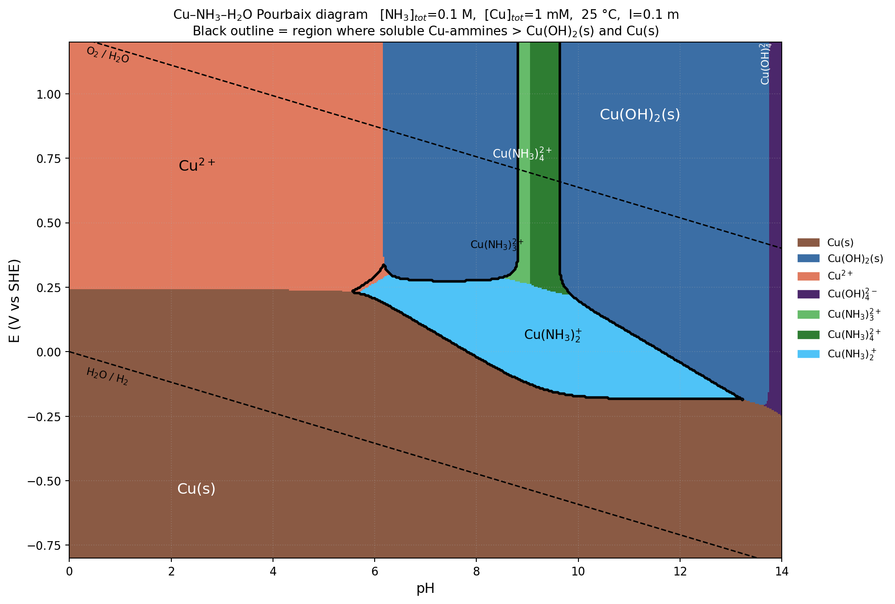

*Presented file: `pourbaix.py`*

## Thermodynamic set (25 °C, corrected to I = 0.1 m by Davies)

| Equilibrium | log K° | log K (I = 0.1) | Source-form |
|---|---|---|---|
| NH₄⁺ ⇌ NH₃ + H⁺ | −9.25 | −9.36 (mixed) | pKₐ |
| Cu²⁺ + H₂O ⇌ CuOH⁺ + H⁺ | −8.00 | −8.32 | B&M |
| Cu²⁺ + 2H₂O ⇌ Cu(OH)₂(aq) + 2H⁺ | −16.20 | −16.63 | B&M |
| Cu²⁺ + 3H₂O ⇌ Cu(OH)₃⁻ + 3H⁺ | −26.90 | −27.22 | B&M |
| Cu²⁺ + 4H₂O ⇌ Cu(OH)₄²⁻ + 4H⁺ | −39.60 | −39.60 | B&M |
| Cu²⁺ + n NH₃ ⇌ Cu(NH₃)ₙ²⁺, n = 1–4 | 4.04, 7.47, 10.27, 11.75 | unchanged (z is preserved) | — |
| Cu⁺ + n NH₃ ⇌ Cu(NH₃)ₙ⁺, n = 1, 2 | 5.93, 10.86 | unchanged | — |
| Cu(OH)₂(s) + 2H⁺ ⇌ Cu²⁺ + 2H₂O | +8.64 | 9.07 (uses [Cu²⁺], a(H⁺)) | log Kₛₚ° = −19.36 |
| Cu²⁺ + 2e⁻ ⇌ Cu(s) | E° = +0.342 V | E°′ = +0.329 V | Nernst |
| Cu²⁺ + e⁻ ⇌ Cu⁺ | E° = +0.159 V | E°′ = +0.140 V | Nernst |

Total ammonia mass balance: [NH₃] + [NH₄⁺] = 0.100 M (Cu depletion of NH₃ is ≤ 4 % and neglected). Cu(I) hydroxide/oxide solids excluded per the "prefer hydroxide" instruction — CuOH is unstable and Cu₂O is not a hydroxide.

## Fields on the diagram

Reading the map: at low pH Cu²⁺ prevails; at low E the metal takes over; at high pH Cu(OH)₂(s) dominates and eventually Cu(OH)₄²⁻ appears above pH ≈ 13.5. The interesting structure is the **soluble-ammine "keyhole"** carved out at moderate E and pH ≈ 6–13. It splits into two sub-regions with a Cu(I)/Cu(II) crossover near E ≈ +0.25 to +0.30 V:

- **Cu(I) ammine leaf** – dominated by Cu(NH₃)₂⁺ (light blue). Broad in pH (≈ 6–13) because Cu(I) has no stable hydroxide here and log β₂ = 10.86 is very large.
- **Cu(II) ammine spike** – Cu(NH₃)₃²⁺ and Cu(NH₃)₄²⁺ (greens). Narrow, ≈ pH 8.8–9.6, sitting above the Cu(I) leaf.

## Ammine-dominance window (black outline)

Criterion: no solid stable, and Σ[Cu-ammine] > ½·[Cu]_tot.

At E = 0.30 V the pH window is **6.0 → 9.6**. Traced across E:

```
   E (V)   pH_low   pH_high   width
  −0.15     9.40    12.9      3.5
   0.00     7.83    11.6      3.8
   0.10     7.00    10.8      3.8
   0.20     6.06     9.98     3.9
   0.30     6.04     9.6      3.6   ← Cu(I)→Cu(II) crossover
   0.35+    8.83     9.62     0.8   (only Cu(II) ammines survive)
```

- **Lower pH edge** (≈ 6): free [NH₃] gets tiny (NH₃/NH₄⁺ ≈ 1:2000 at pH 6). The complexes can no longer hold ≥ 1 mM Cu, and the field collapses into Cu²⁺.
- **Upper pH edge**: two mechanisms.
  - In the **Cu(II) spike**, Cu(OH)₂(s) precipitates above pH ≈ 9.6. Once [NH₃] plateaus near 0.1 M, [OH⁻] keeps rising and the reaction Cu(OH)₂(s) + 4NH₃ ⇌ Cu(NH₃)₄²⁺ + 2OH⁻ (log K = log β₄ − log Kₛₚ = 11.75 − 19.36 = −7.61) can only solubilize ≈ 2.5 µM Cu at pH 11 — well below 1 mM, so the solid persists.
  - In the **Cu(I) leaf**, the loss is again to Cu(OH)₂(s) via Cu(NH₃)₂⁺ oxidation/re-precipitation once one moves out of the reducing envelope, which sets the sloped roof.
- **Lower E edge** ≈ −0.12 V at pH 9 (Cu(NH₃)₂⁺ + e⁻ → Cu(s) + 2NH₃, E°′ = −0.123 V at unit NH₃; the slope on the diagram follows −0.118·log[NH₃] per NH₃ pair released).
- **Upper E edge** is water oxidation; no upper Cu redox boundary inside the ammine field itself.

## Practical take-away

For 0.1 M total NH₃ and 1 mM Cu, ammoniacal dissolution is thermodynamically comfortable only in a fairly small oxidizing region — **roughly pH 8.5–9.5 and E ≈ 0.05–0.7 V** — because at higher pH Cu(OH)₂(s) reclaims the field even with all the ammonia deprotonated. To widen the window (e.g. to reach pH 10–11 without re-precipitating hydroxide), you need to raise [NH₃]_tot to ~1 M or more; each decade in [NH₃] shifts the upper-pH edge by ≈ 2 pH units (four NH₃ per Cu(NH₃)₄²⁺, two OH⁻ produced). If you happen to be etching, working just under +0.3 V and pH 9–9.5 gives full Cu(NH₃)₃²⁺/Cu(NH₃)₄²⁺ solubilization with a comfortable margin against Cu(OH)₂.

A caveat on Kₛₚ: literature values for Cu(OH)₂ range from log Kₛₚ ≈ −18.6 (freshly precipitated) to −20.4 (aged/tenorite-like). Using −18.6 pushes the upper-pH edge of the ammine field ≈ 0.4 units higher; using −20.4 pushes it lower by ≈ 0.5. The code in `pourbaix.py` uses −19.36 (Baes & Mesmer) — change `log_Kstar_CuOH2` if you want to see the sensitivity.
