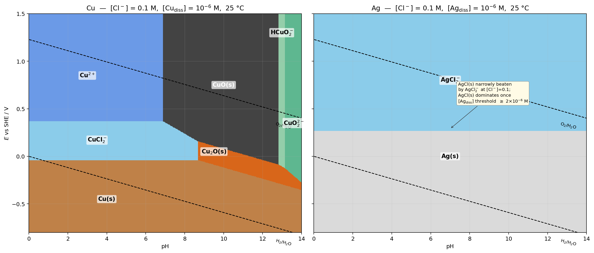

*Presented file: `pourbaix_Cu_Ag.py`*

## Pourbaix diagrams: Cu and Ag in 0.1 M Cl⁻, 25 °C

The two panels above use the same convention: dissolved-species threshold set at 10⁻⁶ M (standard "immunity/passivity/corrosion" cutoff), [Cl⁻] fixed at 0.1 M, water-stability lines dashed.

### Thermodynamic inputs the solver used

**Copper**

| Half-reaction / equilibrium | Value |
|---|---|
| Cu²⁺ + 2 e⁻ ⇌ Cu(s) | E° = +0.340 V |
| Cu⁺ + e⁻ ⇌ Cu(s) | E° = +0.520 V |
| Cu²⁺ + e⁻ ⇌ Cu⁺ | E° = +0.159 V |
| CuCl(s) ⇌ Cu⁺ + Cl⁻ | log Kₛₚ = −6.47 → E°(CuCl/Cu,Cl⁻) = +0.137 V |
| Cu⁺ + 2 Cl⁻ ⇌ CuCl₂⁻ | log β₂ = +5.50 → E°(CuCl₂⁻/Cu,2Cl⁻) = +0.195 V |
| Cu₂O + 2 H⁺ + 2 e⁻ ⇌ 2 Cu + H₂O | E° = +0.471 V |
| 2 CuO + 2 H⁺ + 2 e⁻ ⇌ Cu₂O + H₂O | E° = +0.669 V |
| CuO + 2 H⁺ ⇌ Cu²⁺ + H₂O | log K = +7.66 |
| CuO + H₂O ⇌ HCuO₂⁻ + H⁺ | log K = −18.83 |
| HCuO₂⁻ ⇌ CuO₂²⁻ + H⁺ | log K = −13.15 |

**Silver**

| Half-reaction / equilibrium | Value |
|---|---|
| Ag⁺ + e⁻ ⇌ Ag(s) | E° = +0.7996 V |
| AgCl(s) ⇌ Ag⁺ + Cl⁻ | log Kₛₚ = −9.75 → E°(AgCl/Ag,Cl⁻) = +0.223 V |
| Ag⁺ + 2 Cl⁻ ⇌ AgCl₂⁻ | log β₂ = +5.04 → E°(AgCl₂⁻/Ag,2Cl⁻) = +0.501 V |
| 2 Ag⁺ + H₂O ⇌ Ag₂O + 2 H⁺ | log K = −12.60 → E°(Ag₂O/Ag) = +1.172 V |

The solver builds a per-metal-atom chemical potential

μ/F = (n/x)(E° − E) − (b/x)·0.0592·pH − (c/x)·0.0592·log[Cl⁻] + (1/x)·0.0592·log aₛₚₑc

for every candidate species and picks the smallest at each (pH, E) grid point.

### Effective boundaries at [Cl⁻] = 0.1 M, threshold 10⁻⁶ M

| Boundary | E vs SHE |
|---|---|
| Cu(s) / CuCl(s) | +0.196 V *(inactive — CuCl₂⁻ wins)* |
| Cu(s) / CuCl₂⁻ | **−0.042 V** |
| Ag(s) / AgCl(s) | +0.282 V *(marginal)* |
| Ag(s) / AgCl₂⁻ | **+0.265 V** |
| **ΔE(Ag − Cu) at the immunity ceiling** | **+0.307 V** |

### Which metal is more easily reduced under mildly acidic, weakly oxidising conditions?

**Silver, by ≈ 0.3 V.** Pick any point in that region — say pH 4, E = +0.20 V (roughly the potential of a well-aerated near-neutral solution). On the silver panel the point sits inside the Ag(s) immunity field, so Ag stays metallic. On the copper panel the same point lies inside the CuCl₂⁻ field, so copper actively corrodes to a soluble chloride complex.

Two effects are stacked in the same direction:

**(1) The intrinsic aqueous potentials are already ordered that way.** E°(Ag⁺/Ag) = +0.80 V is 0.28 V above E°(Cu⁺/Cu) = +0.52 V. Silver's outer 5s¹ electron is more strongly bound (fully filled 4d¹⁰ shell, larger relativistic stabilisation of the 5s orbital) and Ag⁺ has a smaller hydration enthalpy than Cu⁺, so pulling an electron off Ag(s) into water costs more.

**(2) Chloride complexation slightly narrows the gap but does not close it.** The two β₂ values are comparable (10⁵·⁰⁴ for AgCl₂⁻ vs 10⁵·⁵⁰ for CuCl₂⁻); complexation lowers both E°(M⁺/M) boundaries similarly, so the ~0.3 V head start Ag has in pure water survives essentially intact in 0.1 M chloride.

There is also a **qualitative difference in the failure mode** just above each immunity ceiling. Silver moves into AgCl(s) — the calculation actually places the AgCl₂⁻ field ~0.017 V below AgCl(s) at [Cl⁻] = 0.1 M and the 10⁻⁶ M threshold, but this is marginal: raising the threshold to ≈ 2 × 10⁻⁶ M or lowering [Cl⁻] slightly makes AgCl(s) the stable phase (this is the annotated yellow note on the Ag panel). So in practice Ag *passivates* — a protective chloride film forms. Copper, by contrast, goes straight into CuCl₂⁻(aq), which is *active* corrosion with no protective solid at low pH. That is why copper piping suffers in chloride-rich water while silver artefacts survive burial in chloride-bearing soils under a thin cerargyrite (AgCl) crust.

The Python script that generated everything is attached alongside the figure if you'd like to change the chloride activity, the immunity threshold, or the temperature.
