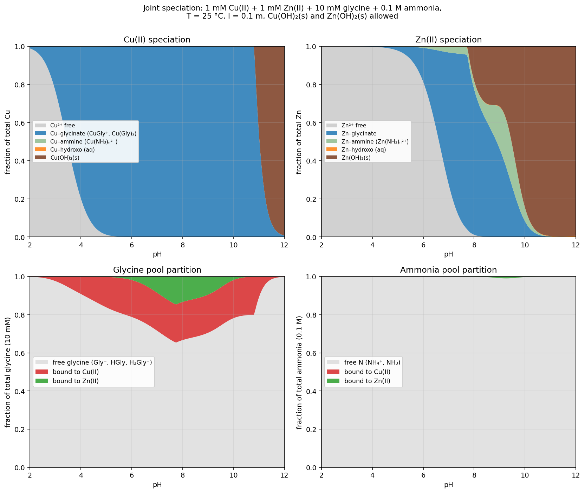
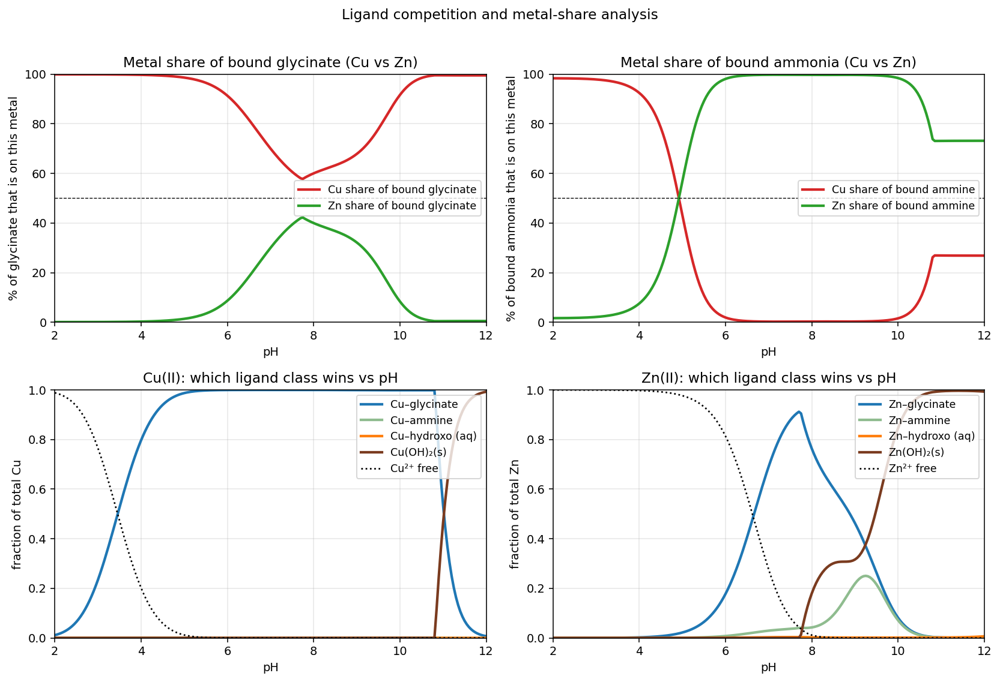

## Setup and constants

Totals: Cu(II) 1 mM, Zn(II) 1 mM, glycine 10 mM, ammonia 0.1 M. T = 25 °C, I = 0.1 m. All four mass balances closed to ≤ 10⁻¹¹ across the pH grid, with hydroxide solids permitted. The formation constants used (log β, conditional at I = 0.1 m, Martell/Smith and IUPAC critical sets; Baes & Mesmer for hydrolysis) are:

- Glycine: p*K*ₐ₁ = 2.36, p*K*ₐ₂ = 9.57
- NH₄⁺/NH₃: p*K*ₐ = 9.29; p*K*w = 13.78
- Cu–glycinate log β₁, β₂ = 8.15, 15.00
- Zn–glycinate log β₁…β₃ = 5.00, 9.20, 11.00
- Cu–ammine log β₁…β₄ = 4.05, 7.47, 10.30, 11.75
- Zn–ammine log β₁…β₄ = 2.27, 4.61, 7.01, 9.06
- Cu(OH)₂(s) log Kₛₚ = −19.7; Zn(OH)₂(s) log Kₛₚ = −16.5

Mixed-ligand Cu(Gly)(NH₃) and analogous ternaries are known but modest; I did not include them, and I note where that assumption bites.

## What the calculation actually shows

**Cu is essentially "locked" as a glycinate chelate over almost the entire non-acidic pH range.** By pH 4, Cu(Gly)⁺ already accounts for ~70 % of total Cu; by pH 5–6 the switch to Cu(Gly)₂ is complete and stays >99 % all the way to about pH 10.8. The chelate effect (log β₂ ≈ 15) beats the tetraammine Cu(NH₃)₄²⁺ (log β₄ ≈ 11.75) even though ammonia is 10× more concentrated than glycine, so Cu–ammine species never exceed ~1 % anywhere in this window.

**Zn behaves quite differently** because its glycinate constants are 3+ log units smaller. Zn stays mostly as free Zn²⁺ up to pH ~6, transitions through ZnGly⁺ / Zn(Gly)₂ (peak ~90 % Zn-glycinate around pH 7.5–8), and then loses that ligation as Zn(OH)₂(s) becomes the sink. Zn(NH₃)ₙ²⁺ makes a real but modest appearance (~20–25 % of Zn) in a narrow window near pH 9.

## Metal partition of the shared ligand pool

**Glycinate.** Cu wins the glycinate pool at every pH.

- pH < 6: Cu takes >90 % of all bound glycinate; Zn hasn't started binding.
- pH 7–8: Cu still holds 60–70 % of bound glycinate — this is the closest Zn gets. At pH ~7.7 the Cu share bottoms out at ~58 %; Zn's share peaks at ~42 %. Because Cu is only 1 mM and *saturated* as Cu(Gly)₂ (i.e. it is using 2 mM of the 10 mM glycine and can't take more), the "extra" glycinate spills onto Zn, but Zn's weaker binding keeps it from ever overtaking.
- pH > 10: Zn precipitates and drops out; Cu's share of glycinate returns to ~99 %.

**Ammonia.** The crossover here is at pH ≈ 4.9.

- pH < 4.9: The few complexed NH₃ ligands are on Cu (because free NH₃ is vanishing, and Cu binds any NH₃ strongly, log β₁ = 4.05 vs 2.27 for Zn). Absolute amounts are tiny — most N is NH₄⁺.
- pH 5–10: Zn holds 98–99.8 % of all ammine-bound N. Cu is not competing because it is already saturated with glycinate.
- pH > 11: Zn precipitates, so its ammine share collapses; Cu(OH)₂(s) also forms, and what little Cu is still aqueous carries ~27 % of the (very small) bound-ammonia pool.

The ammonia pool itself is barely dented: even at the peak (~pH 9) only ~1 % of total ammonia is complex-bound. Ammonia is present in vast excess and does not become a limiting ligand.

## Where hydroxide solids take over

Using the crossover between "glycinate + ammine" ligation and "hydroxo species + hydroxide solid" on each metal:

| Metal | Onset of *M*(OH)₂(s) | 50 % precipitated | 99 % precipitated | Complex→hydroxide crossover |
|---|---|---|---|---|
| **Zn** | ≈ pH **7.75** | pH **9.5** | pH **10.8** | pH **9.2** (Zn-glycinate ↔ Zn(OH)₂(s)) |
| **Cu** | ≈ pH **10.85** | pH **11.05** | pH **11.95** | pH **11.0** (Cu(Gly)₂ ↔ Cu(OH)₂(s)) |

So the "ligand → solid" windows are:

- **Zn(II):** glycinate/ammine ligation gives way to Zn(OH)₂(s) in a broad transition **pH ≈ 7.75 to 10.8**. Half-precipitation is at pH 9.5 despite the ligands; the glycinate chelate is not strong enough to prevent Zn(OH)₂ once *K*ₛₚ is exceeded by ~2 orders of magnitude.
- **Cu(II):** the strong Cu(Gly)₂ chelate holds off precipitation by roughly **4 pH units** past the ligand-free Cu(OH)₂ onset. Cu only starts precipitating at **pH ≈ 10.85** and is essentially complete by pH 12.

## A caveat on mixed ligands

Ternary complexes such as Cu(Gly)(NH₃)⁺ and Cu(Gly)₂(NH₃) (log K in the 3.5–5 range for adding NH₃ to Cu(Gly)ₙ) are documented for this system. Including them would nudge a little of the ammonia pool onto Cu around pH 8–10, softening the ~99 % Zn dominance of the ammine pool to something more like 85–90 %. It would not change the overall picture — Cu still wins glycinate, Zn still wins whatever ammine binding is left, and the hydroxide-solid windows are set by ligand-free hydrolysis so they shift only slightly.
