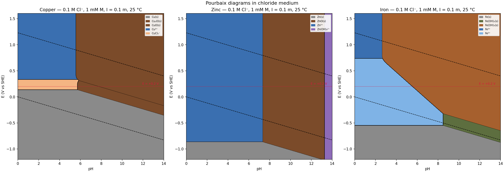

## Results

### Order of first hydroxide/oxide solid along E = +0.2 V

| Rank | Metal | First solid | Onset pH |
|---|---|---|---|
| 1 | **Iron** | Fe(OH)₃(s), ferrihydrite | **5.55** |
| 2 | **Copper** | Cu₂O(s), cuprite | **5.73** |
| 3 | **Zinc** | ZnO(s), zincite | **7.35** |

So the ordering is **Fe < Cu < Zn**. Iron and copper are within 0.2 pH units of each other — chloride is what closes the gap. In the absence of Cl⁻, Cu²⁺/CuO or Cu₂O would appear well before Fe(OH)₃ because Cu(II) hydrolysis is very tight and cuprite is very insoluble; here, the 0.1 M Cl⁻ stabilizes dissolved Cu(I) as CuCl₂⁻ (β = 10^5.50 M⁻²) all the way up to pH ≈ 5.7 at +0.2 V, and only then does Cu₂O nucleate. Ferric hydrolysis, by contrast, is barely touched by chloride (see below), so Fe(OH)₃ still comes out slightly first. Zinc has both the weakest hydrolysis and the weakest chloride binding, so ZnO waits until pH ≈ 7.3.

### Widest soluble chloro-complex predominance window

| Metal | Area where an aqueous Cl-complex is the predominant phase | Dominant complex |
|---|---|---|
| **Copper** | **1.12 V·pH** | **CuCl₂⁻** (Cu(I)) |
| Iron | 0.00 V·pH | — (Fe³⁺ and Fe²⁺ always win over FeCl_n) |
| Zinc | 0.00 V·pH | — (Zn²⁺ always wins over ZnCl_n) |

Copper is the overwhelming winner, and it does so through Cu(I), not Cu(II). On the diagram the CuCl₂⁻ region is the pale-orange stripe sitting on top of Cu(s) between roughly E = +0.14 V and +0.30 V, from pH 0 up to the pH ≈ 5.7 Cu₂O boundary. The physical reason: at [Cl⁻] = 0.1 M, β₂[Cl⁻]² = 10^5.50 × 10^−2 ≈ 316, so CuCl₂⁻ is ~300× more stable than free Cu⁺ at these chloride levels, and chloride shifts the Cu²⁺/Cu(I) couple downward enough (from +0.16 V for Cu²⁺/Cu⁺ to ≈ +0.30 V for Cu²⁺/CuCl₂⁻) to open a genuine predominance zone.

Neither Fe(III) nor Zn(II) can match this. At 0.1 M Cl⁻, one finds (after Davies correction on charges):
- **Fe(III)**: [FeCl²⁺]/[Fe³⁺] ≈ 0.69, [FeCl₂⁺]/[Fe³⁺] ≈ 0.11 — free Fe³⁺ still dominates.
- **Fe(II)**: β₁ = 10^0.14 is essentially zero binding; Fe²⁺ dominates.
- **Zn(II)**: Σ β_n[Cl⁻]^n ≈ 0.3, so ~24% of dissolved Zn sits as ZnCl_n but no single chloro-species — nor the sum — beats Zn²⁺.

You'd need ≳ 1 M Cl⁻ (seawater/brine regime) to open a chloride window for Fe or Zn.

### Reference log K° / E° values the solver actually used

Formation reactions are written from the reference ion in the form
nM·Mm+ + nH·H⁺ + nCl·Cl⁻ + ne·e⁻ + nw·H₂O → Species,
with **log K°** at zero ionic strength (activities). At runtime the solver adds Davies corrections (log γ = −0.509 · [√I/(1+√I) − 0.3I] · z² = −0.107 z² at I = 0.1) and uses log a(Cl⁻) = −1.107.

**Copper — reference Cu²⁺** (source: Baes & Mesmer, NIST 46, Powell et al. 2007 for Cu–Cl)
- *Redox:* E°(Cu²⁺/Cu) = +0.340 V → log K = +11.494; E°(Cu²⁺/Cu⁺) = +0.159 V → log K = +2.687
- *Cu(I) chloro (log β from Cu⁺):* CuCl(aq) 3.14, CuCl₂⁻ 5.50, CuCl₃²⁻ 5.70 (added to +2.687 in the solver to build log K° from Cu²⁺)
- *Cu(II) chloro (log β from Cu²⁺):* CuCl⁺ 0.40, CuCl₂(aq) 0.16
- *Cu(II) hydrolysis (log \*β):* CuOH⁺ −8.0, Cu(OH)₂(aq) −16.2, Cu(OH)₃⁻ −26.8, Cu(OH)₄²⁻ −39.6
- *Solids:* Cu₂O log K = +6.98 (2Cu²⁺ + 2e⁻ + H₂O → Cu₂O + 2H⁺); CuO log \*K_s = 7.65 (dissolution); CuCl(s) log K_s = 6.7 (from Cu⁺ + Cl⁻)

**Zinc — reference Zn²⁺** (source: NIST 46, Baes & Mesmer)
- *Redox:* E°(Zn²⁺/Zn) = −0.762 V → log K = −25.76
- *Chloro:* log β = 0.43, 0.61, 0.53, 0.20 for ZnCl⁺ … ZnCl₄²⁻
- *Hydrolysis (log \*β):* ZnOH⁺ −8.96, Zn(OH)₂(aq) −17.79, Zn(OH)₃⁻ −28.4, Zn(OH)₄²⁻ −41.2
- *Solid:* ZnO(s) log \*K_s = +11.20 (dissolution)

**Iron — reference Fe³⁺** (source: NIST 46 / Stumm & Morgan; ferrihydrite from Cornell & Schwertmann)
- *Redox:* E°(Fe³⁺/Fe²⁺) = +0.771 V → log K = +13.03; E°(Fe²⁺/Fe) = −0.447 V → combined E°(Fe³⁺/Fe) = −0.041 V → log K = −2.08
- *Fe(III) chloro (log β):* FeCl²⁺ 1.48, FeCl₂⁺ 2.13, FeCl₃(aq) 1.13
- *Fe(II) chloro (log β):* FeCl⁺ 0.14
- *Fe(III) hydrolysis (log \*β):* FeOH²⁺ −2.19, Fe(OH)₂⁺ −5.67, Fe(OH)₃(aq) −12.56, Fe(OH)₄⁻ −21.6
- *Fe(II) hydrolysis (log \*β):* FeOH⁺ −9.5, Fe(OH)₂(aq) −20.6, Fe(OH)₃⁻ −31.0
- *Solids:* Fe(OH)₂(s) log \*K_s = +13.5 (dissolution); Fe(OH)₃(s), ferrihydrite log \*K_s = +3.5 (dissolution)

### Simplifications built into the solver (worth stating)

- Mononuclear aqueous species only — Fe₂(OH)₂⁴⁺, Cu₂(OH)₂²⁺ are omitted, which slightly under-predicts hydrolysis at 1 mM total.
- **Ferrihydrite** (log \*K_s = 3.5) is used for Fe(OH)₃(s), not hematite (log \*K_s ≈ −1.9 per Fe). Hematite would push the Fe(OH)₃/Fe²⁺ boundary further left and make Fe an even clearer "first-solid" winner. Ferrihydrite is the practical phase that actually forms on the ~day timescale.
- **Magnetite Fe₃O₄** omitted; it would appear as a small wedge in the low-E, mid-pH iron corner if included.
- pH and pe treated per activity convention (a_H⁺ = 10^−pH, a_e⁻ = 10^−pe); [Cl⁻] treated as concentration with Davies γ_Cl⁻.
- Chloride mass balance ignored (max 4% consumed by 1 mM metal × 4 ligands), so a(Cl⁻) is held at 0.078 across the whole diagram.
