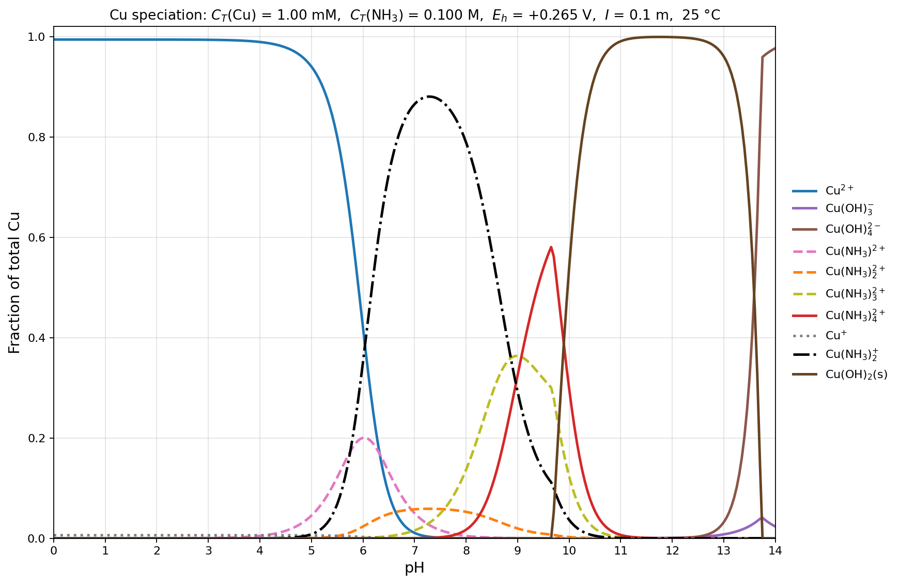

*Presented file: `cu_speciation.csv`*

*Presented file: `cu_speciation.py`*

## Model set-up

Species tracked (12 Cu forms, plus Cu(OH)₂(s)):
- **Cu(II) aqueous:** Cu²⁺, CuOH⁺, Cu(OH)₂(aq), Cu(OH)₃⁻, Cu(OH)₄²⁻, Cu(NH₃)²⁺, Cu(NH₃)₂²⁺, Cu(NH₃)₃²⁺, Cu(NH₃)₄²⁺
- **Cu(I) aqueous:** Cu⁺, Cu(NH₃)₂⁺  (both linked to Cu(II) via Nernst at Eh = 0.265 V)
- **Solid:** Cu(OH)₂(s), Ksp ≈ 10⁻¹⁹·³² (hydroxide only, per your request)

Constraints solved at every pH:
1. Cu mass balance: Σ dissolved Cu + Cu(OH)₂(s) = 1.00 × 10⁻³ M
2. N mass balance: [NH₃] + [NH₄⁺] + Σ n·[Cu(NH₃)ₙ] = 0.100 M
3. Nernst: a(Cu²⁺)/a(Cu⁺) = 10^((0.265 − 0.153)/0.05916) = 78.2 (activity), 164 (conc., after γ correction)
4. Saturation switch: Cu(OH)₂(s) precipitates once γ₂[Cu²⁺]·a(OH⁻)² > Ksp

Activity coefficients from Davies at I = 0.1 m: γ₁ = 0.782, γ₂ = 0.373. Constants (25 °C, I = 0): log Ka(NH₄⁺) = −9.25; log β₁–β₄ for Cu(II)–NH₃ = 4.04, 7.47, 10.27, 11.75; log β₂ for Cu(I)–NH₃ = 10.86; log \*βₙ for Cu(II) hydrolysis = −7.96, −16.2, −26.9, −39.6. Sources: Baes & Mesmer (hydrolysis, Ksp), Sillén–Martell / NIST 46 (ammine β's).

Mass-balance closure is at machine precision (worst residual ~5 × 10⁻¹³) across the full sweep.

## What the diagram shows

**pH 0–5 (Cu²⁺ dominant).** ~99% free Cu²⁺, with a flat ~0.6% Cu⁺ background fixed by Eh. No NH₃ is available (all NH₄⁺), so ammine complexes are negligible.

**pH 5–9 (Cu(I) diammine window).** The striking feature: **Cu(NH₃)₂⁺ climbs to ~88% at pH 7.3.** This is real, not an artifact — Eh = 0.265 V is only 112 mV above E°(Cu²⁺/Cu⁺), and Cu(I) is enormously stabilized by NH₃ (log β₂ = 10.86). Even the tiny Cu⁺ fraction gets scavenged into Cu(NH₃)₂⁺ once trace NH₃ appears. The Cu(II) ammine ladder Cu(NH₃)²⁺ → Cu(NH₃)₂²⁺ passes through as minor players.

**pH 9–10 (Cu(II) tetraammine).** As [NH₃] grows past ~0.03 M, the NH₃⁴ dependence of β₄(Cu²⁺) overtakes the NH₃² dependence of β₂(Cu⁺). Cu(NH₃)₃²⁺ peaks near pH 9 (~36%), Cu(NH₃)₄²⁺ near pH 9.6 (~58%).

**pH 9.7–13 (Cu(OH)₂(s)).** Precipitation wins: solid rises sharply to ~99% and stays there. Even the strongest ammine complex can't keep Cu²⁺ below the saturation ceiling in this window.

**pH > 13.5 (Cu(OH)₄²⁻).** The tetrahydroxo anion redissolves the solid; at pH 14 it accounts for ~98% of total Cu.

Files above: the PNG, the full fraction-vs-pH table as CSV (0.05 pH resolution), and the Python solver. If you'd like a Pourbaix-style Eh–pH map instead, or want to swap in a different Ksp (crystalline tenorite CuO uses log \*Ks ≈ +7.65) or add Cu₂O(s) so we can see whether it beats Cu(OH)₂ at these conditions, say the word.
