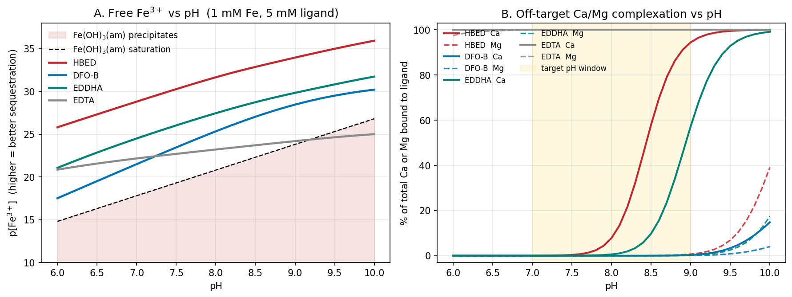

*Presented file: `fe_sequestrant_report.md`*

*Presented file: `speciate.py`*

**Bottom line: DFO-B (desferrioxamine B)** across the full pH 7–9 window; **HBED** if you can cap operation at pH ≤ 8.2 and want a cheaper, industrial-scale option.

Headlines from the run (1 mM each metal, 5 mM ligand, I = 0.1 M):

| | pH 7 | pH 8 | pH 9 |
|---|---|---|---|
| **DFO-B** p[Fe³⁺] / margin / %Ca / %Mg | 21.5 / +3.7 / 0.0 / 0.0 | 25.3 / +4.5 / 0.0 / 0.0 | 28.5 / +4.7 / 0.3 / 0.1 |
| **HBED** p[Fe³⁺] / margin / %Ca / %Mg | 28.8 / +11.0 / 0.01 / 0.0 | 31.7 / +10.9 / 7.8 / 0.0 | 34.0 / +10.2 / **94.4** / 0.7 |
| **EDDHA** p[Fe³⁺] / margin / %Ca / %Mg | 24.5 / +6.7 / 0.0 / 0.0 | 27.5 / +6.7 / 0.6 / 0.0 | 29.8 / +6.0 / 57 / 0.3 |
| EDTA (comparison) | 22.2 / +4.4 / 100 / 100 | 23.2 / +2.4 / 100 / 100 | 24.2 / +0.4 / 100 / 100 |

("margin" = orders of magnitude that free [Fe³⁺] sits below Fe(OH)₃(am) saturation — positive = Fe stays dissolved.)

DFO-B is the only ligand that keeps both objectives satisfied everywhere in pH 7–9: 100 % of the Fe is bound as Fe(HDFB)⁺ with ~4 orders of margin against ferrihydrite precipitation, and Ca + Mg complexation together stay under half a percent. Its hydroxamate donors are pre-organised for Fe(III) and are hopelessly mismatched to hard-sphere Ca²⁺/Mg²⁺ (log K_Ca = 2.64, log K_Mg = 2.02), so raising the pH into the 8–9 range never activates hardness scavenging.

HBED wins on raw Fe-binding strength (~10 orders of margin instead of ~4) and is far more practical for real water treatment, but its phenolate pKₐ's (11.0, 12.5) let Ca into the coordination sphere as pH climbs — 8 % Ca bound at pH 8, but 94 % at pH 9. If the operating pH will drift above ~8.3 in your system, HBED fails the selectivity criterion.

The full survey table, method, per-pH tables, figure, and a runnable `speciate.py` are in the files above — swap in your own log K's or metal totals and rerun.
