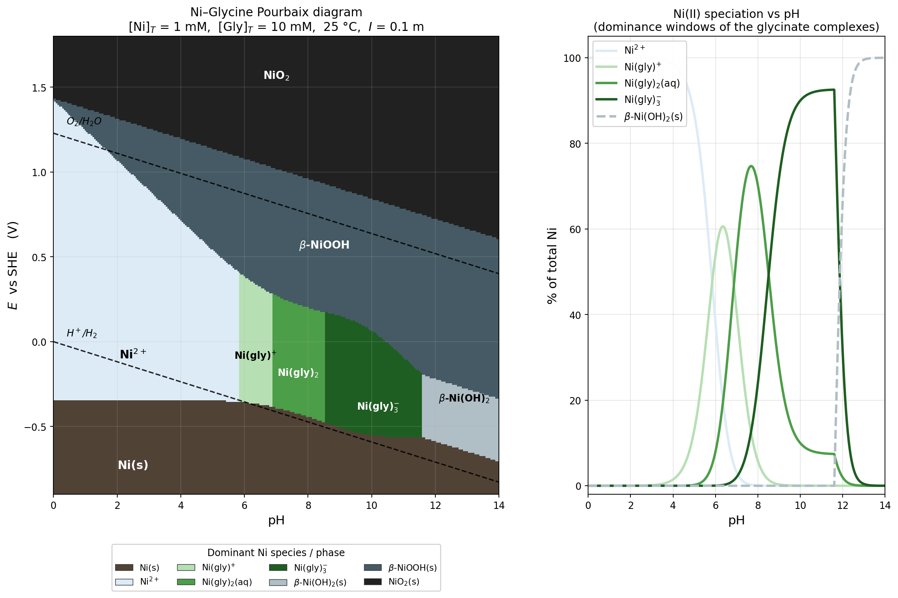

## Ni–Glycine Pourbaix diagram

The left panel of the figure is the 2-D E–pH diagram at your conditions ([Ni]ₜ = 1 mM, [Gly]ₜ = 10 mM, 25 °C, I = 0.1 m). The right panel is a Ni(II) speciation plot along the pH axis so the sequential dominance windows of the glycinate complexes are easy to read.

### Thermodynamic data used (25 °C, I = 0.1 m, Martell & Smith)

- Glycine acidity: pKₐ₁ = 2.35 (COOH), pKₐ₂ = 9.60 (NH₃⁺)
- Ni²⁺ + n Gly⁻ ⇌ Ni(Gly)ₙ^(2–n): log β₁ = 5.78, log β₂ = 10.58, log β₃ = 13.83
- β-Ni(OH)₂(s) + 2H⁺ ⇌ Ni²⁺ + 2H₂O: log *Kₛ = 12.8
- E°(Ni²⁺/Ni) = –0.257 V; E°(β-NiOOH/β-Ni(OH)₂) = +0.49 V; E°(NiO₂/NiOOH) = +1.434 V

I solved the coupled Ni + Gly mass balances at every pH (with a check on Ni(OH)₂ saturation), then placed the redox boundaries using the free [Ni²⁺] that comes out of that speciation.

### Soluble Ni-glycinate stability windows

Along the aqueous corridor (i.e. between the Ni(s) line below and the NiOOH(s) line above), the dominant Ni(II) species change as follows:

| pH range | Dominant Ni(II) species | Fraction at peak |
|---|---|---|
| 0 – 5.85 | Ni²⁺(aq) | ≈100 % below pH 4 |
| 5.85 – 6.87 | Ni(gly)⁺ | ~61 % near pH 6.2 |
| 6.87 – 8.51 | Ni(gly)₂(aq) | ~75 % near pH 7.6 |
| 8.51 – 11.6 | Ni(gly)₃⁻ | ~93 % near pH 10.5 |
| > 11.6 | β-Ni(OH)₂(s) precipitates | — |

Ni(II) stays **fully aqueous up to pH ≈ 11.6**. Without glycine, β-Ni(OH)₂ would already saturate at 1 mM Ni near pH 7.9 (from log *Kₛ = 12.8 → pH = ½(12.8 – 3) ≈ 4.9 on the incipient side and 7.9 for the free-ion 1 mM boundary). Glycinate therefore extends the soluble window by roughly **3.7 pH units** by locking Ni into Ni(gly)₂ and especially the tris-glycinate Ni(gly)₃⁻.

### Redox borders of the aqueous corridor

The lower (metal) boundary Ni²⁺/Ni tilts downward with pH because complexation lowers free [Ni²⁺]:

| pH | E(Ni²⁺/Ni) [V] | E(Ni(II)ₐq/NiOOH) [V] |
|---|---|---|
| 3 | –0.35 | +0.89 |
| 5 | –0.35 | +0.54 |
| 7 | –0.39 | +0.27 |
| 9 | –0.51 | +0.15 |
| 11 | –0.56 | –0.09 |

So the soluble Ni-glycinate region occupies roughly the corridor from about E ≈ –0.35 V (pH 3) to –0.56 V (pH 11) at the bottom and from ≈ +0.89 V (pH 3) down to ≈ –0.09 V (pH 11) at the top. Practically all of that corridor sits inside the water-stability window, which is why Ni-glycinate solutions are stable and easy to handle around neutral pH.

### A couple of caveats

- I have not included the minor Ni-hydroxo species (NiOH⁺, Ni(OH)₂(aq), Ni(OH)₃⁻) or any mixed Ni-Gly-OH complexes. At pH > 11 the ternary Ni-Gly-OH species are known but their formation constants are not well established; if you include them the upper solubility limit shifts by a few tenths of a pH unit.
- log Kₛ for β-Ni(OH)₂ is reported in the range 10.5–13.0 depending on aging and crystallinity; using 12.8 (aged β-form) gives the boundary at pH ≈ 11.6. A fresh, more soluble precipitate (log Kₛ ≈ 11) would push that boundary out to pH ≈ 12.
- Higher-oxide potentials (NiOOH, NiO₂) carry ±0.05 V uncertainty in the literature; the upper boundary of the NiOOH field is drawn accordingly and shouldn't be read to better than a couple of hundredths of a volt.
