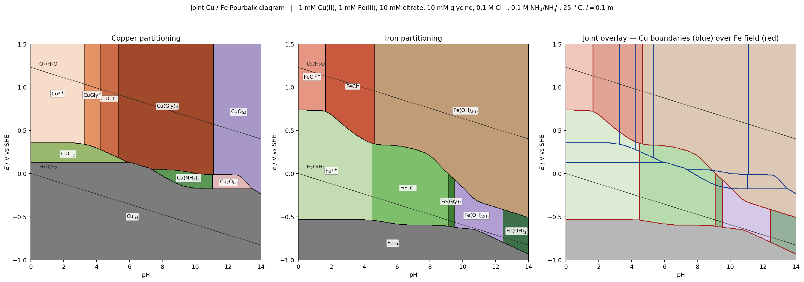

*Presented file: `pourbaix_CuFe_joint.pdf`*

## Approach

The solver builds a predominance map on a 421 × 376 (pH × E) grid. At each node it (i) computes ligand side-reaction coefficients α_L(pH) for citrate (Cit³⁻, three pKₐ), glycine (Gly⁻, two pKₐ), NH₃/NH₄⁺, OH⁻ and Cl⁻ using the mass-balance total ligand concentrations, (ii) evaluates conditional stabilities α_M(II)(pH) = 1 + Σ βᵢ[L]ⁱ for each metal in each redox state, (iii) partitions Cu(II)/Cu(I)/Cu(0) and Fe(III)/Fe(II)/Fe(0) with the Nernst equation using the conditional free-ion activities, and (iv) tests the dominant solid at that node by mass balance ([M]_dissolved,eq = α · [M_free at solid saturation] < C_total ⇒ solid dominates). Free ligand is approximated as C_L,tot · α_L(pH) — valid here because both citrate (10 mM) and glycine (10 mM) are in ≥10× excess over each metal (1 mM), and NH₃/Cl⁻ are in 100× excess.

## Equilibrium data actually used by the solver

**Acid–base (25 °C, I = 0.1 m):** citrate pKₐ = 3.13, 4.76, 6.40; glycine pKₐ = 2.35, 9.78; NH₄⁺ pKₐ = 9.25; pK_w = 13.78.

**Cu(II) log β for [Cu·Lᵢ]:** OH⁻ = 6.3, 11.8, 14.5, 15.6; Cl⁻ = 0.4, 0.16; NH₃ = 4.1, 7.6, 10.5, 12.6; Gly⁻ = 8.6, 15.6; Cit³⁻: CuCit⁻ = 5.9, CuHCit = 9.3, Cu(OH)Cit²⁻ = 10.4.
**Cu(I):** CuCl(aq) = 2.9, CuCl₂⁻ = 5.5, CuCl₃²⁻ = 5.7, Cu(NH₃)₂⁺ = 10.8.
**Fe(III):** OH⁻ = 11.81, 22.3, 28.8, 34.4; Cl⁻ = 1.48, 2.13, 1.10; FeCit = 11.85, FeHCit⁺ = 12.5, Fe(OH)Cit⁻ = 19.3, Fe(OH)₂Cit²⁻ = 24.2.
**Fe(II):** OH⁻ = 4.6, 7.5, 13.0; FeCl⁺ = 0.4; Gly⁻: FeGly⁺ = 4.3, Fe(Gly)₂ = 7.9; FeCit⁻ = 4.4, FeHCit = 6.1.

**Solids (log K° for M^n+ + n OH⁻ ⇌ solid, i.e. -log K_sp):** CuO(s) 7.65, Cu(OH)₂ 8.68, Cu₂O 1.5 (as 2 Cu⁺ + 2 OH⁻), Fe(OH)₃(s) 3.20, Fe(OH)₂ 12.9, FeOOH 0.5.

**Standard potentials (V vs SHE):** Cu²⁺/Cu⁺ +0.153, Cu²⁺/Cu(s) +0.342, Cu⁺/Cu(s) +0.521, Fe³⁺/Fe²⁺ +0.771, Fe²⁺/Fe(s) −0.44. Cell slope 2.303 RT/F = 0.05916 V/decade.

## Copper partitioning (left panel)

- **Cu(s)** occupies the entire lower half, up to a boundary that rises from ~+0.13 V at pH 0 (set by Cu²⁺ + 2 e⁻ → Cu(s) with α_Cu(II) shifted by chloride and glycine complexing), curves down through +0.05 V near pH 7 where Cu(Gly)₂ takes over as the dissolved form, and drops to about −0.23 V at pH 14 (Cu(s)/CuO boundary).
- **Cu²⁺(aq)** persists only pH ≲ 3.2 at E > +0.35 V, before glycine and citrate protonation frees enough ligand to depress the free Cu²⁺.
- **CuGly⁺** and **CuCit⁻** appear as narrow vertical bands, 3.2 < pH < 4.2 and 4.2 < pH < 5.3 respectively, above E ≈ +0.30 V. Each is one dominant-species step wide (~1 pH unit) and reflects the ordering log β(CuGly⁺) = 8.6 < log β(CuCit⁻) = 5.9 + protonation state of citrate.
- **Cu(Gly)₂(aq)** is the dominant Cu(II) species over the wide window pH 5.4–11.1, E > 0 V. This is the single largest Cu region (≈17k of 158k grid nodes). It wins over Cu(NH₃)₄²⁺ even at 100 mM NH₃ because log β₂(Gly) = 15.6 versus log β₄(NH₃) = 12.6 — a ≈10³ advantage that swamps the 10× ligand ratio.
- **CuO(s)** dominates for pH > 11.2 above E ≈ −0.23 V. Cu(OH)₂ is metastable relative to CuO at 25 °C and is only used as a check.
- **Cu(I) band:** a thin sliver of Cu(s)-stabilised aqueous Cu(I) opens up because of chloride and ammonia:
    - **CuCl₂⁻** for pH 0–5.8, E ≈ +0.14 to +0.35 V (the "chloride tongue" familiar from Cu–Cl Pourbaix diagrams).
    - **Cu(NH₃)₂⁺** near pH 7.5–11.0, E ≈ −0.05 to +0.05 V.
    - **Cu₂O(s)** occupies a small stability window pH 11–13.4, E ≈ −0.20 to −0.10 V, wedged between Cu(NH₃)₂⁺, CuO(s) and Cu(s).

## Iron partitioning (middle panel)

- **Fe(s)** covers the whole lower slice below E ≈ −0.54 V (nearly pH-independent; the Fe²⁺/Fe(s) couple slope in strong Fe²⁺ complexation regions is modest because Fe(II)–citrate stability is only log β ≈ 4.4).
- **Fe²⁺(aq)** dominates pH 0–4.5, −0.5 V < E < +0.36 V.
- **FeCit⁻ (Fe(II)–citrate)** — the wide green field over pH 4.5–9.1, E ≈ −0.5 to +0.3 V. Citrate is the dominant Fe(II) carrier here.
- **FeCit(aq) (Fe(III)–citrate)** and its hydroxo variants occupy pH 1.7–4.6 at E > +0.35 V — the well-known Fe(III)–citrate solubility window that holds ferric iron dissolved below pH ~5.
- **FeCl²⁺** appears only in a small triangle pH < 1.6 at E > +0.73 V (where free Fe³⁺ is high and chloride complexes are competitive).
- **Fe(OH)₃(s)** is the dominant ferric solid across essentially the whole map above pH 4.7 and E > −0.5 V (≈29k of 158k nodes — the single largest Fe region).
- **Fe(OH)₂(s)** takes a narrow slab pH 9.6–12.4 at E between −0.55 and about −0.30 V; **Fe(OH)₃⁻** takes over above pH 12.5 in the same E range (alkaline dissolution of the ferric solid via the amphoteric OH⁻ ligation).
- **Fe(Gly)₂(aq)** shows only as a sliver at pH 9.2–9.5 where glycine deprotonation (pKₐ 9.78) briefly overtakes citrate.

## Principal junctions (predominance triple/quadruple points)

**Copper:**
| Approx (pH, E / V) | Species meeting |
|---|---|
| 3.2, +0.36 | Cu²⁺ / CuCl₂⁻ / CuGly⁺ |
| 4.2, +0.30 | CuCit⁻ / CuCl₂⁻ / CuGly⁺ |
| 5.4–5.9, +0.15…+0.20 | Cu(Gly)₂ / CuCit⁻ / CuCl₂⁻ |
| 7.4–7.5, +0.05…+0.07 | Cu(Gly)₂ / Cu(NH₃)₂⁺ / Cu(s) / Cu₂O(s) (near-quadruple) |
| 11.1, −0.16 | Cu(NH₃)₂⁺ / Cu(s) / Cu₂O(s) |
| 11.2, −0.23 | Cu(Gly)₂ / CuO(s) / Cu(s) |

**Iron:**
| Approx (pH, E / V) | Species meeting |
|---|---|
| 1.7, +0.74 | Fe²⁺ / FeCit(aq) / FeCl²⁺ |
| 4.5–4.7, +0.36 | Fe²⁺ / FeCit⁻ / FeCit(aq) / Fe(OH)₃(s) (near-quadruple) |
| 9.1–9.6, −0.61…+0.01 | FeCit⁻ / Fe(Gly)₂ / Fe(OH)₃(s) / Fe(s) cluster |
| 12.5, −0.40 | Fe(OH)₂(s) / Fe(OH)₃(s) / Fe(OH)₃⁻ |
| 12.5, −0.78 | Fe(OH)₂(s) / Fe(OH)₃⁻ / Fe(s) |

## Boundary equations (Nernst form with conditional α)

For any redox couple M(n+) + n e⁻ ⇌ M((n−1)+), the boundary drawn is

E(pH) = E° + (0.05916/n) · log₁₀ [α_M(n+)(pH) · C_M / (α_M((n−1)+)(pH) · C_M)]
      = E° + (0.05916/n) · log₁₀ [α_M(n+)(pH) / α_M((n−1)+)(pH)]

so the pH dependence comes entirely from the difference of the two α-functions. Solid–aqueous boundaries are drawn from log K* with the appropriate H⁺ or OH⁻ stoichiometry, e.g. for CuO(s):

Cu²⁺ + H₂O ⇌ CuO(s) + 2 H⁺,   log ([Cu²⁺]/[H⁺]²) = 7.65,   so  [Cu²⁺]_sat = 10^(7.65 − 2 pH)

and the boundary is where [Cu²⁺]_sat · α_Cu(II)(pH) = 10⁻³ (1 mM total). The vertical rises at pH ≈ 3.2, 4.2, 5.4 in the Cu(II) field are exactly the citrate/glycine (de)protonation steps rolled up into α_Cu(II).

## Caveats

This is a specialist's sketch built on published log β and E° values (Martell & Smith, NIST 46, IUPAC compilations), not the output of a certified thermodynamic package (HSC, GWB/PHREEQC, Medusa, FactSage). Three deliberate approximations are worth stating:

1. **Ligand depletion neglected.** Free-ligand concentration is set to C_L,tot · α_L(pH) without subtracting metal-bound ligand. Safe here because ligand:metal ratios are 10–100, but breaks down at total metal ≳ 5 mM.
2. **Activity coefficients rolled into the reported log β.** Every constant used is a conditional (mixed) constant at I ≈ 0.1 m; no explicit Davies/SIT correction is applied on top. Redoing the solver at I = 1 m or in seawater would shift many boundaries by 0.05–0.15 pH/E units.
3. **Kinetics ignored.** Ammonia oxidation to N₂/NO_x above the O₂/H₂O line, citrate oxidation at high E, and Fe(OH)₃(s) → goethite/hematite ageing are all thermodynamically favourable in parts of the map but slow at 25 °C on laboratory timescales; the diagram is a snapshot of the metastable solution equilibrium a chemist would actually measure over minutes to hours.

For a publication-grade version I would re-run the same species set in Medusa or PHREEQC with a WATEQ4F/minteq database and cross-plot the boundaries; the topology should match what is shown here to within a few tenths of a pH unit and ~50 mV in E.
