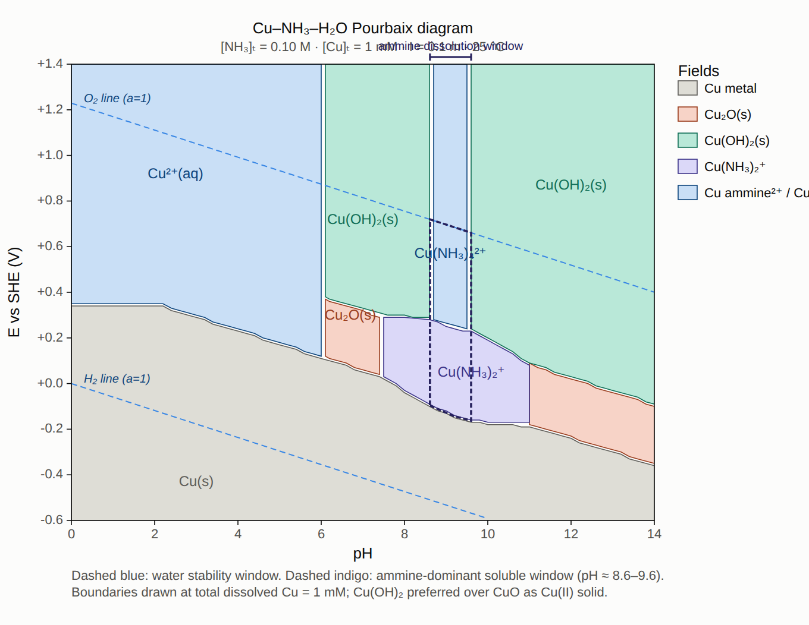

Now to render. I'll pass the SVG through the visualizer.

### How to read it

Five fields are drawn from the equilibrium classifier (Davies-corrected at *I* = 0.1 m, boundaries taken at a total soluble Cu of 1 mM). The vertical stack at each pH follows the sequence you would expect walking up in potential — metal, cuprous oxide, cupric hydroxide, then soluble Cu(II). Ammonia rearranges the picture wherever free NH₃ is significant.

### The key result: the soluble Cu-ammine window

**Cu(OH)₂(s) is stable in two disjoint pH intervals**, not one. At 0.1 M NH₃ / 1 mM Cu the boundary condition `α_Cu(II) · *K*ₛ · [H⁺]² = 10⁻³ M` has three roots (≈ 6.09, 8.61, 9.60), so the solid field splits:

| pH interval | Cu(II) form |
|---|---|
| 0 – 6.1 | Cu²⁺(aq), essentially no complexation |
| 6.1 – 8.6 | Cu(OH)₂(s) — hydroxide wins |
| **8.6 – 9.6** | **Cu(NH₃)ₙ²⁺ (soluble) — ammine wins** |
| 9.6 – 14 | Cu(OH)₂(s) — hydroxide wins again |

The middle band is the answer to your last question. Inside it, ammine complexes dominate over both Cu(OH)₂(s) and Cu(s):

- **pH ≈ 8.6 – 9.6**, **E ≈ −0.16 V to +1.23 V vs SHE** (the H₂O/O₂ line caps it).
- At E ≈ +0.10 V the dominant complex switches from **Cu(NH₃)₂⁺** (below, ≈ 100% of dissolved Cu(I)) to **Cu(NH₃)₄²⁺** (above, ≈ 70% of dissolved Cu(II), with Cu(NH₃)₃²⁺ ≈ 25% and Cu(NH₃)₅²⁺ ≈ 3%).
- Widest E-slice: ≈ 1.56 V at pH 9.5.

Outside this narrow pH strip either the hydroxide re-precipitates (upward re-appearance above pH ≈ 9.6 is the counter-intuitive part) or Cu²⁺(aq) sits with no meaningful complexation (pH ≲ 6.5, where NH₄⁺ dominates and free NH₃ is negligible).

### Why the hydroxide re-precipitates above pH 9.6

Ammonia can only complex Cu(II) via its free NH₃ form, whose maximum concentration is capped at ≈ 0.10 M once pH ≫ p*K*ₐ(NH₄⁺) = 9.24. Meanwhile the driving force for Cu(OH)₂ precipitation, [OH⁻]², keeps rising two decades per pH unit. Above pH ≈ 9.6 the hydroxide wins again — this is why aqueous ammonia at only 0.1 M is not a good long-term chelator for copper past pH 10. Raising [NH₃]ₜ to ≈ 1 M erases the upper Cu(OH)₂ field and gives the "classical" wedge that runs to pH 12+.

### Sources of numbers used

- Standard potentials Cu²⁺/Cu (+0.340 V), Cu²⁺/Cu⁺ (+0.159 V), Cu⁺/Cu (+0.520 V), Cu₂O/Cu (+0.471 V): CRC / Bard-Parsons-Jordan.
- log β for Cu(II)-ammines {4.04, 7.47, 10.27, 11.75, 11.40} and log β₂(Cu(I)) = 10.86: Smith & Martell.
- log \*Ks(Cu(OH)₂) = 8.68 (Ksp ≈ 2 × 10⁻²⁰): Baes & Mesmer.
- p*K*ₐ(NH₄⁺) = 9.24; Davies (A = 0.509, *I* = 0.1) applied to all charged species.

If it would be useful I can also generate a companion diagram at [NH₃]ₜ = 1 M (which erases the upper Cu(OH)₂ field entirely), or a strip plot showing dissolved-Cu speciation vs pH at fixed E.
