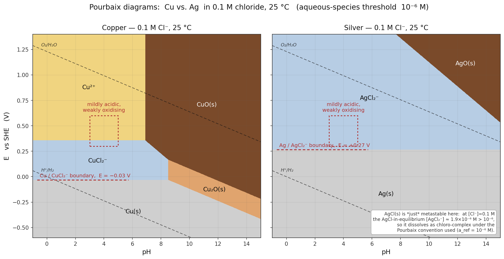

The revised figure now clearly shows the two immunity boundaries and the mildly acidic / weakly oxidising study window on both panels.

The diagram is below; here is what it says and the numbers behind it.

**The solver's method.** For every candidate species *i* containing *n*_M metal atoms I compute a per-metal-atom grand potential

Ω_i / n_M  =  [ ΔG_f°(i) + RT ln a_i  −  n_O · μ°(H₂O)  −  (n_H − 2n_O) · μ(H⁺)  −  n_Cl · μ(Cl⁻)  −  n_e · μ(e⁻) ] / n_M

with charge balance fixing n_e = (n_H − 2n_O) − n_Cl − Q_i, and with μ(H⁺) = −RT ln 10 · pH, μ(e⁻) = −F·E, μ(Cl⁻) = μ°(Cl⁻) + RT ln[Cl⁻]. At each (pH, E) the stable species is argmin over *i*. Aqueous species are evaluated at a_ref = 10⁻⁶ M (the standard Pourbaix "corrosion threshold"); solids at unit activity. For two aqueous species with the same n_M the RT ln a_ref cancels, so their predominance boundary is independent of the threshold, as it should be.

**Equilibrium constants used** (25 °C, I → 0; from Bard–Parsons–Jordan, *Standard Potentials in Aqueous Solution* (IUPAC, 1985), and Pourbaix, *Atlas of Electrochemical Equilibria*):

Copper
- E°(Cu²⁺/Cu) = +0.340 V
- E°(Cu⁺/Cu) = +0.521 V
- E°(Cu₂O + 2H⁺ + 2e⁻ → 2Cu + H₂O) = +0.471 V
- E°(2CuO + 2H⁺ + 2e⁻ → Cu₂O + H₂O) = +0.669 V
- pK_sp(CuCl) = 6.76        (K_sp = 1.72 × 10⁻⁷)
- log β₂(CuCl₂⁻) = 5.35;   log β₃(CuCl₃²⁻) = 5.70

Silver
- E°(Ag⁺/Ag) = +0.7996 V
- E°(Ag₂O + 2H⁺ + 2e⁻ → 2Ag + H₂O) = +1.173 V
- E°(2AgO + 2H⁺ + 2e⁻ → Ag₂O + H₂O) = +1.398 V
- pK_sp(AgCl) = 9.75        (K_sp = 1.77 × 10⁻¹⁰)
- log β₂(AgCl₂⁻) = 5.04;   log β₃(AgCl₃²⁻) = 5.30

Every ΔG_f° in the calculation is derived from these constants alone (using ΔG° = −nFE° or ΔG° = −RT ln K), then combined through the environment reference free energies μ°(H₂O) = −237.14 kJ/mol and μ°(Cl⁻) = −131.23 kJ/mol. The derived formation energies the solver actually plugs in are Cu²⁺ +65.61, Cu⁺ +50.27, Cu₂O −146.25, CuO −127.15, CuCl(s) −119.55, CuCl₂⁻ −242.73, CuCl₃²⁻ −375.96; Ag⁺ +77.15, Ag₂O −10.79, AgO +10.92, AgCl(s) −109.73, AgCl₂⁻ −214.08, AgCl₃²⁻ −346.79  (all kJ/mol).

**Reading the diagram.** The dashed red horizontal lines mark the upper edge of each metal's immunity region at pH 4:

- **Cu | CuCl₂⁻** boundary at **E ≈ −0.03 V** — copper leaves the metallic state very readily because the CuCl₂⁻ chloro-complex stabilises Cu(I) in solution, pulling the boundary far below the bare Cu²⁺/Cu line (which would sit at +0.16 V at 10⁻⁶ M without Cl⁻).
- **Ag | AgCl₂⁻** boundary at **E ≈ +0.27 V** — silver's immunity region extends much higher. Its bare Ag⁺/Ag line at +0.44 V (at 10⁻⁶ M) is pulled down by the AgCl₂⁻ complex, but only to +0.27 V.

Inside the dashed red study box (pH 3–5, E = 0.30–0.60 V, i.e. mildly acidic and weakly oxidising) the solver reports Cu²⁺ as the dominant Cu species and AgCl₂⁻ as the dominant Ag species — so both metals are, strictly, oxidised there. But Ag sits **~0.3 V closer** to its immunity boundary than Cu does, so a much weaker reductant is enough to plate silver back out. Equivalently, **Ag is more easily reduced to the zero-valent state**: at any E between roughly 0 and +0.27 V, Ag is metallic while Cu is dissolved as CuCl₂⁻.

**Why the gap survives chloride.** Chloride pulls both immunity boundaries down by essentially the same amount (~0.17–0.19 V) via the ML₂⁻ complexes, so the ~0.46 V head-start silver has from its intrinsic E°(Ag⁺/Ag) is very nearly preserved. The one caveat, noted on the silver panel, is that AgCl(s) does not form its own passivating field at exactly [Cl⁻] = 0.1 M under the 10⁻⁶-M convention: the equilibrium [AgCl₂⁻] over AgCl(s) is  K_sp · β₂ · [Cl⁻] = 10⁻⁴·⁷¹ · 0.1 ≈ 1.9 × 10⁻⁶ M, barely above the threshold, so chloro-complex dissolution wins. Drop the chloride to ≲ 50 mM (or raise the threshold) and AgCl(s) reappears between Ag(s) and AgCl₂⁻; push the chloride into the seawater range (≳ 0.5 M) and AgCl(s) is comprehensively out-competed by AgCl₂⁻/AgCl₃²⁻ and silver loses much of its nobility. Copper does not have an analogous passivating chloride at any Cl⁻ concentration in this pH window.
