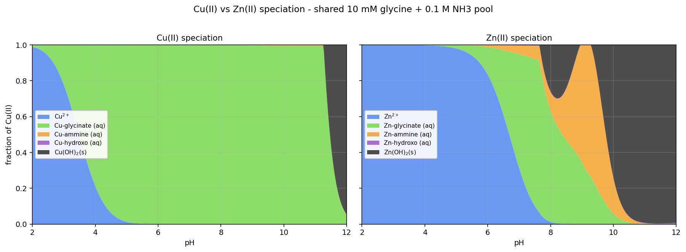
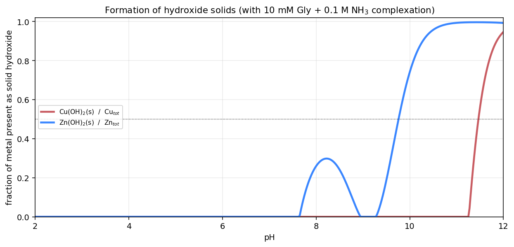
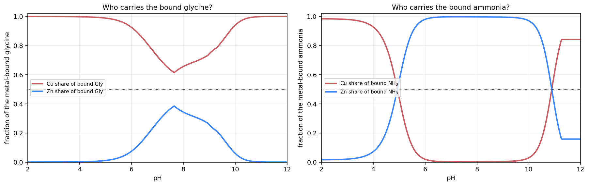
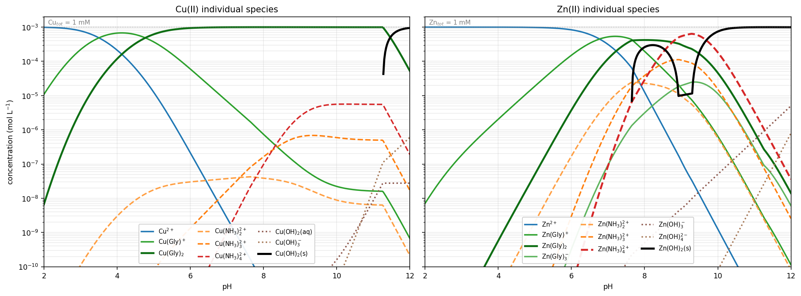
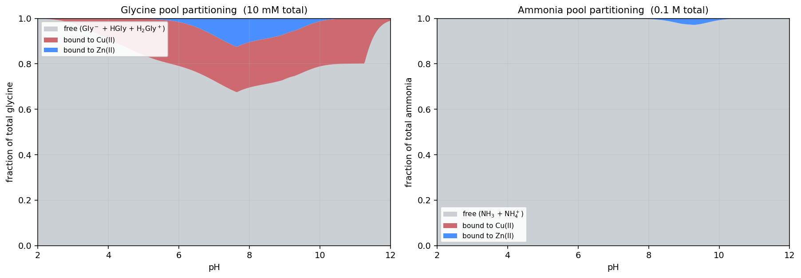

All plots look correct. Now I'll present the files and write the answer.

## Model

Two mass balances (glycine, ammonia) solved self-consistently at each pH by Newton's method (`scipy.optimize.fsolve`), with each metal's free ion determined either by its α-coefficient or, once IAP > Ksp, pinned to Ksp/[OH⁻]². Cu(OH)₂(s) and ε-Zn(OH)₂(s) were forced whenever supersaturated (your "prefer hydroxide solids" instruction). Aqueous hydroxo complexes M(OH)ₙ were kept in parallel. Constants at 25 °C, I ≈ 0.1 M (log β):

| system | log β values |
|---|---|
| Gly acid–base | pKₐ₁ = 2.35, pKₐ₂ = 9.60 |
| NH₄⁺/NH₃ | pKₐ = 9.25 |
| Cu–Gly | 8.15, 15.05 |
| Cu–NH₃ | 4.15, 7.65, 10.55, 12.60 |
| Cu–OH | 6.03, 11.76, 15.10, 16.30 · pKsp = 19.32 |
| Zn–Gly | 4.96, 9.06, 10.70 |
| Zn–NH₃ | 2.37, 4.81, 7.31, 9.46 |
| Zn–OH | 5.04, 11.10, 13.60, 14.80 · pKsp = 16.90 |

Mass balance closes to 1 part in 10¹² at every pH point.

## Who dominates each ligand pool

**Glycine → Cu owns it.** Cu(Gly)₂ is roughly 6 orders of magnitude stronger than Zn(Gly)₂ (log β₂ = 15.05 vs. 9.06). Cu ties up ≈ 2 mM of the 10 mM glycine pool as Cu(Gly)₂ across the entire pH 5–11 window and holds ≥ 60 % of the *metal-bound* glycine at every pH. Zn's best moment is a shallow window at pH 7–8 where it captures ~30–40 % of the bound glycine, right when Cu is already saturated (Cu(Gly)₂ is already at its stoichiometric ceiling of 1 mM).

**Ammonia → Zn owns the aqueous ammine pool at intermediate pH.** This is a counter-intuitive but robust consequence of the pool sizes: Cu's affinity for NH₃ is higher (log β₄ = 12.60 vs. 9.46 for Zn), but *Cu is already fully committed to glycinate*, so essentially no Cu is left free to grab NH₃. Zn, only weakly held by glycinate, migrates preferentially into Zn(NH₃)ₙ²⁺. Between pH 5 and 11, Zn carries **> 98 %** of the bound ammonia; Cu carries essentially none. This flips only above pH 11 when Zn precipitates and drops out of the ammine pool.

Both metals together sequester only a small fraction of the 0.1 M ammonia total (peak ≈ 3 % near pH 9) — NH₃ is in massive excess, so [NH₃]free ≈ speciation of NH₃/NH₄⁺ alone.

## pH windows for the hydroxide solids

| solid | first appears (1 %) | dominant (50 %) | ~complete (95 %) |
|---|---|---|---|
| Zn(OH)₂(s), first lobe | pH 7.68 | — | — (peaks ≈ 30 % near pH 8.25) |
| Zn(OH)₂(s), redissolves (Zn(NH₃)₄²⁺) | back to 0 at pH ≈ 9.15 | | |
| Zn(OH)₂(s), second lobe | reappears at pH 9.35 | **pH 9.77** | pH 10.48 |
| Cu(OH)₂(s) | pH 11.28 | **pH 11.48** | pH ≈ 12 (94.7 % at pH 12) |

So the aqueous-complex → solid crossover happens near **pH 9.8 for Zn** and **pH 11.5 for Cu** — a roughly 1.7-pH-unit gap that mirrors the difference in log β₂(M–Gly). The two-lobe Zn(OH)₂ curve is a textbook amphoteric-in-ammonia effect: the overall reaction  

  Zn(OH)₂(s) + 4 NH₃ ⇌ Zn(NH₃)₄²⁺ + 2 OH⁻  (log K = log β₄ − pKsp = 9.46 − 16.9 = −7.44)  

opens up a solubility window at pH 8.9–9.4 where [NH₃] has climbed above ~30 mM but [OH⁻] is still only ~10⁻⁵ M; above pH 9.5 the [OH⁻]² factor overwhelms it and the solid returns.

## Dominant species table

| pH | Cu dominant | % | Zn dominant | % |
|---|---|---|---|---|
| 2 | Cu²⁺ | 98.9 | Zn²⁺ | 100 |
| 4 | Cu(Gly)⁺ | 66.8 | Zn²⁺ | 99.8 |
| 6 | Cu(Gly)₂ | 94.0 | Zn²⁺ | 83.3 |
| 7 | Cu(Gly)₂ | 99.3 | Zn(Gly)⁺ | 51.7 |
| 8 | Cu(Gly)₂ | 99.9 | Zn(Gly)₂ | 42.0 |
| 9 | Cu(Gly)₂ | 99.7 | Zn(NH₃)₄²⁺ | 53.8 |
| 10 | Cu(Gly)₂ | 99.4 | **Zn(OH)₂(s)** | 74.2 |
| 11 | Cu(Gly)₂ | 99.4 | **Zn(OH)₂(s)** | 99.3 |
| 12 | **Cu(OH)₂(s)** | 94.7 | **Zn(OH)₂(s)** | 99.3 |

## Take-home picture

1. **Cu is a glycinate specialist across the middle of the diagram.** Cu(Gly)₂ dominates pH 5–11 and pins Cu in solution 3–4 pH units past its own naked-metal precipitation threshold (~pH 4.8 without ligands). The Cu–ammine complexes exist but never exceed ~1 % because glycinate wins per-donor.
2. **Zn is displaced onto ammonia.** Because Cu monopolises glycinate, Zn ends up hosting essentially all the bound ammonia, most visibly as Zn(NH₃)₄²⁺ around pH 9.
3. **Solids appear at very different pH.** Zn(OH)₂(s) opens a first lobe already at pH 7.7 and takes over completely by pH 10.5, with a real ammonia-induced re-dissolution valley at pH 8.9–9.4. Cu(OH)₂(s) is held off by Cu(Gly)₂ until pH 11.3 and only fully dominates near pH 12.

The Python source (`model.py`, `analyze.py`, `logplot.py`) sits in `/home/claude/spec/` if you'd like to swap in different constants, another Zn(OH)₂ polymorph, or add mixed-ligand complexes like Cu(NH₃)ₙ(OH)ₘ.
