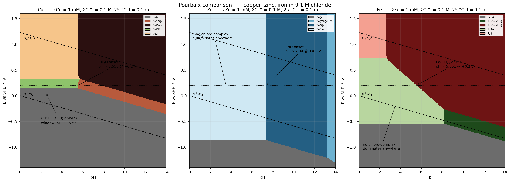

## How the solver was built

Basis species chosen: Cu²⁺, Zn²⁺, Fe³⁺ (plus Cl⁻, H⁺, e⁻, H₂O). Each other species is defined by its formation reaction from that basis, so every equilibrium collapses to

$$\log a_i \;=\; \log K_i \;+\; \nu_M\log a_M \;-\; \nu_H\,\text{pH} \;-\; \nu_e\,\text{pe} \;+\; \nu_L\log a_{\text{Cl}^-}$$

At each (pH, E) grid point the solver (i) computes the log a_M that would put 1 mM of metal into solution across every aqueous species and (ii) compares that against every solid's saturation log a_M; if any solid is supersaturated the least-soluble one is taken as stable and log a_M is pinned to its saturation value.

Ionic-strength correction uses the Davies equation at I = 0.1 m: log γ(±1) = −0.107, log γ(±2) = −0.428, log γ(±3) = −0.963, log γ(±4) = −1.712. Free chloride activity in 0.1 M Cl⁻ therefore drops to **log a(Cl⁻) = −1.107** (a = 0.0782 M) — this is the number the equilibria "see".

## Thermodynamic inputs actually loaded (25 °C, I = 0 references)

Compiled from Baes & Mesmer, *The Hydrolysis of Cations* (1976/86); Martell & Smith / NIST; Bard–Parsons–Jordan (1985); CRC Handbook 95 ed. All redox potentials converted with log K = nE°/0.05916 V.

**Copper — basis Cu²⁺**

| couple / equilibrium | value | log K |
|---|---|---|
| Cu²⁺ + 2e⁻ → Cu(s) | E° = +0.340 V | +11.494 |
| Cu²⁺ + e⁻ → Cu⁺ | E° = +0.153 V | +2.586 |
| Cu²⁺/Cu₂O (derived) | E° = +0.209 V (2e⁻) | +7.066 |
| CuO(s) + 2H⁺ → Cu²⁺ + H₂O | log*K_so = +7.66 | — |
| CuCl(s) → Cu⁺ + Cl⁻ | log K_sp = −6.73 | — |
| Cu²⁺ hydrolysis (n = 1‥4) | log*β_n = −7.50, −16.24, −26.75, −39.98 | |
| Cu²⁺ + n Cl⁻ (n = 1‥4) | log β_n = +0.30, −0.02, −2.29, −4.59 | |
| **Cu⁺ + n Cl⁻ (n = 1‥3)** | **log β_n = +2.72, +5.50, +5.70** | |

**Zinc — basis Zn²⁺**

| | |
|---|---|
| Zn²⁺ + 2e⁻ → Zn(s), E° = −0.7626 V | log K = −25.78 |
| ZnO(s) + 2H⁺ → Zn²⁺ + H₂O, log*K_so = +11.2 | |
| Zn²⁺ hydrolysis: log*β = −8.96, −16.9, −28.4, −41.2 | |
| Zn²⁺ + n Cl⁻: log β = +0.43, +0.61, +0.53, +0.20 | |

**Iron — basis Fe³⁺**

| | |
|---|---|
| Fe³⁺ + e⁻ → Fe²⁺, E° = +0.771 V | log K = +13.03 |
| Fe³⁺ + 3e⁻ → Fe(s), E° = −0.037 V | log K = −1.876 |
| Fe(OH)₃(am, ferrihydrite) + 3H⁺ → Fe³⁺ + 3H₂O, log*K_so = +3.55 | |
| Fe(OH)₂(s) + 2H⁺ → Fe²⁺ + 2H₂O, log*K_so = +12.9 | |
| Fe³⁺ hydrolysis: log*β = −2.19, −5.67, −12.56, −21.6 | |
| Fe²⁺ hydrolysis: log*β = −9.5, −20.6, −31.0 | |
| Fe³⁺ + Cl⁻ / +2Cl⁻: log β = +1.48, +2.13 | |
| Fe²⁺ + Cl⁻: log β = +0.14 | |

Magnetite and hematite are omitted; ferrihydrite is the phase that actually precipitates from Fe(III) in aqueous media at room T (the classical corrosion-Pourbaix choice). Note this: if you switched to goethite/hematite the Fe field would shift a bit but the qualitative story below is unchanged.

## Chloro-complex windows

Quick smell-test with just the equilibrium ratios at a(Cl⁻) = 0.078:

| ratio | value |
|---|---|
| **CuCl₂⁻ / Cu⁺** [Cu(I)] | **1.9 × 10³** |
| CuCl₃²⁻ / Cu⁺ [Cu(I)] | 2.4 × 10² |
| FeCl²⁺ / Fe³⁺ | 2.4 |
| FeCl₂⁺ / Fe³⁺ | 0.82 |
| CuCl⁺ / Cu²⁺ | 0.16 |
| FeCl⁺ / Fe²⁺ | 0.11 |
| ZnCl⁺ / Zn²⁺ | 0.21 |
| ZnCl₂ / Zn²⁺ | 0.025 |

Sweeping the whole water window and asking, at each pH, *"is any Cl-bearing species the dominant aqueous form somewhere in E?"*:

| metal | pH range where a chloro complex dominates the aqueous field |
|---|---|
| **Cu** | **pH 0.00 – 5.55  (Δ ≈ 5.6 pH units)** — CuCl₂⁻ [Cu(I)] over the whole strip from ~−0.05 to +0.30 V |
| Zn | ∅ — Zn²⁺ wins at every (pH, E) |
| Fe | ∅ — Fe³⁺ or its hydroxo species and Fe²⁺ always beat the chloro complexes |

**Copper opens the widest chloro window by a huge margin**, and the reason is single-oxidation-state specific: Cu(I) is a soft d¹⁰ cation and complexes Cl⁻ two-orders-of-magnitude harder than Cu(II) does; log β₂(CuCl₂⁻, Cu(I)) = +5.50 means that at only 0.1 M Cl⁻, 99.95 % of any Cu(I) present is CuCl₂⁻. That effectively lowers the free Cu⁺ activity so much that the disproportionation Cu⁺ ⇌ ½Cu(s) + ½Cu²⁺ swings backward and a persistent Cu(I)-chloride solution field opens between the Cu(s) and Cu(II) fields — exactly the green band on the left panel. Zn(II) and Fe(II)/Fe(III) chloride complexes are too weak (log β ≤ 2) at a chloride activity of 0.08 M to ever out-compete the aquo/hydroxo forms.

## Order of first hydroxide/oxide along the +0.20 V line

Solved by bisection to 10⁻⁵ pH resolution:

| metal | first oxide/hydroxide | pH of onset at E = +0.20 V |
|---|---|---|
| **Fe** | Fe(OH)₃(s) (ferrihydrite) | **5.551** |
| **Cu** | Cu₂O(s) (cuprite) | **5.555** |
| **Zn** | ZnO(s) (zincite) | **7.340** |

**Order (lowest → highest pH): Fe < Cu ≪ Zn** — with Fe and Cu functionally tied at pH ≈ 5.55 (Fe wins by ~0.004 pH) and Zn coming in ~1.8 pH units later.

The near-coincidence between Fe and Cu is a genuine accident of chemistry rather than a symmetry:

- **Cu₂O** onset is set directly by the redox couple 2Cu²⁺ + H₂O + 2e⁻ → Cu₂O(s) + 2H⁺ (E° = +0.209 V). The +0.2 V horizontal cut is *just* below the standard potential, so once pH pushes the Nernst term past 5.55 (with the chloride-modified Cu(II)/Cu(I) speciation baked in through the solver), Cu₂O nucleates.

- **Fe(OH)₃** onset works completely differently. At +0.2 V, Fe(II) is 10^9.6 times more abundant than Fe(III), so ~all soluble Fe sits as Fe²⁺ (≈10⁻³ M). The tiny residual Fe³⁺ activity, buffered by the Fe³⁺/Fe²⁺ Nernst term to ≈10⁻¹³, still exceeds K_so × [H⁺]³ once pH gets to 5.55, and ferrihydrite drops out even though the *bulk* solution is Fe(II).

- **ZnO** onset is the pure amphoteric case: no redox, just ZnO + 2H⁺ ⇌ Zn²⁺ + H₂O with log*K_so = +11.2. Setting a_Zn²⁺ to 1 mM × γ₂ = 10⁻³·⁴³ gives pH ≈ 7.31 analytically; the solver returns 7.34 once the ZnCl⁺ and ZnOH⁺ side-terms are included.

So the deep reasons for the ordering differ: Fe is early because Fe(III) is *aggressively* hydrolyzing (log*β₁ = −2.19) even from vanishingly small Fe³⁺ activity; Cu is early because at +0.2 V we're straddling a redox boundary; Zn is late because it's a plain-vanilla divalent-cation hydrolysis with log*K_so almost 4 log-units more soluble than the Cu/Fe drivers.
