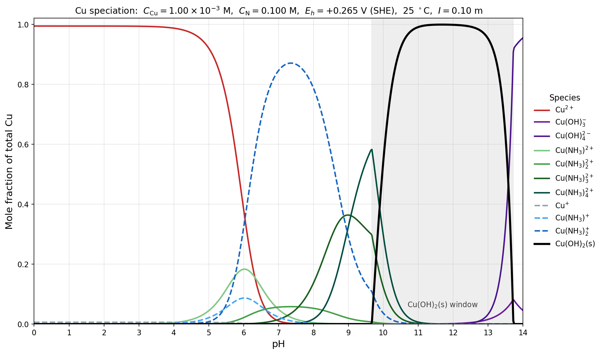
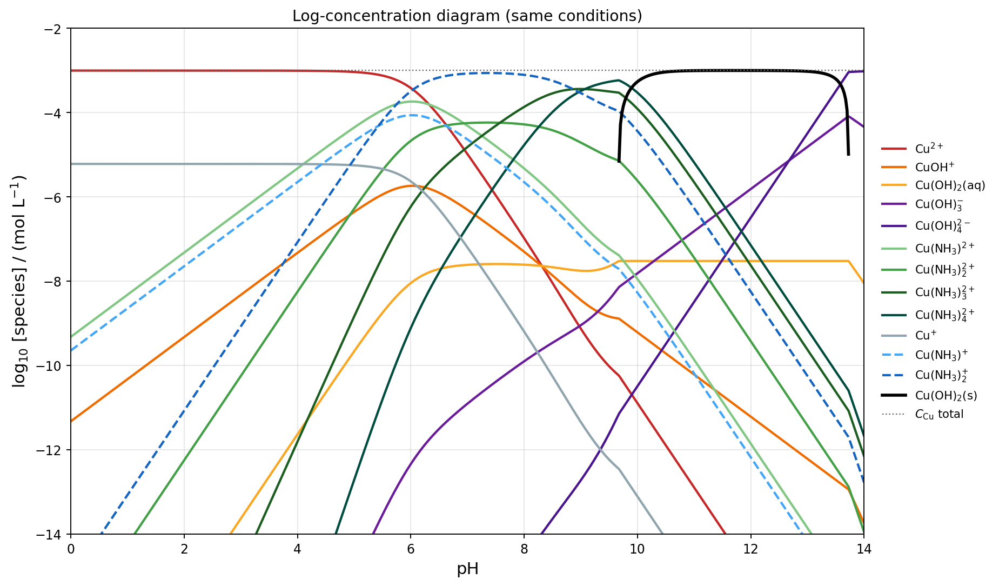
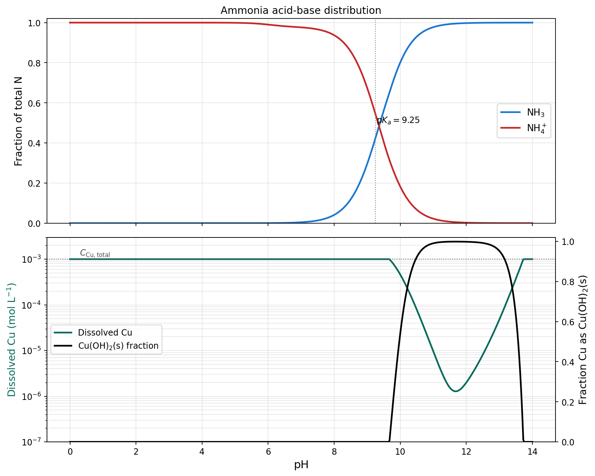

*Presented file: `cu_nh3_speciation.csv`*

## Model

I solved the full aqueous Cu–NH₃–OH–H₂O system with an imposed redox potential and Cu(OH)₂(s) as the only allowed solid (per your "prefer hydroxide solids" instruction — see the caveat about Cu(s) and Cu₂O at the end). Working variables are the free activities {Cu²⁺} and {NH₃}; concentrations follow from Davies activity coefficients.

**Species (13 total).** Cu(II) aq: Cu²⁺, CuOH⁺, Cu(OH)₂⁰, Cu(OH)₃⁻, Cu(OH)₄²⁻, Cu(NH₃)ₙ²⁺ (n = 1–4). Cu(I) aq: Cu⁺, Cu(NH₃)⁺, Cu(NH₃)₂⁺. Solid: Cu(OH)₂(s).

**Constants used** (I = 0, 25 °C; Davies applied on the fly):

| Reaction | log β / log K |
|---|---|
| Cu²⁺ + n OH⁻ → Cu(OH)ₙ, n = 1–4 | 6.0, 11.8, 15.4, 16.4 (Baes & Mesmer) |
| Cu²⁺ + n NH₃ → Cu(NH₃)ₙ²⁺, n = 1–4 | 4.04, 7.47, 10.27, 11.75 (Bjerrum) |
| Cu⁺ + n NH₃ → Cu(NH₃)ₙ⁺, n = 1, 2 | 5.93, 10.86 |
| Cu(OH)₂(s) ⇌ Cu²⁺ + 2 OH⁻ | log Ksp = −19.32 |
| NH₄⁺ ⇌ NH₃ + H⁺ | pKa = 9.25 |
| Cu²⁺ + e⁻ ⇌ Cu⁺ | E° = +0.153 V |

**Redox couple.** {Cu²⁺}/{Cu⁺} is fixed by Nernst at every pH: log({Cu²⁺}/{Cu⁺}) = (0.265 − 0.153)/0.05916 = **1.893**, i.e. ~78:1 among the *free* ions.

**Activity model.** Davies at I = 0.10 m: log γ_z = −0.509 z²[√I/(1+√I) − 0.3 I], giving γ± = 0.782 (|z|=1), 0.373 (|z|=2). pH is the H⁺ activity; {OH⁻} = 10^(pH−14).

**Solver.** At each pH: (1) solve the 2×2 nonlinear system in log{Cu²⁺}, log{NH₃} for the fully-soluble case with ΣCu = 1.00 mM and Σ[N + NH₃-bound-to-Cu] = 100 mM; (2) check the saturation index of Cu(OH)₂; (3) if SI > 0, fix {Cu²⁺} = Ksp/{OH⁻}² and re-solve for {NH₃} alone, taking the remainder of Cu into the solid. Ammonia consumed by Cu-ammines is included in the N mass balance (up to ≈4% of the pool). Grid: pH 0 → 14, 0.025 spacing (561 points). Sum of all fractions = 1.00000 at every point (verified).

## Results

**Regions along the pH axis:**

| pH range | Dominant Cu form(s) | Physical picture |
|---|---|---|
| 0 – ~4 | **Cu²⁺** (>99%) | No free NH₃ (all NH₄⁺); no hydrolysis. |
| ~4 – ~6 | Cu²⁺ retreating; **Cu(NH₃)ₙ²⁺** (n = 1–2) rising | Traces of NH₃ appear; low-order ammines. |
| ~6 – ~9 | **Cu(NH₃)₂⁺ (Cu(I))** dominant, peak 87% at pH 7.35 | Strong Cu(I) diammine outcompetes the higher-order Cu(II) ammines while {NH₃} is still small. |
| ~9 – 9.7 | **Cu(NH₃)₄²⁺** briefly dominant, peak 58% at pH 9.68 | {NH₃} passes ≈0.03 M; Cu(II) tetraammine takes over just as OH⁻ reaches saturation. |
| **9.7 – 13.7** | **Cu(OH)₂(s)** (up to 99.9% at pH 11.7) | Precipitation traps almost all Cu; dissolved Cu drops to 1.3 × 10⁻⁶ M. |
| 13.7 – 14 | Cu(OH)₃⁻, then **Cu(OH)₄²⁻** | Amphoteric redissolution of the hydroxide. |

**Why the Cu(I) diammine wins at intermediate pH.** The free {Cu²⁺}/{Cu⁺} is fixed at 78 by Eh, so isolated ions favor Cu(II) by ≈98:1.5. But complexation swings it: for the Cu(NH₃)₄²⁺/Cu(NH₃)₂⁺ couple,

$$[Cu(NH_3)_4^{2+}]/[Cu(NH_3)_2^+] = 10^{(11.75-10.86)} \cdot 78 \cdot [NH_3]^2 \approx 606\,[NH_3]^2$$

The crossover is at [NH₃] ≈ 0.041 M, i.e. around pH ≈ 9.1. Below that, the two-coordinate Cu(I) diammine dominates because it needs only two NH₃; above, the four-coordinate Cu(II) tetraammine takes over — but only for a narrow window before Cu(OH)₂(s) precipitates.

## Sensitivities and caveats to note

- **Ksp.** If you use log Ksp = −20.35 (aged tenorite CuO computed as Cu(OH)₂) the solid window opens ≈0.5 pH earlier and the low-pH side of the Cu(NH₃)₄²⁺ peak gets truncated.
- **Cu(NH₃)₅²⁺** (log β₅ ≈ 8.6) is often omitted and is negligible here even at pH 12 with [NH₃] ≈ 0.1 M (contribution < 1% relative to Cu(OH)₂(s)).
- **Cu(s).** At Eh = 0.265 V, Cu(s) needs {Cu²⁺} ≥ 10⁻²·⁵⁴ ≈ 2.9 mM; the highest {Cu²⁺} in your system is ≈4 × 10⁻⁴, so Cu(s) is never stable. ✓
- **Cu₂O(s), if allowed.** The couple 2Cu²⁺ + H₂O + 2e⁻ ⇌ Cu₂O(s) + 2H⁺ gives E° ≈ 0.208 V; at Eh = 0.265 V it saturates when {Cu²⁺} > 9.2·{H⁺}. This is met around pH 5–7 in your system. **You asked me to prefer hydroxide solids, so I excluded Cu₂O.** If it were included, it would take a bite out of the Cu(NH₃)₂⁺ peak between pH ≈ 5 and 9 and produce a small Cu₂O(s) plateau.
- **Bjerrum β's vs. other sets.** Different critical compilations shift the Cu(II)-ammine β's by ±0.3 log units; the qualitative picture (Cu(I) diammine dominant at moderate pH, Cu(II) tetraammine near pH 9.5, hydroxide precipitation) is robust to that.

The CSV has all 13 species mole fractions plus dissolved-Cu total and solid fraction at every pH; the log-concentration plot shows every curve down to 10⁻¹⁴ M for anyone chasing minor species.
