# Run statistics

Built 2026-09-17 11:48 UTC from `Fable5_1.zip`, `Opus4_7.zip`: 55 runs, 74 response segments, 456 tool calls. Timings come from claude.ai's saved block timestamps and cover the branch claude.ai shows.

Comparisons across configurations use only the prompt levels more than one configuration ran (L1). Opus4_7_high also ran L2, L3, L4, summarized in its own section and plot folder.

## By configuration, L1 prompts (medians unless noted)

| Config | Runs | Wall | Active | Thinking | Tools | Tool calls | Segments | Typed / auto continues (total) | Incomplete | Alternate branches | Answer words |
|---|---|---|---|---|---|---|---|---|---|---|---|
| Fable5_1_max | 6 | 16m 45s | 16m 45s | 12m 57s | 3m 24s | 20 | 1 | 1 / 1 | 1 | 0 | 528.5 |
| Fable5_1_medium | 6 | 3m 34s | 3m 34s | 1m 43s | 1m 30s | 5.5 | 1 | 0 / 0 | 0 | 0 | 458 |
| Opus4_7_max | 11 | 17m 20s | 17m 02s | 10m 09s | 2m 24s | 14 | 2 | 12 / 3 | 0 | 4 | 602 |
| Opus4_7_high | 11 | 7m 26s | 7m 26s | 4m 05s | 1m 31s | 9 | 1 | 0 / 2 | 0 | 1 | 744 |

## By configuration, only the 6 prompts every configuration ran (L1_1, L1_3, L1_4, L1_9, L1_10, L1_11)

| Config | Runs | Wall | Active | Thinking | Tools | Tool calls | Segments | Typed / auto continues (total) | Incomplete | Alternate branches | Answer words |
|---|---|---|---|---|---|---|---|---|---|---|---|
| Fable5_1_max | 6 | 16m 45s | 16m 45s | 12m 57s | 3m 24s | 20 | 1 | 1 / 1 | 1 | 0 | 528.5 |
| Fable5_1_medium | 6 | 3m 34s | 3m 34s | 1m 43s | 1m 30s | 5.5 | 1 | 0 / 0 | 0 | 0 | 458 |
| Opus4_7_max | 6 | 18m 27s | 16m 28s | 12m 40s | 3m 24s | 11.5 | 2 | 7 / 3 | 0 | 3 | 546.5 |
| Opus4_7_high | 6 | 6m 20s | 6m 20s | 3m 53s | 1m 10s | 7 | 1 | 0 / 0 | 0 | 0 | 660 |

## Opus4_7_high by prompt level (medians unless noted)

| Level | Runs | Wall | Thinking | Tools | Tool calls | Literature / build / commands / inspect / present (share of calls) | Final code lines | Pages reached (total) | Answer words |
|---|---|---|---|---|---|---|---|---|---|
| L1 | 11 | 7m 26s | 4m 05s | 1m 31s | 9 | 0% / 30% / 42% / 19% / 9% | 277 | 0 | 744 |
| L2 | 8 | 3m 54s | 2m 38s | 0m 41s | 2 | 8% / 29% / 50% / 8% / 4% | 0 | 18 | 639.5 |
| L3 | 6 | 1m 56s | 1m 29s | 0m 00s | 0 | 0% / 0% / 100% / 0% / 0% | 0 | 0 | 493 |
| L4 | 7 | 1m 44s | 0m 47s | 0m 00s | 0 | 33% / 0% / 44% / 0% / 22% | 0 | 27 | 462 |

## Longest runs (all prompts)

| Run | Wall | Thinking | Tools | Tool calls | Segments | Stop reasons |
|---|---|---|---|---|---|---|
| L1_11 Opus4_7_max | 46m 42s | 25m 01s | 13m 51s | 27 | 4 | max_tokens, max_tokens, max_tokens, end_turn |
| L1_3 Opus4_7_max | 46m 10s | 35m 45s | 6m 38s | 9 | 4 | max_tokens, max_tokens, max_tokens, end_turn |
| L1_8 Opus4_7_max | 33m 45s | 22m 00s | 5m 49s | 29 | 3 | max_tokens, max_tokens, end_turn |
| L1_11 Fable5_1_max | 32m 38s | 20m 01s | 6m 26s | 26 | 2 | max_tokens, end_turn |
| L1_10 Fable5_1_max | 31m 02s | 20m 28s | 7m 20s | 45 | 2 | max_tokens, tool_use_limit |
| L1_6 Opus4_7_max | 28m 41s | 21m 36s | 2m 23s | 11 | 3 | max_tokens, max_tokens, end_turn |
| L1_9 Opus4_7_max | 21m 43s | 15m 12s | 1m 53s | 14 | 2 | max_tokens, end_turn |
| L1_1 Fable5_1_max | 18m 23s | 13m 21s | 4m 08s | 26 | 1 | end_turn |

## Tool calls (all runs)

| Tool | Calls | Median duration | Errors | Share of tool time |
|---|---|---|---|---|
| bash_tool | 224 | 3.4 s | 0 | 41% |
| view | 82 | 1.3 s | 0 | 2% |
| create_file | 53 | 53.0 s | 0 | 45% |
| str_replace | 34 | 6.9 s | 0 | 10% |
| present_files | 23 | 0.8 s | 0 | 0% |
| web_search | 22 | 1.8 s | 0 | 1% |
| chart_display_v0 | 6 | 4.6 s | 0 | 0% |
| Artifact | 5 | 1.3 s | 0 | 0% |
| web_fetch | 4 | 1.4 s | 1 | 0% |
| visualize:read_me | 2 | 1.0 s | 0 | 0% |
| visualize:show_widget | 1 | 56.5 s | 0 | 1% |

## Tool calls by category, L1 prompts (totals; share of that configuration's tool calls)

Categories: literature search = `web_search`, `web_fetch`; build/edit scripts = `create_file`, `str_replace`; commands = `bash_tool`; inspect = `view`; present = `present_files`, `chart_display_v0`, `visualize:*`, `Artifact`.

| Config | Tool calls | Per run (mean) | Literature search | Build/edit scripts | Commands | Inspect files/images | Present results |
|---|---|---|---|---|---|---|---|
| Fable5_1_max | 130 | 21.7 | 21 (16%) | 11 (8%) | 71 (55%) | 20 (15%) | 7 (5%) |
| Fable5_1_medium | 28 | 4.7 | 0 (0%) | 0 (0%) | 17 (61%) | 6 (21%) | 5 (18%) |
| Opus4_7_max | 168 | 15.3 | 0 (0%) | 43 (26%) | 77 (46%) | 35 (21%) | 13 (8%) |
| Opus4_7_high | 100 | 9.1 | 0 (0%) | 30 (30%) | 42 (42%) | 19 (19%) | 9 (9%) |

## Web research, L1 prompts

| Config | Runs that searched | Searches | Search result URLs (distinct per run, summed) | Pages fetched | Fetches failed | Pages reached | Domains (median per searching run) |
|---|---|---|---|---|---|---|---|
| Fable5_1_max | 4 of 6 | 17 | 138 | 3 | 1 | 138 | 19.5 |
| Fable5_1_medium | 0 of 6 | 0 | 0 | 0 | 0 | 0 | 0 |
| Opus4_7_max | 0 of 11 | 0 | 0 | 0 | 0 | 0 | 0 |
| Opus4_7_high | 0 of 11 | 0 | 0 | 0 | 0 | 0 | 0 |

## Code written in the visible session, L1 prompts

Rebuilt from the conversation: each script's final text is its last `create_file` or `cat > file << EOF` write with later `str_replace` edits applied. Edits made by other commands (for example `sed -i`) aren't visible, so a few final lengths are approximate; `code_files.csv` lists every file.

| Config | Scripts written | Final code lines (total) | Final code lines per run (median) | Lines written incl. rewrites | str_replace edits | Inline script lines | Command lines | HTML files |
|---|---|---|---|---|---|---|---|---|
| Fable5_1_max | 21 | 2800 | 398.5 | 2821 | 1 | 429 | 1385 | 0 |
| Fable5_1_medium | 9 | 709 | 101 | 709 | 0 | 39 | 787 | 0 |
| Opus4_7_max | 25 | 5955 | 483 | 6891 | 15 | 2019 | 2314 | 0 |
| Opus4_7_high | 13 | 3504 | 277 | 3734 | 17 | 369 | 408 | 0 |

## Plots comparing configurations (L1 prompts)

### Wall time per prompt and configuration (L1 prompts)

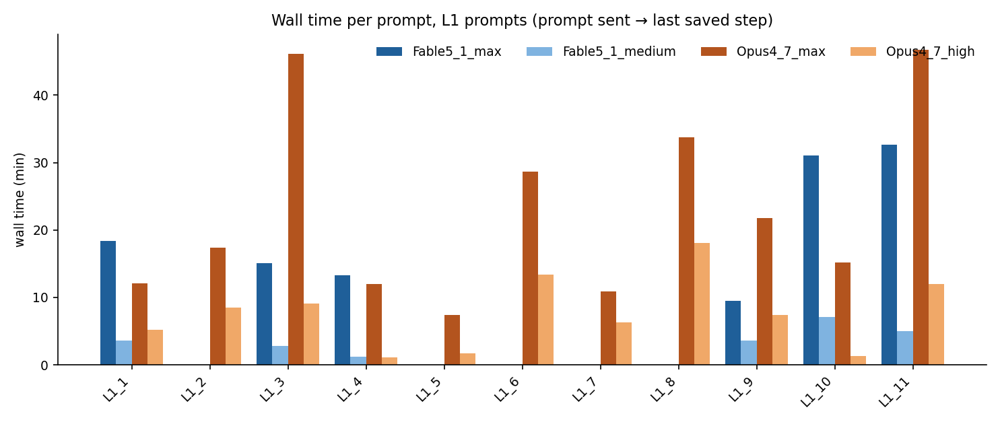

### Time breakdown per run (L1 prompts)

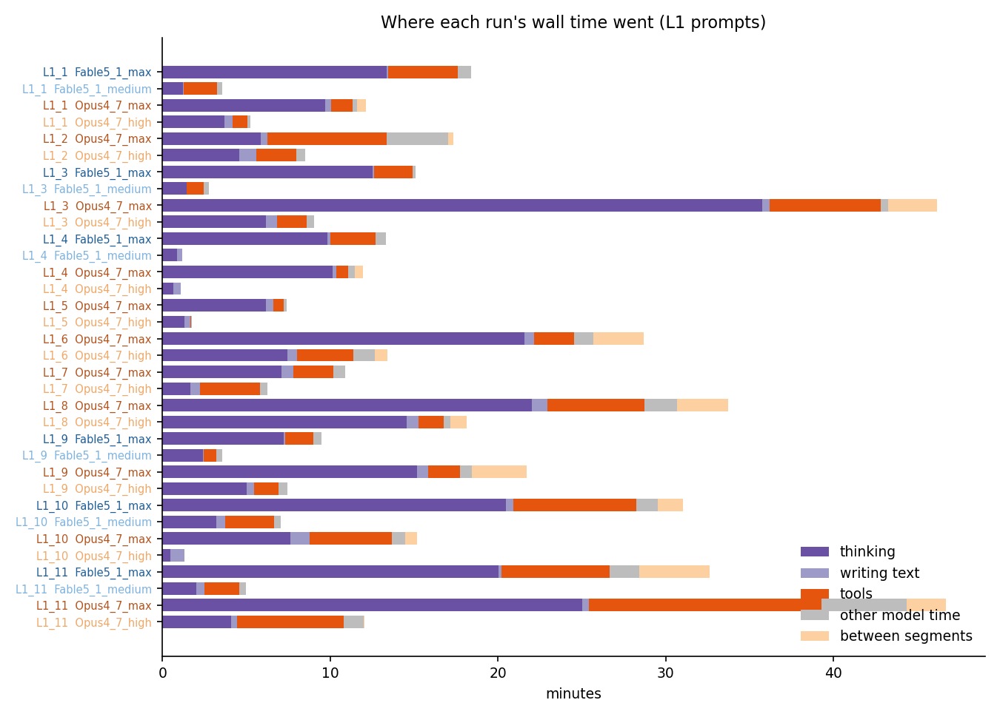

### Per-run distributions by configuration, L1 prompts

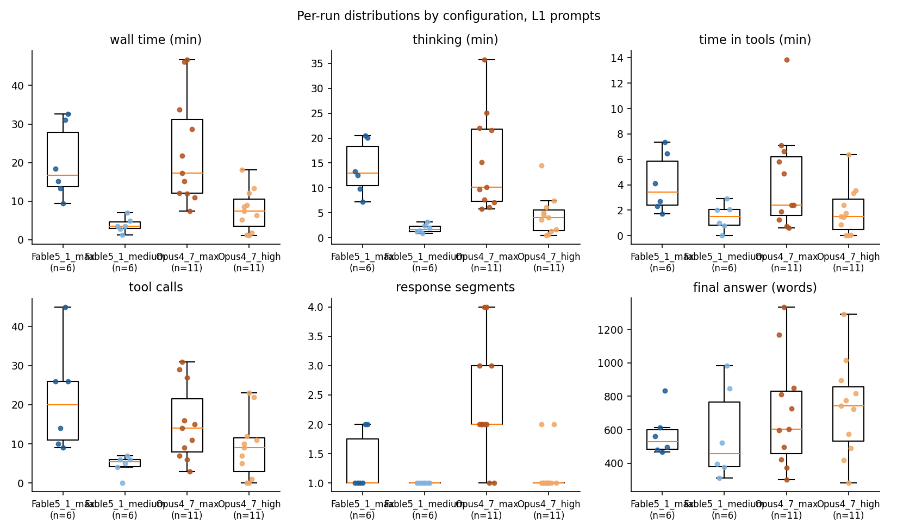

### Per-run distributions on the 6 prompts every configuration ran (L1_1, L1_3, L1_4, L1_9, L1_10, L1_11)

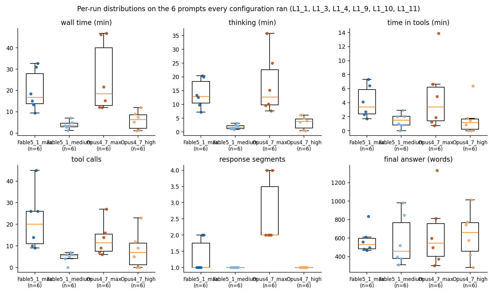

### Turn (segment) durations and Continue counts (L1 prompts)

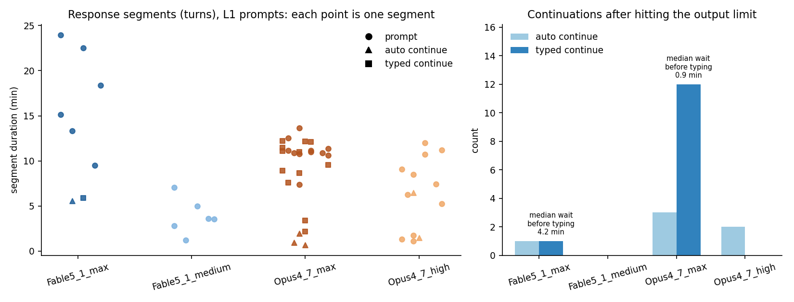

### Mean tool calls per run by tool (L1 prompts)

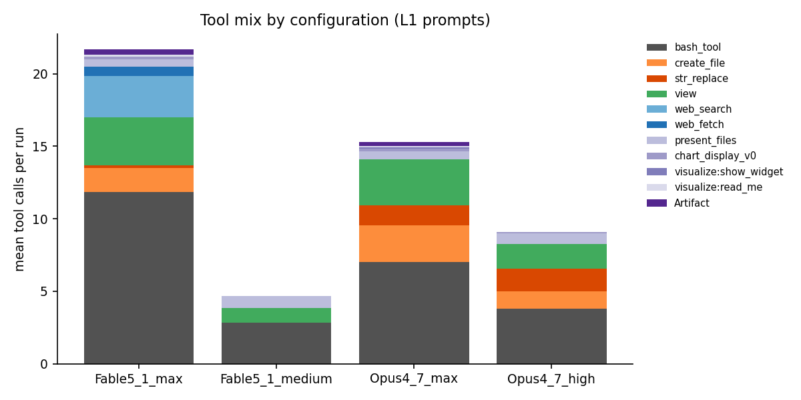

### Tool call durations by tool (L1 prompts)

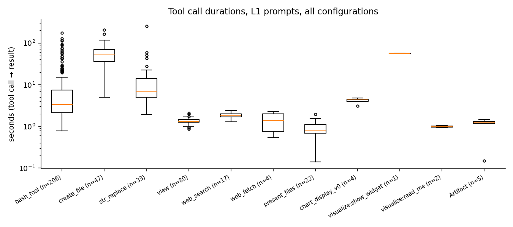

### Wall time vs tool calls (L1 prompts)

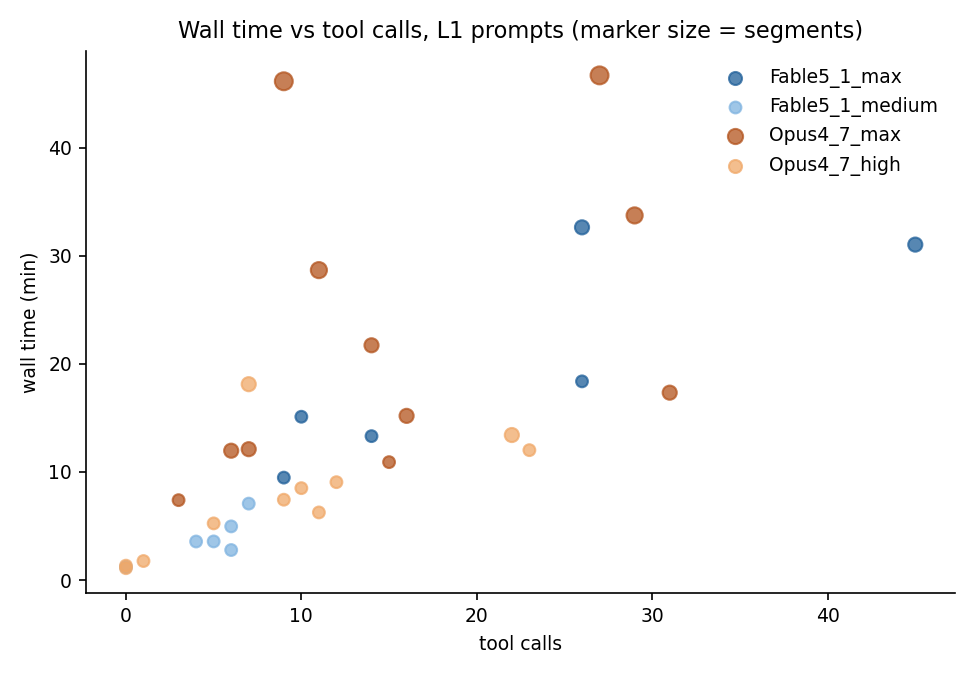

### Prompts run in more than one configuration

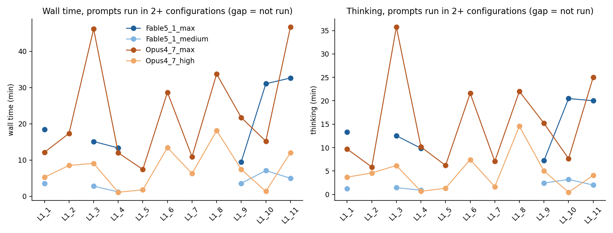

### Tool calls by category (L1 prompts)

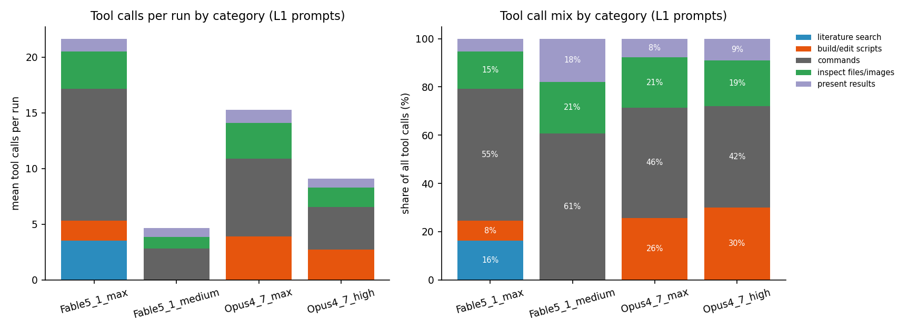

### Code written in the visible session and web pages reached, per run (L1 prompts)

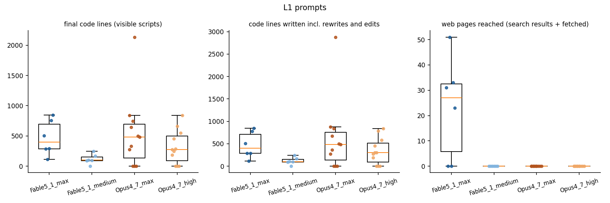

### Tool calls by type, per prompt and configuration (L1 prompts)

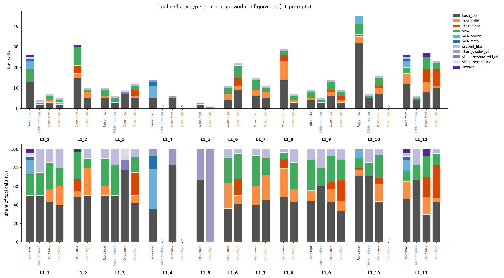

### Tool calls by category, per prompt and configuration (L1 prompts)

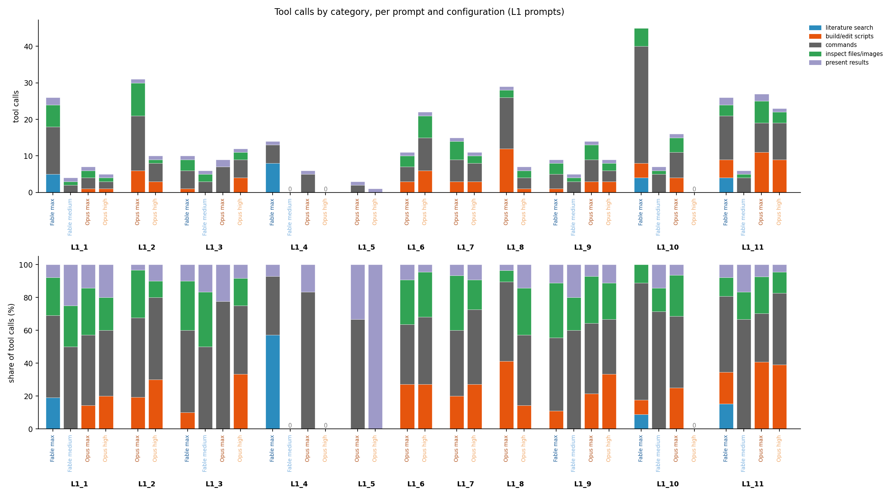

### Where the wall time went, per prompt and configuration (L1 prompts)

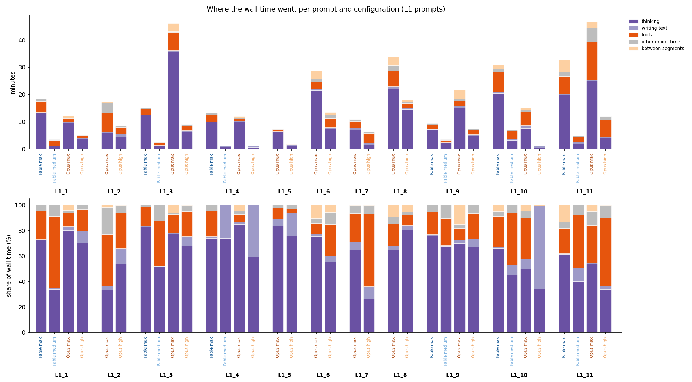

## Plots for Opus4_7_high across prompt levels (L1, L2, L3, L4)

### Opus4_7_high: wall time and tool calls per prompt

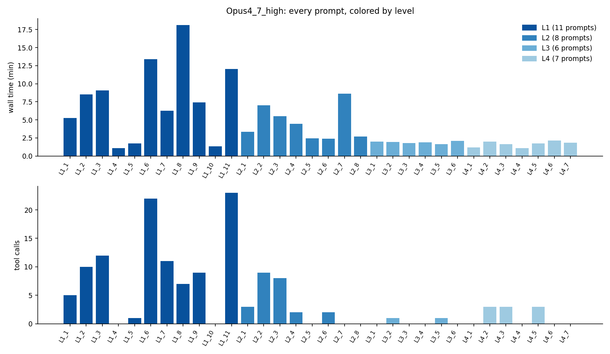

### Opus4_7_high: distributions by prompt level

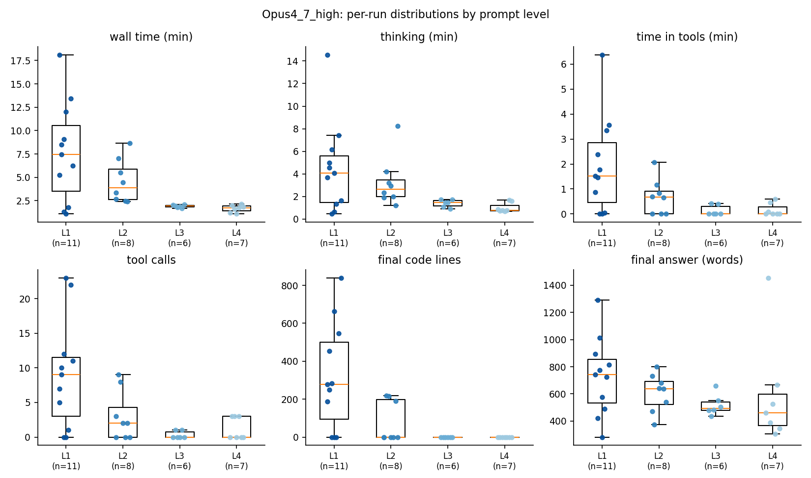

### Opus4_7_high: tool calls by type per prompt, grouped by level

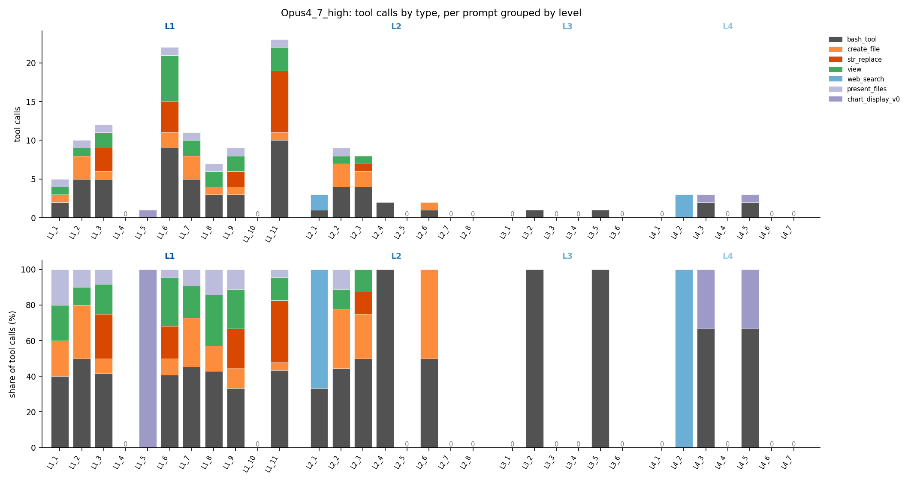

### Opus4_7_high: tool calls by category per prompt, grouped by level

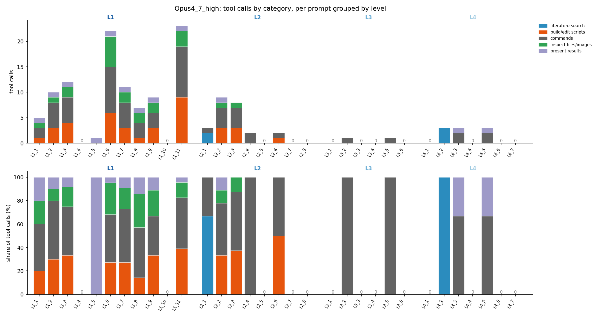

### Opus4_7_high: where the wall time went per prompt, grouped by level

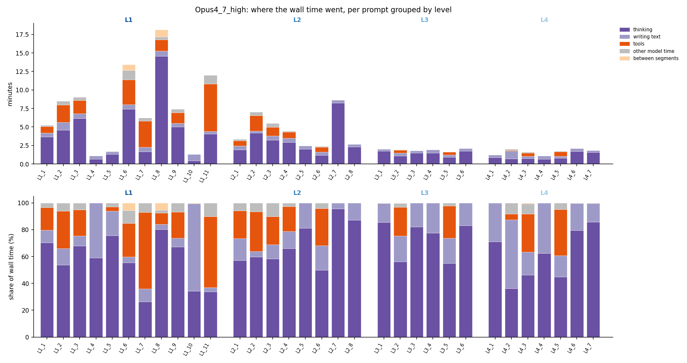

### Opus4_7_high: mean tool mix and time split by level

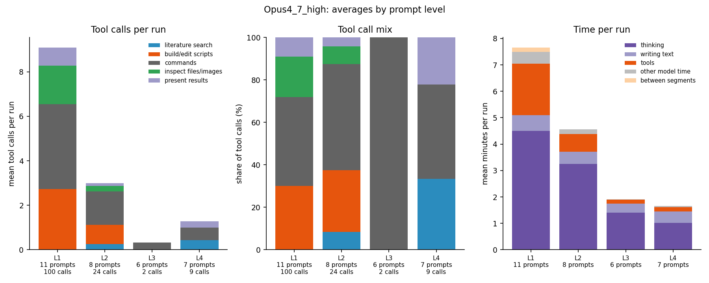

## Definitions

- **wall_s**: prompt sent → last saved step of the shown branch. Includes any wait before a typed "Continue". Matches the exports' `runs.csv`.
- **active_s**: sum of response segment durations (first block start → last block stop in each assistant message).
- **waiting_s**: wall_s − active_s: time between segments (a typed Continue waits for you; an automatic one only for the server).
- **thinking_s / text_s**: summed thinking and text block durations. **tool_s**: summed tool call → tool result time.
- **other_s**: active_s − thinking − text − tools (gaps between blocks inside a segment).
- **segment trigger**: `prompt`, `auto continue` (claude.ai continued after the output limit) or `typed continue` (a "Continue" message). **user_wait_s**: previous segment end → the typed Continue.
- **alternate_messages / alternate_active_s**: messages and active time on branches claude.ai doesn't show (they ran in parallel in the same sandbox and aren't in the timings).
- **final_answer_words**: words of text after the last working tool call (charts, images and file cards excluded).
- **calls_* / frac_***: tool calls per category (lit, build, cmd, inspect, present, other) and their share of the run's tool calls. **n_<tool> / tool_s_<tool> / errors_<tool>**: calls, seconds and error results per tool. **time_<category>_s**: tool seconds per category.
- **thinking_share / text_share / tool_share / waiting_share**: those times divided by wall_s. **mean_segment_s / max_segment_s**: response segment lengths. **user_wait_total_s**: summed waits before typed Continues. **median_tool_call_s**: median tool call duration.
- **in_comparison**: the run's prompt level was run by more than one configuration, so it's included in the cross-configuration tables and plots.
- **search_result_urls**: distinct URLs returned by the run's web searches. **pages_fetched**: distinct URLs fetched successfully. **pages_reached**: the union of the two. **web_domains**: distinct domains among them.
- **final_code_lines / final_code_chars**: summed final size of the code files (.py, .js, .sh, …) the run wrote, as visible in the conversation. **code_lines_written**: every line written to code files, counting rewrites and `str_replace` new text. **inline_script_lines**: `python - << EOF` and `python -c` code run without saving a file. **command_lines**: lines of all `bash_tool` commands, heredocs included.

## CSV files

| File | One row per | Use it for |
|---|---|---|
| `runs.csv` | run | everything above plus prompt metadata (`prompt_id`, `level`, `prompt_number`, `prompt_title`, `prompt_text`, chat link) |
| `prompts.csv` | prompt | prompt metadata and each configuration's key metrics side by side, as `<config>__<metric>` columns |
| `metrics_long.csv` | run × numeric metric | pivoting and plotting any metric by config, level or prompt |
| `tool_calls_by_prompt.csv` | run × tool | tool mix per prompt: calls, seconds, errors, share of the run's calls |
| `segments.csv` | response segment | turn-level durations, triggers and waits |
| `tools.csv` | tool call | per-call durations, errors, exit codes and sizes |
| `code_files.csv` | file written | final length of each visibly written script |
